# NXKeys для Siemens NX 2512

**NXKeys** — подсистема контекстного клавиатурного управления (Leader-based hotkey system) для Siemens NX 2512.

Система исключает необходимость запоминания сотен разрозненных сочетаний клавиш в CAD/CAM/CAE. Вместо назначения отдельных шорткатов на каждую функцию NXKeys использует простой список команд в 3 колонки: `CapsLock` открывает подсказку активного модуля, а показанная клавиша запускает команду или вложенное подменю через NX Command Bridge. При работе в NX `CapsLock` используется только как trigger и принудительно возвращается в выключенное состояние.

> **Дисклеймер:** NXKeys является сторонним модулем расширения и не относится к продуктам Siemens AG. Доступность и поведение конкретного `BUTTON ID` зависят от текущего контекста NX, роли пользователя, активной лицензии и загруженной детали.

---

## Архитектурный принцип

Вместо прямых глобальных привязок NXKeys разделяет управление на два уровня:
1. **Системный минимум (12 барьерных сочетаний):** Стандартные операции ОС и файлового ввода-вывода (`Ctrl+S`, `Ctrl+Z`, `Ctrl+C` и т.д.).
2. **Адаптивный Leader (`CapsLock` + дерево клавиш):** Все профессиональные инструменты CAD/CAM/CAE вызываются через контекстное оверлейное меню. Первый уровень остаётся компактным, а подтипы и фильтры раскрываются вложенными уровнями.

```text
┌─────────────┬─────────────┬─────────────┐
│      Q      │      W      │      E      │
│ Инспекция   │  Создание   │  Следующий  │
├─────────────┼─────────────┼─────────────┤
│      A      │  АКТИВНЫЙ   │      D      │
│ Структура   │   МОДУЛЬ    │ Добавление  │
├─────────────┼─────────────┼─────────────┤
│      Z      │      X      │      C      │
│ Уменьшение  │  Удаление   │ Преобразов. │
└─────────────┴─────────────┴─────────────┘
```

### Назначение клавиш сетки

Клавиши 3x3 сетки имеют устойчивую пространственную семантику во всех 14 поддерживаемых модулях:

| Клавиша | Позиция в сетке | Категория операций | Пример (Modeling) | Пример (Sketch) |
|---|---|---|---|---|
| `W` | Верх | Создание основного конструктивного элемента | Sketch | Line |
| `E` | Верх-Право | Логическое продолжение / основной следующий шаг | Extrude | Rectangle |
| `D` | Право | Добавление тела, элемента или зависимости | Hole | Circle |
| `C` | Низ-Право | Преобразование, замена или вращение | Revolve | Arc |
| `X` | Низ | Удаление, фаски, скругления, завершение | Edge Blend | Trim |
| `Z` | Низ-Лево | Уменьшение, ослабление или фаска | Chamfer | Extend |
| `A` | Лево | Массивы, структуры, связи | Pattern Feature | Offset Curve |
| `Q` | Верх-Лево | Измерения, проверка, сервисный анализ | Mirror Feature | Constraints |

Дополнительная клавиша `1` открывает `Selection Filters` в модулях, где нужно быстро выбрать приоритет выбора: Body, Face, Edge, Feature, Component, Reset, Select All или Deselect All. В Sketch клавиши `W`, `E`, `D`, `C` раскрывают подтипы Line, Rectangle, Circle и Arc, а `Q` открывает Sketch Constraints.

В Modeling и Assembly добавлены специальные ветки, которые доступны вне Sketch:

| Ветка | Назначение |
|---|---|
| `2` | Special: переход в Modeling/Sheet Metal, быстрый WAVE, Layers, Materials |
| `3` | WAVE Tools: Interface Linker, Part Navigator, Graph Browser, Load Data |
| `4` | Layer Tools: view/category/copy/info |
| `5` | Material Display: palettes, visual material display, deassign override |
| `6` | Sheet Metal Tools: Sheet Metal from Solid, Sheet Feature, Extend Sheet, boundary analysis |

Каждая команда в профиле имеет `icon_hint`; HUD и preview настроек показывают компактную NX-подобную пиктограмму рядом с клавишей.

*Полное дерево команд доступно в [интерактивной карте](docs/command-tree.html).*

---

## Навигация и управление Leader

| Горячая клавиша | Действие |
|---|---|
| `CapsLock` | Открыть оверлей Leader для текущего модуля NX |
| `Q / W / E / A / D / Z / X / C / 1..6` | Выполнить команду текущего уровня или открыть подменю |
| `Space` | Быстрый текстовый поиск внутри активного модуля |
| `Enter` | Выполнить первый результат поиска или подтвердить опасную операцию |
| `Tab` / `Shift+Tab` | Принудительный запрос следующего / предыдущего модуля NX |
| `Backspace` / `Esc` | Сбросить ввод / закрыть оверлей |
| Двойной `CapsLock` | Включить фиксацию оверлея (Sticky mode) |

При фактической смене приложения в NX (например, при переходе из Modeling в Sketch) `NX2512_CommandBridge` публикует новый контекст, и оверлей автоматически перестраивает набор команд. Исполнение команд чужого модуля блокируется.

---

## Базовые глобальные шорткаты

Политикой `BasicShortcutPolicy` в системе зафиксирован строгий перечень из 12 базовых сочетаний. Добавление иных прямых шорткатов в глобальный профиль запрещено — все доменные операции NX должны объявляться в структуре модулей `nx2512-pro-hybrid.json`.

| Сочетание | Команда | Сочетание | Команда |
|---|---|---|---|
| `Ctrl+N` | New | `Ctrl+X` | Cut |
| `Ctrl+O` | Open | `Ctrl+C` | Copy |
| `Ctrl+S` | Save | `Ctrl+V` | Paste |
| `Ctrl+Shift+S` | Save As | `Delete` | Delete |
| `Ctrl+Z` | Undo | `Ctrl+F` | Fit |
| `Ctrl+Y` | Redo | `F5` | Refresh |

---

## Архитектура системы

NXKeys состоит из внешнего сервиса обработки клавиатурных событий (out-of-process) и внутрипроцессного моста для Siemens NX (in-process C# DLL), взаимодействующих через файл-ориентированный IPC-протокол.

```mermaid
flowchart LR
    Hook[Win32 Keyboard Hook] --> Queue[Event Queue]
    BridgeContext[NX Bridge context.json] --> Resolver[AdaptiveModuleResolver]
    Resolver --> Scope[Active Module Scope]
    Queue --> DFA[DFA Sequence Evaluator]
    Scope --> DFA
    DFA --> HFSM[Leader HFSM]
    HFSM --> Guards[ContextGuardEvaluator]
    Guards -->|Опасная операция| Confirm[AwaitingConfirmation]
    Guards -->|Безопасно| Dispatch[Command Dispatcher]
    Confirm --> Dispatch
    Dispatch --> Pending[IPC: pending]
    Pending --> Processing[IPC: processing]
    Processing --> NX[NXOpen / UFUN API]
    NX --> Result[IPC: completed / failed]
    Result --> HFSM
```



### Состояния конечного автомата (HFSM)

* `Idle` — оверлей неактивен, ожидание триггера `CapsLock`.
* `Root` — оверлей активен, отображается первый уровень команд и подменю текущего модуля.
* `Prefix` / `Search` — вложенный уровень подменю или режим поиска команд внутри контекста.
* `AwaitingConfirmation` — подтверждение операций с побочными эффектами (требуется нажатие `Enter`).
* `Dispatching` / `AwaitingResult` — отправка запроса в CommandBridge и ожидание отклика NX.
* `SwitchingModule` — обработка смены активного приложения NX.
* `Failed` — обработка ошибок валидации или исполнения.

---

## Подсистемы и компоненты

| Компонент | Назначение |
|---|---|
| `NX2512_HotkeyStudio` | Перехват клавиш, оверлей Leader, CLI-управление и служба деплоя |
| `NX2512_CommandBridge` | Внутрипроцессный плагин NX (C# DLL), экспорт контекста и вызов `BUTTON ID` |
| `NX2512_ControlCenter` | Панель мониторинга покрытия команд и статуса IPC |
| `NX2512_Catalog_Studio` | Утилита извлечения и анализа командных идентификаторов NXOpen/UFUN |
| `NXKeys.Protocol` | Библиотека типов IPC-протокола (`context.json`, `status.json`, команды) |
| `NXKeys.StateMachines` | Детерминированные автоматы (DFA, HFSM), контекстные валидаторы (Guards) |
| `NXKeys.StateMachines.Tests` | Инварианты, реплей-сессии и генеративное тестирование |

---

## Конфигурация

Источниками истины являются JSON-конфигурации в каталоге `config/`:

* `config/nx2512-pro-hybrid.json` (Схема v3) — определение 12 базовых шорткатов и 14 модулей.
* `config/nx2512-state-machines.json` — таймауты IPC, правила подтверждения и контекстные Guards.

*Примечание:* Последовательности Leader (`LeaderSequenceItem`) не сериализуются вручную, а динамически собираются из модулей при загрузке профиля.

---

## Установка и развертывание

### Системные требования
* Windows 10 / 11 x64
* Siemens NX / Designcenter NX 2512
* .NET 8.0 SDK x64
* Наличие `NXOpen.dll` и `NXOpenUI.dll` в установке NX
* Права записи в `%LOCALAPPDATA%\NXKeys`

### Инсталляция

1. Закройте Siemens NX.
2. Запустите скрипт установки из PowerShell:

```powershell
powershell -NoProfile -ExecutionPolicy Bypass -File .\install-nx-ribbon-buttons.ps1 `
  -Clean `
  -NxRoot "C:\Program Files\Siemens\NX2512"
```

3. Запускайте NX через сгенерированный командный файл:

```cmd
%LOCALAPPDATA%\NXKeys\managed\NX2512.6000\launch-nx2512-with-nxkeys.cmd
```

### Структура управляемого пакета (Managed Package)

Развертывание использует стейджинг, хэширование SHA-256, манифест резервных копий и атомарные операции с поддержкой отката (rollback):

```text
%LOCALAPPDATA%\NXKeys\managed\NX2512.6000\
├── NX2512_HotkeyStudio.exe
├── nx2512-pro-hybrid.json
├── nx2512-state-machines.json
├── package-manifest.json
├── custom_dirs.dat
├── launch-nx2512-with-nxkeys.cmd
├── resolution-report.md
├── control-center/
└── custom/
    ├── application/
    │   ├── NX2512_CommandBridge.dll
    │   └── nxkeys_command_bridge.men
    └── startup/
        ├── nxkeys_generated.men
        ├── nxkeys_ribbon.rtb
        ├── nxkeys_toolbar.tbr
        ├── launch-hotkeystudio-daemon.cmd
        └── launch-hotkeystudio-gui.cmd
```

---

## IPC Command Bridge

Обмен данными между службой `HotkeyStudio` и плагином `CommandBridge` осуществляется через файловую очередь:

```text
%LOCALAPPDATA%\NXKeys\bridge\
├── pending/        # Новые запросы на исполнение BUTTON ID
├── processing/     # Команды, принятые мостом NX
├── completed/      # Успешно исполненные команды
├── failed/         # Сбои исполнения и отмененные команды
├── context.json    # Текущий контекст NX (приложение, выделение, модальные диалоги)
└── status.json     # Статус работоспособности Bridge
```

Перед исполнением каждого запроса `CommandBridge` повторно проверяет:
* Срок актуальности запроса и ревизию `context.json`;
* Активное приложение NX и отсутствие блокирующих модальных окон;
* Доступность и чувствительность высылаемого `BUTTON ID`.

Если статус завершения операции неопределен, запросу присваивается статус `interrupted_unknown`, а повторный автоповтор блокируется.

---

## Управление через C# CLI

Все административные операции доступны через консольный интерфейс `NX2512_HotkeyStudio.exe`:

```powershell
$exe = ".\NX2512_HotkeyStudio\dist\NX2512_HotkeyStudio.exe"
$config = ".\config\nx2512-pro-hybrid.json"

# Валидация JSON-схемы профиля
& $exe validate --config $config

# Сканирование структуры команд
& $exe scan --config $config --json

# Поиск BUTTON ID в каталоге
& $exe catalog --config $config --query "Extrude"

# Проектирование и выполнение плана установки
& $exe plan --config $config
& $exe apply --config $config --dry-run
& $exe apply --config $config --yes

# Диагностика подсистем и IPC Bridge
& $exe health --config $config
& $exe bridge-status --config $config

# Резервные копии и восстановление
& $exe backups --config $config
& $exe restore --config $config --manifest "...\manifest.json"

# Запуск службы в режиме интеграции с NX
& $exe launch --config $config -- -nx
```

---

## Проверки и CI/CD

Автоматические тесты проверяют соблюдение ключевых инвариантов системы:

* Версию JSON Schema v4 и ровно 12 базовых глобальных сочетаний;
* Наличие ровно 14 модулей и не менее 112 производных команд;
* Уникальность префиксов модулей, полных DFA-последовательностей и `input_key` внутри каждого уровня подменю;
* Детерминированность автоматов (DFA/HFSM), контекстные Guards и safety-инварианты;
* Автономную сборку проектов HotkeyStudio, ControlCenter и CommandBridge;
* Корректность развертывания и актуальность документации.

Для выполнения локальной валидации запустите:

```powershell
node .\scripts\validate-command-tree.mjs
```

---

## Ограничение интеграционной проверки

Сборка проектов проверяет корректность контрактов API NXOpen, однако окончательная проверка доступности команд требует выполнения на реальной рабочей станции с Siemens NX 2512 под соответствующей ролью и лицензией. Перед использованием деструктивных команд убедитесь в корректности их выполнения в вашей среде NX.

---

## Документация

* [Оглавление документации](docs/README.md)
* [Интерактивная карта команд](docs/command-tree.html)
* [Конфигурация](docs/CONFIGURATION.md)
* [Архитектура системы](docs/ARCHITECTURE.md)
* [Архитектура автоматов](docs/STATE_MACHINE_ARCHITECTURE.md)
* [Установка](docs/INSTALLATION.md)
* [Модель безопасности](docs/SAFETY_MODEL.md)
* [Диагностика и устранение неполадок](docs/TROUBLESHOOTING.md)

---

## Лицензия

[MIT](LICENSE)
