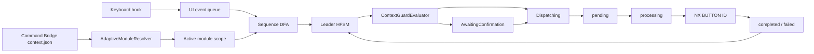

# NXKeys для Siemens NX 2512

NXKeys — C#-платформа для быстрого и безопасного управления Siemens NX 2512. В новой архитектуре остаются только **12 базовых глобальных сочетаний**, а все рабочие CAD/CAM/CAE-команды вызываются через **адаптивный модульный Leader**.

```text
CapsLock → одна клавиша Q/W/E/A/D/Z/X/C
```

Набор восьми команд автоматически определяется по текущему приложению NX: Sketch, Modeling, Assembly, Drafting, PMI, Surface, Sheet Metal, Manufacturing, Simulation, Routing, Mold, Reuse, Inspect/View или Selection/Object.

> NXKeys не является продуктом Siemens. Доступность конкретного `BUTTON ID` зависит от сборки NX, лицензии, роли, локализации, открытой детали и текущего выбора.

## Основной принцип

Пользователь не запоминает отдельные сочетания для каждой профессиональной функции и не вводит префикс модуля вручную.

1. `NX2512_CommandBridge` публикует актуальный `context.json`.
2. `AdaptiveModuleResolver` определяет модуль по `module_id`, `module_label` и `application_id`.
3. Нажатие `CapsLock` открывает только восемь команд активного модуля.
4. Нажатие одной клавиши запускает соответствующий `BUTTON ID`.
5. Guards повторно проверяют контекст перед постановкой запроса в Bridge.
6. Опасные операции требуют `Enter`.

## Единая клавиатурная сетка

```text
┌─────────────┬─────────────┬─────────────┐
│ Q · NW      │ W · N       │ E · NE      │
│ инспекция   │ начало      │ следующий   │
├─────────────┼─────────────┼─────────────┤
│ A · W       │   МОДУЛЬ    │ D · E       │
│ структура   │  определяется│ добавить    │
├─────────────┼─────────────┼─────────────┤
│ Z · SW      │ X · S       │ C · SE      │
│ уменьшить   │ завершить   │ преобразовать│
└─────────────┴─────────────┴─────────────┘
```

| Клавиша | Слот | Устойчивая семантика |
|---|---|---|
| `W` | `N` | запуск, создание или открытие основного объекта |
| `E` | `NE` | следующий основной шаг процесса |
| `D` | `E` | добавление объекта, материала или зависимости |
| `C` | `SE` | преобразование или замена |
| `X` | `S` | завершение, удаление или вторичная обработка |
| `Z` | `SW` | удаление, уменьшение или ослабление |
| `A` | `W` | структура, связь или паттерн |
| `Q` | `NW` | инспекция, измерение или сервисная команда |

## Примеры адаптации

### Modeling

```text
CapsLock+W  Sketch
CapsLock+E  Extrude
CapsLock+D  Hole
CapsLock+C  Revolve
CapsLock+X  Edge Blend
CapsLock+Z  Chamfer
CapsLock+A  Pattern Feature
CapsLock+Q  Mirror Feature
```

### Sketch

```text
CapsLock+W  Line
CapsLock+E  Rectangle
CapsLock+D  Circle
CapsLock+C  Arc
CapsLock+X  Trim
CapsLock+Z  Extend
CapsLock+A  Offset Curve
CapsLock+Q  Sketch Checker
```

### Sheet Metal

```text
CapsLock+W  Base Tab
CapsLock+E  Flange
CapsLock+D  Contour Flange
CapsLock+C  Bend
CapsLock+X  Unbend
CapsLock+Z  Rebend
CapsLock+A  Flat Pattern
CapsLock+Q  Sheet Metal Preferences
```

Полная матрица 14 × 8 доступна в [интерактивной HTML-карте](docs/command-tree.html).

## Управление Leader

| Клавиша | Действие |
|---|---|
| `CapsLock` | открыть набор активного модуля |
| `Q/W/E/A/D/Z/X/C` | выполнить команду текущего набора |
| `Space` | поиск только внутри активного модуля |
| `Enter` | выполнить первый результат поиска или подтвердить опасную команду |
| `Tab` / `Shift+Tab` | явно запросить следующий/предыдущий модуль NX |
| `Backspace` | вернуться или закрыть Leader |
| `Esc` | отменить ввод |
| двойной `CapsLock` | sticky-режим |

При фактической смене приложения NX открытый Leader автоматически перестраивает набор. Команды другого модуля скрыты и не выполняются.

## Базовые сочетания

Прямые ускорители ограничены фиксированным системным минимумом:

| Сочетание | Команда |
|---|---|
| `Ctrl+N` | New |
| `Ctrl+O` | Open |
| `Ctrl+S` | Save |
| `Ctrl+Shift+S` | Save As |
| `Ctrl+Z` | Undo |
| `Ctrl+Y` | Redo |
| `Ctrl+X` | Cut |
| `Ctrl+C` | Copy |
| `Ctrl+V` | Paste |
| `Delete` | Delete |
| `Ctrl+F` | Fit |
| `F5` | Refresh |

`BasicShortcutPolicy` запрещает добавлять иные прямые сочетания в канонический профиль. Профессиональные операции должны находиться в `modules[].command_sets[].commands`.

## Архитектура



### Состояния HFSM

```text
Idle
Root
Prefix
Search
AwaitingConfirmation
Dispatching
AwaitingResult
SwitchingModule
Failed
```

Префикс модуля существует только как внутренний токен DFA. Пользователь вводит одну командную клавишу.

## Компоненты

| Компонент | Назначение |
|---|---|
| `NX2512_HotkeyStudio` | адаптивный Leader, Studio, CLI, deployment и диагностика |
| `NX2512_ControlCenter` | обзор покрытия, контекста и API-каталога |
| `NX2512_CommandBridge` | проверка контекста и выполнение точного `BUTTON ID` внутри NX |
| `NX2512_Catalog_Studio` | извлечение UI/NXOpen/UFUN-каталогов |
| `NXKeys.Protocol` | общий протокол запросов, результатов и контекста |
| `NXKeys.StateMachines` | DFA, HFSM, guards и декларативная policy |
| `NXKeys.StateMachines.Tests` | replay, randomized и safety-инварианты |

## Источники истины

```text
config/nx2512-pro-hybrid.json      схема v3: базовые сочетания и 14 модулей
config/nx2512-state-machines.json  таймауты, guards и confirmation
```

Производные `LeaderSequenceItem` не сериализуются: они собираются из модулей при загрузке профиля. Это исключает дублирование и расхождение двух карт команд.

## Быстрая установка

Требования:

- Windows 10/11 x64;
- Siemens NX / Designcenter NX 2512;
- .NET 8 SDK x64;
- `NXOpen.dll` и `NXOpenUI.dll` целевой установки;
- права записи в `%LOCALAPPDATA%\NXKeys`.

Закройте NX и выполните:

```powershell
powershell -NoProfile -ExecutionPolicy Bypass -File .\install-nx-ribbon-buttons.ps1 `
  -Clean `
  -NxRoot "C:\Program Files\Siemens\NX2512"
```

Запускать NX следует через:

```text
%LOCALAPPDATA%\NXKeys\managed\NX2512.6000\launch-nx2512-with-nxkeys.cmd
```

## Managed-пакет

```text
%LOCALAPPDATA%\NXKeys\managed\NX2512.6000\
├─ NX2512_HotkeyStudio.exe
├─ nx2512-pro-hybrid.json
├─ nx2512-state-machines.json
├─ package-manifest.json
├─ custom_dirs.dat
├─ launch-nx2512-with-nxkeys.cmd
├─ resolution-report.md
├─ control-center\
└─ custom\
   ├─ application\
   │  ├─ NX2512_CommandBridge.dll
   │  └─ nxkeys_command_bridge.men
   └─ startup\
      ├─ nxkeys_generated.men
      ├─ nxkeys_ribbon.rtb
      ├─ nxkeys_toolbar.tbr
      ├─ launch-hotkeystudio-daemon.cmd
      └─ launch-hotkeystudio-gui.cmd
```

Развёртывание использует staging, SHA-256, backup manifest, атомарную запись, проверку установленного пакета и rollback. Устаревшие управляемые файлы удаляются только по предыдущему package manifest.

## Command Bridge

```text
%LOCALAPPDATA%\NXKeys\bridge\
├─ pending\
├─ processing\
├─ completed\
├─ failed\
├─ context.json
└─ status.json
```

Перед выполнением Bridge повторно проверяет срок запроса, ревизию контекста, количество выбранных объектов, приложение NX, модальный диалог, модуль и чувствительность `BUTTON ID`. Неопределённо завершившийся запрос получает `interrupted_unknown` и не исполняется повторно.

## C# CLI

```powershell
$exe = ".\NX2512_HotkeyStudio\dist\NX2512_HotkeyStudio.exe"
$config = ".\config\nx2512-pro-hybrid.json"

& $exe validate --config $config
& $exe scan --config $config --json
& $exe catalog --config $config --query "Extrude"
& $exe plan --config $config
& $exe apply --config $config --dry-run
& $exe apply --config $config --yes
& $exe health --config $config
& $exe bridge-status --config $config
& $exe backups --config $config
& $exe restore --config $config --manifest "...\manifest.json"
& $exe launch --config $config -- -nx
```

## Проверки

CI должен подтвердить:

- C#-only дерево;
- JSON schema v3;
- ровно 12 базовых сочетаний;
- ровно 14 модулей и 112 производных команд;
- уникальные префиксы и восемь слотов каждого модуля;
- фиксированную сетку `QWE/A·D/ZXC`;
- отсутствие устаревшей подсистемы меню жестов;
- DFA/HFSM, guards, confirmation, replay и randomized-инварианты;
- сборку HotkeyStudio, Control Center и CommandBridge contract;
- deployment-инварианты;
- соответствие HTML-карты профилю.

Локальная проверка:

```powershell
node .\scripts\validate-command-tree.mjs
```

## Документация

- [Оглавление](docs/README.md)
- [Интерактивная карта](docs/command-tree.html)
- [Конфигурация](docs/CONFIGURATION.md)
- [Архитектура](docs/ARCHITECTURE.md)
- [Архитектура автоматов](docs/STATE_MACHINE_ARCHITECTURE.md)
- [Установка](docs/INSTALLATION.md)
- [Безопасность](docs/SAFETY_MODEL.md)
- [Диагностика](docs/TROUBLESHOOTING.md)

## Ограничение интеграционной проверки

Contract build проверяет форму используемого NXOpen API, но окончательная проверка требует реального Siemens NX 2512 с нужной ролью и лицензией. Перед эксплуатацией destructive-команд проверьте каждый целевой `BUTTON ID` на рабочей станции.

## Лицензия

MIT.
