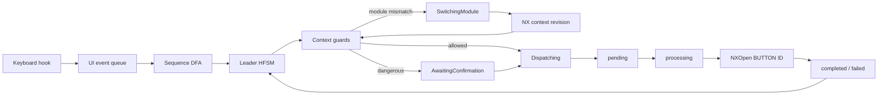

# NXKeys для Siemens NX 2512

NXKeys — C#-платформа для быстрого и безопасного управления Siemens NX 2512 через прямые горячие клавиши, контекстный Leader Key, радиальные меню и NXOpen Command Bridge.

Проект рассчитан на Windows x64 и использует единый .NET 8-контур: настройка, сканирование, развёртывание, запуск NX, диагностика, резервное копирование и восстановление выполняются без Go CLI/TUI.

> NXKeys не является продуктом Siemens. Доступность конкретной команды зависит от сборки NX, лицензии, роли, локализации, активного приложения, открытой детали и выбранных объектов.

## Что даёт NXKeys

- единый канонический профиль `config/nx2512-pro-hybrid.json`;
- 14 модулей контекстного выбора и 112 позиций модульной карты;
- 47 прямых горячих клавиш;
- прикладные и объектные радиальные меню;
- DFA для распознавания последовательностей;
- HFSM для состояний Leader, подтверждений, поиска и переключения модулей;
- декларативные guards и fallback-действия из `config/nx2512-state-machines.json`;
- выполнение точного NX `BUTTON ID` через Command Bridge;
- транзакционное развёртывание, SHA-256 manifest, backup и rollback;
- Adaptive Control Center для обзора команд и текущего контекста NX;
- интерактивная HTML-карта всех команд.

## Интерактивное дерево команд

Полная визуальная карта находится в:

```text
docs/command-tree.html
```

Она показывает:

- дерево `CapsLock → модуль → команда`;
- матрицу 14 модулей × 8 направлений;
- прямые горячие клавиши;
- все прикладные, модульные и объектные радиальные меню;
- `BUTTON ID`;
- требования выбора;
- destructive/confirmation-флаги;
- декларативные guards;
- fallback `switch_module`;
- путь команды через DFA, HFSM и Bridge.

### Открытие локально

Из корня репозитория:

```powershell
py -m http.server 8080
```

Откройте:

```text
http://localhost:8080/docs/command-tree.html
```

При запуске через HTTP страница автоматически читает актуальные файлы:

```text
config/nx2512-pro-hybrid.json
config/nx2512-state-machines.json
```

При прямом открытии через `file://` браузер обычно блокирует чтение соседних JSON. В этом случае нажмите «Загрузить профиль» и «Загрузить policy» либо перетащите оба файла на страницу.

[Открыть исходник интерактивной карты](docs/command-tree.html)

## Модель управления

### Прямые клавиши

Прямые сочетания предназначены для глобальных и часто используемых действий:

```text
Ctrl+N       New
Ctrl+O       Open
Ctrl+S       Save
Ctrl+Z       Undo
Ctrl+Y       Redo
Ctrl+F       Fit
Ctrl+E       Expressions
Ctrl+M       Modeling
Ctrl+Shift+D Drafting
```

Полный список отображается во вкладке **«Прямые клавиши»** интерактивной карты и хранится в секции `keyboard` канонического профиля.

### Leader Key

Базовый сценарий:

```text
CapsLock → модуль → команда
```

Управление HUD:

| Клавиша | Действие |
|---|---|
| `Space` | перейти в поиск |
| `Tab` / `Shift+Tab` | выбрать следующий/предыдущий модуль |
| `Backspace` | вернуться на уровень назад |
| `Esc` | отменить и освободить перехват |
| `Enter` | подтвердить опасную команду |
| двойной `CapsLock` | sticky-режим |

Модульная карта использует одинаковые смысловые позиции:

| Слот | Смысл |
|---|---|
| `N` | запуск, создание или открытие основного объекта |
| `NE` | следующий основной шаг процесса |
| `E` | добавление объекта, материала или зависимости |
| `SE` | преобразование или замена |
| `S` | завершение, удаление или вторичная обработка |
| `SW` | удаление, уменьшение или ослабление |
| `W` | структура, связь или паттерн |
| `NW` | инспекция, измерение или сервисная команда |

### Радиальные меню

Профиль содержит:

- глобальные прикладные radial-наборы;
- radial-набор каждого модуля;
- объектные меню для `Face`, `Edge`, `Feature` и `Component`.

Визуальная раскладка каждого меню доступна во вкладке **«Радиальные меню»** HTML-карты.

## Архитектура



### Слои

| Слой | Назначение |
|---|---|
| `SequenceAutomaton` | детерминированное распознавание последовательностей |
| `LeaderStateMachine` | состояния `Idle`, `Root`, `Prefix`, `Search`, `AwaitingConfirmation`, `Dispatching`, `AwaitingResult`, `SwitchingModule`, `Failed` |
| `ContextGuardEvaluator` | проверка модуля, Bridge, выбора, детали, диалога и достоверности контекста |
| `LeaderBehaviorProfile` | декларативные таймауты, guards, confirmation и fallback |
| `NX2512_CommandBridge` | повторная проверка контекста и выполнение команды внутри NX |

Подробности: [архитектура конечных автоматов](docs/STATE_MACHINE_ARCHITECTURE.md).

## Компоненты

| Компонент | Назначение |
|---|---|
| `NX2512_HotkeyStudio` | WinForms UI, CLI, Leader Engine, сканирование, deployment, запуск NX, health-check и restore |
| `NX2512_ControlCenter` | обзор команд, покрытия, контекста Bridge и API-каталога |
| `NX2512_CommandBridge` | NXOpen-библиотека для выполнения точного `BUTTON ID` |
| `NX2512_Catalog_Studio` | извлечение UI-команд, NXOpen/UFUN и построение кандидатного crosswalk |
| `NXKeys.Protocol` | общие snake_case DTO протокола без дополнительной runtime-DLL |
| `NXKeys.StateMachines` | DFA, HFSM, guards и декларативная policy |
| `NXKeys.StateMachines.Tests` | инвариантные, replay и randomized-тесты |

## Требования

- Windows 10/11 x64;
- Siemens NX или Designcenter NX 2512;
- .NET 8 SDK x64 для сборки;
- `NXOpen.dll` и `NXOpenUI.dll` целевой установки для production-сборки Bridge;
- права записи в `%LOCALAPPDATA%\NXKeys`.

Build-скрипты не скачивают и не запускают удалённые установщики SDK. Зависимости устанавливаются пользователем или администратором заранее.

## Быстрая установка

Закройте Siemens NX и выполните:

```powershell
powershell -NoProfile -ExecutionPolicy Bypass -File .\install-nx-ribbon-buttons.ps1 `
  -Clean `
  -NxRoot "C:\Program Files\Siemens\NX2512"
```

При нестандартном расположении NXOpen:

```powershell
powershell -NoProfile -ExecutionPolicy Bypass -File .\install-nx-ribbon-buttons.ps1 `
  -Clean `
  -NxOpenDll "D:\Siemens\NX2512\NXBIN\managed\NXOpen.dll"
```

Установщик:

1. проверяет .NET 8;
2. проверяет остановку NX;
3. собирает HotkeyStudio;
4. собирает CommandBridge против DLL целевой установки;
5. публикует Control Center;
6. формирует чистый staging;
7. строит deployment plan;
8. создаёт резервную копию;
9. атомарно устанавливает файлы;
10. удаляет только ранее управляемые устаревшие файлы;
11. проверяет SHA-256;
12. выполняет rollback при ошибке;
13. запускает health-check.

## Запуск Siemens NX

После установки используйте сгенерированную обёртку:

```text
%LOCALAPPDATA%\NXKeys\managed\NX2512.6000\launch-nx2512-with-nxkeys.cmd
```

Она передаёт управление C# launcher:

```powershell
NX2512_HotkeyStudio.exe launch --config nx2512-pro-hybrid.json -- <аргументы NX>
```

Launcher:

- разрешает абсолютный путь к `ugraf.exe`;
- проверяет `custom_dirs.dat`;
- запускает Leader Engine идемпотентно;
- передаёт только `UGII_CUSTOM_DIRECTORY_FILE`;
- не изменяет глобальный `PATH`;
- не подменяет `UGII_USER_DIR`;
- использует `ProcessStartInfo.ArgumentList`.

## Managed-пакет

Стандартный путь:

```text
%LOCALAPPDATA%\NXKeys\managed\NX2512.6000\
├─ NX2512_HotkeyStudio.exe
├─ NX2512_HotkeyStudio.dll
├─ nx2512-pro-hybrid.json
├─ nx2512-state-machines.json
├─ package-manifest.json
├─ custom_dirs.dat
├─ launch-nx2512-with-nxkeys.cmd
├─ resolution-report.md
├─ radial-menu-plan.md
├─ radial-menu-plan.json
├─ control-center\
│  └─ NX2512_ControlCenter.exe
└─ custom\
   ├─ application\
   │  ├─ NX2512_CommandBridge.dll
   │  └─ nxkeys_command_bridge.men
   └─ startup\
      ├─ nxkeys_generated.men
      ├─ nxkeys_ribbon.rtb
      ├─ nxkeys_toolbar.tbr
      ├─ launch-hotkeystudio-daemon.cmd
      └─ launch-hotkeystudio-gui.cmd
```

Bridge DLL устанавливается только в `custom\application`.

## Надёжность Command Bridge

Файловая очередь:

```text
%LOCALAPPDATA%\NXKeys\bridge\
├─ pending\
├─ processing\
├─ completed\
├─ failed\
├─ context.json
└─ status.json
```

Перед исполнением Bridge повторно проверяет:

- `expires_utc`;
- `expected_context_revision`;
- `expected_selection_count`;
- `expected_application_id`;
- отсутствие модального диалога;
- требуемый модуль;
- наличие и чувствительность `BUTTON ID`.

Запрос атомарно перемещается `pending → processing`. Запрос, прерванный аварийным завершением NX, не воспроизводится автоматически и получает результат `interrupted_unknown`. Повторный `request_id` не исполняется второй раз.

## Декларативные guards

Файл:

```text
config/nx2512-state-machines.json
```

задаёт:

- таймауты каждого состояния;
- допустимые модули;
- состояния Bridge и взаимодействия;
- минимальную достоверность контекста;
- наличие work/display part;
- минимальное/максимальное число выбранных объектов;
- `types_any` и `types_all`;
- обязательное подтверждение;
- `show_reason` и `switch_module`;
- `retry_once`.

Пример:

```json
{
  "commands": {
    "MB": {
      "guards": {
        "modules": ["modeling"],
        "require_work_part": true,
        "selection": {
          "minimum": 1,
          "types_any": ["Edge"]
        }
      },
      "on_unavailable": {
        "action": "show_reason",
        "message": "Выберите одно или несколько рёбер"
      }
    }
  }
}
```

## C# CLI

```powershell
$exe = ".\NX2512_HotkeyStudio\dist\NX2512_HotkeyStudio.exe"
$config = ".\config\nx2512-pro-hybrid.json"

& $exe validate --config $config
& $exe scan --config $config --json
& $exe catalog --config $config --query "Extrude"
& $exe plan --config $config
& $exe apply --config $config --dry-run
& $exe apply --config $config --yes
& $exe health --config $config
& $exe bridge-status --config $config
& $exe backups --config $config
& $exe restore --config $config --manifest "...\manifest.json"
& $exe launch --config $config -- -nx
```

## Сборка компонентов

### HotkeyStudio

```powershell
powershell -NoProfile -ExecutionPolicy Bypass -File .\NX2512_HotkeyStudio\build.ps1 -Clean
```

### CommandBridge

```powershell
powershell -NoProfile -ExecutionPolicy Bypass -File .\NX2512_CommandBridge\build.ps1 `
  -NxRoot "C:\Program Files\Siemens\NX2512" `
  -Clean
```

### Catalog Studio

```powershell
powershell -NoProfile -ExecutionPolicy Bypass -File .\NX2512_Catalog_Studio\build.ps1 `
  -NxRoot "C:\Program Files\Siemens\NX2512" `
  -Clean
```

## Разработка и CI

Workflow `.github/workflows/ci.yml` выполняется на `windows-latest` и проверяет:

- отсутствие Go-исходников и `go.mod`;
- корректность JSON-профилей;
- DFA/HFSM, protocol, policy, replay и randomized-инварианты;
- сборку и publish HotkeyStudio;
- наличие `nx2512-state-machines.json` в publish;
- канонический профиль через C# CLI;
- сборку и publish Control Center;
- NXOpen contract stubs;
- компиляцию фактического CommandBridge против contract stubs;
- deployment-инварианты;
- соответствие интерактивной карты каноническому профилю;
- наличие ссылок на карту в README и docs index;
- Windows x64 artifact.

Локальная проверка документации:

```powershell
node .\scripts\validate-command-tree.mjs
```

## Структура репозитория

```text
NX2512_HotkeyStudio/         основной UI, CLI и runtime
NX2512_ControlCenter/        адаптивный обзор команд
NX2512_CommandBridge/        NXOpen Bridge
NX2512_Catalog_Studio/       каталог UI/API
NXKeys.Protocol/             общий протокол
NXKeys.StateMachines/        DFA, HFSM и guards
NXKeys.StateMachines.Tests/  инвариантные тесты
config/                      канонические профили
docs/                        документация и HTML-карта
roles/                       экспортированные роли NX
scripts/                     build/doc validation
```

## Безопасность

NXKeys не должен:

- изменять файлы системной установки Siemens;
- редактировать бинарный формат `.mtx`;
- автоматически писать во все профили Siemens;
- добавлять каталоги NXKeys в глобальный `PATH`;
- подменять `UGII_USER_DIR`;
- устанавливать SDK или запускать загруженный install-скрипт;
- исполнять неоднозначную команду;
- обходить подтверждение destructive-команды;
- повторно исполнять неизвестно завершившийся запрос.

Подробнее: [модель безопасности](docs/SAFETY_MODEL.md).

## Документация

- [Оглавление](docs/README.md)
- [Интерактивное дерево всех команд](docs/command-tree.html)
- [Архитектура конечных автоматов](docs/STATE_MACHINE_ARCHITECTURE.md)
- [Установка](docs/INSTALLATION.md)
- [Конфигурация](docs/CONFIGURATION.md)
- [Архитектура](docs/ARCHITECTURE.md)
- [Модель безопасности](docs/SAFETY_MODEL.md)
- [Диагностика](docs/TROUBLESHOOTING.md)
- [Спецификация NX Pro Hybrid](docs/NX_PRO_HYBRID_SOURCE_SPEC.md)
- [Control Center](NX2512_ControlCenter/README.md)
- [Роли NX](roles/README.md)
- [Состояние сборки](BUILD_REPORT.md)

## Ограничения

Contract build подтверждает компилируемость используемой формы NXOpen API, но не заменяет интеграционный тест внутри реального Siemens NX 2512. Перед эксплуатацией destructive-команд необходимо проверить Bridge на целевой сборке NX, роли и лицензии.

## Лицензия

MIT.
