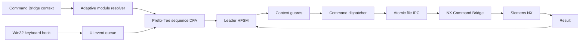

# NXKeys

[](https://github.com/Homiakus/NXkeys/actions/workflows/ci.yml)
[](https://github.com/Homiakus/NXkeys/actions/workflows/mnemonic-command-language.yml)
[](https://github.com/Homiakus/NXkeys/actions/workflows/full-command-map.yml)
[](https://github.com/Homiakus/NXkeys/actions/workflows/pages.yml)
[](LICENSE)
[](https://dotnet.microsoft.com/)

NXKeys — клавиатурный слой управления Siemens NX / Designcenter NX 2512. Команды вызываются через контекстный мнемонический язык, а не через сотни конфликтующих глобальных ускорителей.

```text
CapsLock → действие → объект → команда → вариант
```

Примеры:

```text
CapsLock → C → F → E    Create → Feature → Extrude
CapsLock → T → F → M    Transform → Feature → Mirror
CapsLock → M → L → C    Manage → Layer → Copy
CapsLock → P → O → G    Process → Operation → Generate Tool Path
CapsLock → S → F        Select → Face
```

**Интерактивная карта:** https://homiakus.github.io/NXkeys/

> NXKeys — сторонний проект. Реальная доступность команд определяется установленной сборкой NX 2512, лицензиями, ролью, локализацией и корпоративными MenuScript-расширениями.

## Текущее покрытие

В репозитории используются два согласованных слоя:

| Слой | Назначение |
|---|---|
| `config/nx2512-pro-hybrid.json` | Проверенный базовый профиль: 12 прямых системных сочетаний, 14 контекстных модулей, ручные `BUTTON ID`, aliases и safety-policy. |
| `config/full-command-map/` | Полный каталог из **1169 намерений команд** в **32 разделах**, с частотой `K1–K5`, русскими/английскими названиями и заранее рассчитанными мнемоническими путями. |
| `config/nx2512-pro-full.generated.json` | Генерируемый профиль конкретной установки NX. В Git не является универсальным источником истины, потому что разрешённые `BUTTON ID` зависят от локального каталога NX. |

Для каждой из 1169 функций путь существует всегда. Исполняемой команда становится только после надёжного разрешения в реальный `BUTTON ID`. Неоднозначные и отсутствующие команды остаются в профиле отключёнными и попадают в отчёт — выдуманные ID не создаются.

Подробности: [FULL_COMMAND_MAP.md](FULL_COMMAND_MAP.md).

## Как работает ввод

1. `CapsLock` открывает HUD активного приложения NX.
2. Первая клавиша задаёт действие: Create, Edit, Transform, Process и т.д.
3. Следующая клавиша задаёт объект: Feature, Body, Surface, Operation, Tool и т.д.
4. Последующие клавиши уточняют команду и вариант.
5. Внутренний префикс модуля добавляется движком автоматически и пользователем не вводится.

HUD показывает допустимые продолжения в **3 колонки**. Пути внутри каждого активного модуля уникальны и не являются префиксами других команд. Частые проверенные команды могут иметь безопасный короткий alias.

## Управление

| Клавиша | Действие |
|---|---|
| `CapsLock` | Открыть HUD |
| Буква или цифра | Перейти по ветви или выполнить команду |
| `Space` | Поиск по командам активного модуля |
| `Enter` | Выполнить найденную команду или подтвердить опасную операцию |
| `Backspace` | Сбросить текущий путь |
| `Esc` | Закрыть HUD |
| `Tab` / `Shift+Tab` | Явно переключить модуль |
| Двойной `CapsLock` | Закрепить HUD |

Поиск учитывает имя, `BUTTON ID`, русский и английский aliases, модуль, раздел каталога, путь и частоту использования.

## Мнемонический алфавит

Первая клавиша — действие:

| Клавиша | Категория | Значение |
|---|---|---|
| `C` | Create | создать или добавить |
| `E` | Edit | изменить |
| `T` | Transform | переместить, отразить, размножить |
| `X` | Remove | удалить, убрать, подавить |
| `P` | Process | рассчитать, сгенерировать, решить |
| `I` | Inspect | измерить, проверить, проанализировать |
| `V` | View | показать, скрыть, ориентировать |
| `S` | Select | выбрать или задать фильтр |
| `A` | Annotate | размеры, PMI, символы, примечания |
| `M` | Manage | навигаторы, слои, материалы, библиотеки |
| `F` | File | файловые операции |
| `G` | Go | переход между приложениями NX |
| `U` | Utilities | выражения, журналы, настройки |
| `H` | Help | справка, поиск, диагностика |

Вторая клавиша обычно задаёт объект:

| Клавиша | Объект | Клавиша | Объект |
|---|---|---|---|
| `A` | Annotation / Additive | `B` | Body / Base |
| `C` | Component | `D` | Dimension / Datum |
| `E` | Edge | `F` | Feature / Frame |
| `G` | Geometry / Curve | `H` | Sheet Metal |
| `I` | Inspection | `J` | Fixture |
| `K` | Constraint | `L` | Layout / Layer |
| `M` | Material / Mold | `N` | Simulation |
| `O` | CAM Operation | `P` | Part / Data |
| `Q` | Quality | `R` | Routing |
| `S` | Sketch / Selection | `T` | Tool / Template |
| `U` | Surface | `V` | View |
| `W` | WAVE | `Y` | Assembly / Ship |
| `Z` | Other |  |  |

Полная грамматика: [docs/MNEMONIC_COMMAND_LANGUAGE.md](docs/MNEMONIC_COMMAND_LANGUAGE.md).

## Контекстные модули

```text
modeling       sketch          assembly       drafting
pmi            surface         sheet_metal    manufacturing
simulation     routing         mold           reuse
inspect_view   selection_object
```

Command Bridge публикует активное приложение, модуль, Work/Display Part, выбранные типы и количество объектов, модальное состояние, ревизию контекста и результат последней команды. По этим данным выбирается текущий набор.

## Безопасность

Перед dispatch проверяются:

- свежесть и достоверность контекста;
- активный модуль и приложение;
- Work Part и Display Part;
- модальный диалог и активная команда NX;
- типы и количество выбранных объектов;
- доступность точного `BUTTON ID`;
- destructive-флаг и подтверждение.

`UG_SEL_*` не запускаются как обычные псевдокнопки. Действие `set_selection_filter` применяет глобальные фильтры NXOpen. Разрушительные операции требуют `Enter`. Запрос с неизвестным результатом получает `interrupted_unknown` и автоматически не повторяется.

## Требования

### Базовый профиль

- Windows 10/11 x64;
- Siemens NX или Designcenter NX 2512;
- .NET 8 SDK x64;
- `NXOpen.dll` и `NXOpenUI.dll` целевой установки;
- права записи в `%LOCALAPPDATA%\NXKeys`.

### Полная карта 1169 команд

Дополнительно требуется Node.js 20+ и экспорт `NX2512_Catalog_Studio`, содержащий `06_ui_commands_buttons.csv`.

## Установка базового профиля

Закройте Siemens NX и выполните:

```powershell
powershell -NoProfile -ExecutionPolicy Bypass -File .\install-nx-ribbon-buttons.ps1 `
  -Clean `
  -NxRoot "C:\Program Files\Siemens\NX2512"
```

Для Designcenter NX:

```powershell
powershell -NoProfile -ExecutionPolicy Bypass -File .\install-nx-ribbon-buttons.ps1 `
  -Clean `
  -NxRoot "C:\Program Files\Siemens\DesigncenterNX2512"
```

## Установка полного профиля

```powershell
.\install-full-command-profile.ps1 `
  -CatalogDir "D:\NX2512_Catalog_Output" `
  -NxRoot "C:\Program Files\Siemens\NX2512" `
  -Clean
```

Только компиляция и отчёт без установки:

```powershell
.\install-full-command-profile.ps1 `
  -CatalogDir "D:\NX2512_Catalog_Output" `
  -CompileOnly
```

Результаты:

```text
config/nx2512-pro-full.generated.json
docs/generated/full-command-resolution.md
```

## Запуск

```text
%LOCALAPPDATA%\NXKeys\managed\NX2512.6000\launch-nx2512-with-nxkeys.cmd
```

Managed launcher задаёт отдельный `UGII_CUSTOM_DIRECTORY_FILE`, не подменяет глобальный `PATH` и не изменяет `UGII_USER_DIR`.

## Конфигурация и версии schema

Исходный базовый и сгенерированный профили сохраняются как `schema_version: 4` для совместимости установщика. При загрузке HotkeyStudio мигрирует модель в runtime schema v5 и добавляет/нормализует:

```text
path
path_labels
aliases
search_aliases
action
selection_type
```

Полный профиль дополнительно содержит `full_command_catalog`, `catalog_refs`, `frequency`, `resolution_status` и кандидатов разрешения.

Подробности: [docs/CONFIGURATION.md](docs/CONFIGURATION.md).

## Архитектура


```mermaid
flowchart LR
    Keyboard[Win32 keyboard hook] --> Queue[UI event queue]
    Context[Command Bridge context] --> Resolver[Adaptive module resolver]
    Resolver --> DFA[Prefix-free sequence DFA]
    Queue --> DFA
    DFA --> HFSM[Leader HFSM]
    HFSM --> Guards[Context guards]
    Guards --> Dispatch[Command dispatcher]
    Dispatch --> IPC[Atomic file IPC]
    IPC --> Bridge[NX Command Bridge]
    Bridge --> NX[Siemens NX]
    NX --> Result[Result]
    Result --> HFSM
```

| Компонент | Назначение |
|---|---|
| `NX2512_HotkeyStudio` | Перехват клавиш, HUD, CLI, runtime и deployment |
| `NX2512_CommandBridge` | Контекст NX, selection-фильтры и вызов `BUTTON ID` |
| `NX2512_ControlCenter` | Состояние, поиск, покрытие и диагностика |
| `NX2512_Catalog_Studio` | Извлечение UI-команд, NXOpen, UFUN и crosswalk |
| `NXKeys.Protocol` | Общие типы IPC schema 3 |
| `NXKeys.StateMachines` | DFA, HFSM, guards и policy |

## CLI

```powershell
$exe = ".\NX2512_HotkeyStudio\dist\NX2512_HotkeyStudio.exe"
$config = ".\config\nx2512-pro-hybrid.json"

& $exe validate --config $config
& $exe scan --config $config --json
& $exe catalog --config $config --query "Extrude"
& $exe plan --config $config
& $exe apply --config $config --dry-run
& $exe apply --config $config --yes
& $exe health --config $config
& $exe bridge-status --config $config
& $exe backups --config $config
& $exe launch --config $config -- -nx
```

## Проверка

```powershell
node .\scripts\validate-command-tree.mjs
node .\scripts\validate-full-command-map.mjs
dotnet run --project .\NXKeys.StateMachines.Tests\NXKeys.StateMachines.Tests.csproj -c Release
dotnet build .\NX2512_HotkeyStudio\NX2512_HotkeyStudio.csproj -c Release -p:Platform=x64
```

CI проверяет базовые сочетания, 14 модулей, 1169 намерений и 32 раздела, prefix-free пути, schema migration, selection filters, DFA/HFSM, IPC, сборку приложений и Command Bridge contract.

## Документация

- [Полная карта 1169 команд](FULL_COMMAND_MAP.md)
- [Оглавление документации](docs/README.md)
- [Мнемонический язык](docs/MNEMONIC_COMMAND_LANGUAGE.md)
- [Конфигурация](docs/CONFIGURATION.md)
- [Установка](docs/INSTALLATION.md)
- [Архитектура](docs/ARCHITECTURE.md)
- [Автоматы](docs/STATE_MACHINE_ARCHITECTURE.md)
- [Безопасность](docs/SAFETY_MODEL.md)
- [IPC API](docs/api.md)
- [Диагностика](docs/TROUBLESHOOTING.md)
- [Control Center](NX2512_ControlCenter/README.md)

## Ограничения

CI подтверждает структуру, код и NXOpen contract stubs, но не наличие лицензии и чувствительность каждой UI-команды в конкретной NX. Перед рабочим применением выполните dry-run, изучите `resolution-report.md`, протестируйте команды на копии детали и отдельно проверьте destructive-операции.

## Лицензия

[MIT](LICENSE)
