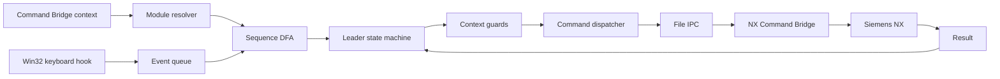

# NXKeys

[](https://github.com/Homiakus/NXkeys/actions/workflows/ci.yml)
[](https://github.com/Homiakus/NXkeys/actions/workflows/pages.yml)
[](LICENSE)
[](https://dotnet.microsoft.com/)

Клавиатурное управление Siemens NX 2512 через последовательности команд.

```text
CapsLock → действие → объект → команда → вариант
```

Примеры:

```text
CapsLock → C → F → E    Create → Feature → Extrude
CapsLock → T → F → M    Transform → Feature → Mirror
CapsLock → M → L → C    Manage → Layer → Copy
CapsLock → P → O → G    Process → Operation → Generate Toolpath
CapsLock → S → F        Select → Face
```

**Интерактивная карта:** https://homiakus.github.io/NXkeys/

> NXKeys — сторонний проект. Доступность команд зависит от роли, лицензии, локализации и активного приложения Siemens NX.

## Как это работает

`CapsLock` открывает HUD для текущего приложения NX. Дальнейшие клавиши образуют путь к команде. Внутренний префикс модуля добавляется автоматически.

HUD показывает доступные продолжения в **3 колонки**. Команды другого модуля не выполняются.

Часто используемые команды могут иметь короткие пути:

```text
C F E    Extrude
C E      короткий путь к Extrude

E E B    Edge Blend
E B      короткий путь к Edge Blend
```

Короткий и полный путь вызывают одну команду и используют одинаковые проверки безопасности.

## Управление

| Клавиша | Действие |
|---|---|
| `CapsLock` | Открыть HUD |
| Буква или цифра | Перейти по ветви или выполнить команду |
| `Space` | Поиск по командам активного модуля |
| `Enter` | Выполнить найденную команду или подтвердить опасную операцию |
| `Backspace` | Сбросить текущий ввод |
| `Esc` | Закрыть HUD |
| `Tab` / `Shift+Tab` | Переключить модуль вручную |
| Двойной `CapsLock` | Закрепить HUD |

Поиск учитывает название, `BUTTON ID`, путь, модуль и поисковые псевдонимы.

## Мнемонические категории

Первая клавиша задаёт действие:

| Клавиша | Категория | Значение |
|---|---|---|
| `C` | Create | создать или добавить |
| `E` | Edit | изменить |
| `T` | Transform | переместить, отразить, размножить |
| `X` | Remove | удалить, убрать, подавить |
| `P` | Process | рассчитать, сгенерировать, решить |
| `I` | Inspect | измерить, проверить, проанализировать |
| `V` | View | показать, скрыть, ориентировать |
| `S` | Select | выбрать или задать фильтр |
| `A` | Annotate | размеры, PMI, символы, примечания |
| `M` | Manage | навигаторы, слои, материалы, библиотеки |
| `F` | File | файловые операции |
| `G` | Go | переход между приложениями NX |
| `U` | Utilities | выражения, журналы, настройки |
| `H` | Help | справка, поиск, диагностика |

Вторая клавиша обычно задаёт объект:

| Клавиша | Объект | Клавиша | Объект |
|---|---|---|---|
| `A` | Annotation | `B` | Body / Base |
| `C` | Component | `D` | Dimension / Datum |
| `E` | Edge | `F` | Feature |
| `G` | Geometry / Curve | `H` | Sheet Metal |
| `K` | Constraint | `L` | Layer |
| `M` | Material / Mold | `N` | Simulation |
| `O` | CAM Operation | `P` | Part |
| `R` | Routing | `S` | Sketch |
| `T` | Tool / Template | `U` | Surface |
| `V` | View | `W` | WAVE |
| `Y` | Assembly | `Z` | Other |

Полный список путей: [docs/MNEMONIC_COMMAND_LANGUAGE.md](docs/MNEMONIC_COMMAND_LANGUAGE.md).

## Поддерживаемые модули

```text
modeling       sketch          assembly       drafting
pmi            surface         sheet_metal    manufacturing
simulation     routing         mold           reuse
inspect_view   selection_object
```

Command Bridge передаёт приложению NXKeys:

- активное приложение NX;
- наличие Work Part и Display Part;
- типы и количество выбранных объектов;
- наличие модального окна;
- ревизию контекста;
- состояние последней команды.

По этим данным выбирается профиль текущего модуля.

## Безопасность

Перед выполнением команды проверяются:

- актуальность контекста;
- активный модуль;
- наличие рабочей и отображаемой детали;
- отсутствие блокирующего диалога;
- типы и количество выбранных объектов;
- доступность `BUTTON ID`;
- необходимость подтверждения.

Команды с `requires_selection` не выполняются без подходящего выбора. Разрушительные операции требуют `Enter`.

Если результат запроса нельзя определить, команда получает состояние `interrupted_unknown` и не повторяется автоматически.

## Установка

### Требования

- Windows 10 или Windows 11 x64;
- Siemens NX или Designcenter NX 2512;
- .NET 8 SDK x64;
- `NXOpen.dll` и `NXOpenUI.dll` из установки NX;
- права записи в `%LOCALAPPDATA%\NXKeys`.

### Развёртывание

Закройте Siemens NX и выполните в PowerShell из корня репозитория:

```powershell
powershell -NoProfile -ExecutionPolicy Bypass -File .\install-nx-ribbon-buttons.ps1 `
  -Clean `
  -NxRoot "C:\Program Files\Siemens\NX2512"
```

Для Designcenter NX:

```powershell
powershell -NoProfile -ExecutionPolicy Bypass -File .\install-nx-ribbon-buttons.ps1 `
  -Clean `
  -NxRoot "C:\Program Files\Siemens\DesigncenterNX2512"
```

Запуск:

```cmd
%LOCALAPPDATA%\NXKeys\managed\NX2512.6000\launch-nx2512-with-nxkeys.cmd
```

Установщик собирает проекты, создаёт управляемый пакет и сохраняет резервную копию изменяемых файлов.

## Конфигурация

Основной профиль:

```text
config/nx2512-pro-hybrid.json
```

Правила автоматов и проверки безопасности:

```text
config/nx2512-state-machines.json
```

Исходный профиль schema v4 читается без ручной конвертации. При загрузке NXKeys создаёт runtime schema v5 с полями:

```text
path
path_labels
aliases
search_aliases
action
selection_type
```

Известные `BUTTON ID` получают заданные пути. Для остальных команд путь строится по действию, объекту и названию. Коллизии и конфликтующие префиксы устраняются при загрузке.

После аудита сочетаний 2026-07-28 профиль явно различает обычные NX-команды и команды выбора:

- `action: "execute_command"` отправляет `BUTTON ID` в `InvokeMenuButtonAction`;
- `action: "set_selection_filter"` включает глобальный selection-фильтр NXOpen без запуска псевдокнопки `UG_SEL_*`;
- `selection_type` задаёт ожидаемый тип выбора (`edge`, `face`, `body`, `component`, `curve`, `datum`, `feature`, `operation`, `all`, `reset`, `none`);
- primary-команды сохраняют быстрый one-key alias, а вложенные группы сохраняют submenu alias.

Подробности: [docs/CONFIGURATION.md](docs/CONFIGURATION.md).

## Архитектура


```mermaid
flowchart LR
    Keyboard[Win32 keyboard hook] --> Queue[Event queue]
    Context[Command Bridge context] --> Resolver[Module resolver]
    Resolver --> DFA[Sequence DFA]
    Queue --> DFA
    DFA --> HFSM[Leader state machine]
    HFSM --> Guards[Context guards]
    Guards --> Dispatch[Command dispatcher]
    Dispatch --> IPC[File IPC]
    IPC --> Bridge[NX Command Bridge]
    Bridge --> NX[Siemens NX]
    NX --> Result[Result]
    Result --> HFSM
```

| Компонент | Назначение |
|---|---|
| `NX2512_HotkeyStudio` | Перехват клавиш, HUD, CLI и установка |
| `NX2512_CommandBridge` | Плагин NX для получения контекста и запуска `BUTTON ID` |
| `NX2512_ControlCenter` | Состояние системы и диагностика |
| `NX2512_Catalog_Studio` | Извлечение команд NXOpen, UFUN и MenuScript |
| `NXKeys.Protocol` | Типы файлового IPC |
| `NXKeys.StateMachines` | DFA, HFSM и проверки контекста |
| `NXKeys.StateMachines.Tests` | Тесты автоматов и правил безопасности |

IPC-каталог:

```text
%LOCALAPPDATA%\NXKeys\bridge\
├── pending\
├── processing\
├── completed\
├── failed\
├── context.json
└── status.json
```

## CLI

```powershell
$exe = ".\NX2512_HotkeyStudio\dist\NX2512_HotkeyStudio.exe"
$config = ".\config\nx2512-pro-hybrid.json"

& $exe validate --config $config
& $exe scan --config $config --json
& $exe catalog --config $config --query "Extrude"
& $exe plan --config $config
& $exe apply --config $config --dry-run
& $exe apply --config $config --yes
& $exe health --config $config
& $exe bridge-status --config $config
& $exe backups --config $config
& $exe launch --config $config -- -nx
```

## Проверка

Проверка профиля и карты:

```powershell
node .\scripts\validate-command-tree.mjs
```

Сборка HotkeyStudio:

```powershell
dotnet build .\NX2512_HotkeyStudio\NX2512_HotkeyStudio.csproj -c Release -p:Platform=x64
```

Тесты автоматов:

```powershell
dotnet run --project .\NXKeys.StateMachines.Tests\NXKeys.StateMachines.Tests.csproj -c Release
```

CI проверяет:

- 12 базовых глобальных сочетаний;
- 14 модулей;
- уникальность путей;
- отсутствие конфликтов префиксов;
- наличие aliases, `action` и `selection_type`;
- маршрутизацию `UG_SEL_*` через `set_selection_filter`;
- DFA, HFSM и правила подтверждения;
- сборку HotkeyStudio, Control Center и Command Bridge;
- целостность профилей, IPC и документации.

## Документация

- [Интерактивная карта](https://homiakus.github.io/NXkeys/)
- [Мнемонический язык](docs/MNEMONIC_COMMAND_LANGUAGE.md)
- [Аудит сочетаний и selection-фильтров](docs/audit/11-shortcut-selection-audit.md)
- [Конфигурация](docs/CONFIGURATION.md)
- [Архитектура](docs/ARCHITECTURE.md)
- [Автоматы](docs/STATE_MACHINE_ARCHITECTURE.md)
- [Безопасность](docs/SAFETY_MODEL.md)
- [Установка](docs/INSTALLATION.md)
- [Диагностика](docs/TROUBLESHOOTING.md)

## Ограничения

CI проверяет код и контракты NXOpen по тестовым заглушкам. Реальная доступность `BUTTON ID` проверяется только в установленном Siemens NX 2512 с нужной ролью и лицензией.

Перед рабочим применением:

1. выполните `apply --dry-run`;
2. проверьте `resolution-report.md`;
3. протестируйте команды на копии детали;
4. отдельно проверьте команды с подтверждением;
5. сохраните manifest резервной копии.

## Лицензия

[MIT](LICENSE)
