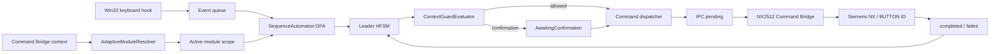

# NXKeys для Siemens NX 2512

[](https://github.com/Homiakus/NXkeys/actions/workflows/ci.yml)
[](LICENSE)
[](https://dotnet.microsoft.com/)

**NXKeys** — контекстная клавиатурная система управления Siemens NX 2512. Она заменяет сотни несвязанных горячих клавиш единым мнемоническим языком:

```text
CapsLock → действие → объект → команда → вариант
```

Вместо запоминания положения кнопки на ленте пользователь формулирует намерение:

```text
CapsLock → C → F → E    Create → Feature → Extrude
CapsLock → T → F → M    Transform → Feature → Mirror
CapsLock → M → L → C    Manage → Layer → Copy
CapsLock → P → O → G    Process → Operation → Generate Toolpath
CapsLock → S → F        Select → Face
```

NXKeys определяет активное приложение NX, показывает доступные ветви в HUD, проверяет контекст и вызывает точный `BUTTON ID` через внутрипроцессный Command Bridge.

> **Важно:** NXKeys является сторонним расширением и не относится к Siemens AG. Доступность конкретной команды зависит от установленной роли, лицензии, локализации, активного приложения NX и текущего состояния детали.

---

## Что изменилось в новой архитектуре

Ранее профиль строился вокруг позиционной сетки `QWE / A·D / ZXC`. Текущая версия использует семантические пути произвольной глубины:

- первая клавиша всегда обозначает **действие**;
- вторая — **объект или семейство**;
- следующие клавиши уточняют **команду и вариант**;
- одинаковая грамматика применяется во всех 14 контекстных модулях;
- частые операции имеют короткие aliases;
- неизвестные заранее команды получают детерминированный путь без конфликтов;
- пользователь не вводит внутренний префикс модуля — NXKeys добавляет его автоматически;
- source-профиль schema v4 автоматически мигрирует в runtime schema v5.

HUD отображает следующий уровень дерева в **3 колонки**, поэтому пользователь видит только релевантные продолжения текущего пути, а не полный каталог NX.

---

## Быстрый старт

### Требования

- Windows 10 или Windows 11 x64;
- Siemens NX / Designcenter NX 2512;
- .NET 8 SDK x64;
- доступные `NXOpen.dll` и `NXOpenUI.dll` из установки NX;
- права записи в `%LOCALAPPDATA%\NXKeys`.

### Установка

1. Закройте Siemens NX.
2. Откройте PowerShell в корне репозитория.
3. Запустите установщик:

```powershell
powershell -NoProfile -ExecutionPolicy Bypass -File .\install-nx-ribbon-buttons.ps1 `
  -Clean `
  -NxRoot "C:\Program Files\Siemens\NX2512"
```

Для Designcenter NX путь может выглядеть так:

```powershell
powershell -NoProfile -ExecutionPolicy Bypass -File .\install-nx-ribbon-buttons.ps1 `
  -Clean `
  -NxRoot "C:\Program Files\Siemens\DesigncenterNX2512"
```

4. Запустите NX через созданный launcher или ярлык:

```cmd
%LOCALAPPDATA%\NXKeys\managed\NX2512.6000\launch-nx2512-with-nxkeys.cmd
```

Установщик собирает проекты, формирует managed package, создаёт резервные копии и не изменяет системную установку NX напрямую.

---

## Как пользоваться

| Ввод | Действие |
|---|---|
| `CapsLock` | Открыть Leader HUD для активного модуля NX |
| Буква или цифра | Перейти по ветви или выполнить терминальную команду |
| `Space` | Открыть поиск внутри активного модуля |
| `Enter` | Выполнить первый результат поиска или подтвердить опасную операцию |
| `Backspace` | Вернуться на предыдущий уровень; в поиске удалить символ |
| `Esc` | Закрыть HUD и отменить текущий ввод |
| `Tab` / `Shift+Tab` | Переключиться на следующий / предыдущий модуль NX |
| Двойной `CapsLock` | Зафиксировать HUD в Sticky mode |

При работе в NX клавиша `CapsLock` используется как trigger и автоматически возвращается в выключенное состояние.

### Канонический путь и alias

У команды может быть полный обучающий путь и короткий экспертный alias:

```text
C F E    Create → Feature → Extrude
C E      alias для Extrude

E E B    Edit → Edge → Blend
E B      alias для Edge Blend
```

Alias указывает на ту же команду и наследует её guards, требования к выбору и подтверждение.

---

## Мнемонический словарь

### Действия — первая клавиша

| Клавиша | Действие | Назначение |
|---|---|---|
| `C` | Create | создать или добавить |
| `E` | Edit | изменить существующее |
| `T` | Transform | переместить, отразить, размножить |
| `X` | Remove | удалить, убрать, подавить |
| `P` | Process | рассчитать, сгенерировать, решить |
| `I` | Inspect | измерить, проверить, проанализировать |
| `V` | View | показать, скрыть, ориентировать |
| `S` | Select | выбор и фильтры |
| `A` | Annotate | размеры, PMI, символы, примечания |
| `M` | Manage | навигаторы, слои, материалы, библиотеки |
| `F` | File | файловые операции |
| `G` | Go | переход между приложениями NX |
| `U` | Utilities | выражения, журналы, настройки |
| `H` | Help | справка, поиск и диагностика |

### Объекты — вторая клавиша

| Клавиша | Объект | Клавиша | Объект |
|---|---|---|---|
| `A` | Annotation | `B` | Body / Base |
| `C` | Component | `D` | Dimension / Datum |
| `E` | Edge | `F` | Feature |
| `G` | Geometry / Curve | `H` | Sheet Metal |
| `K` | Constraint | `L` | Layer |
| `M` | Material / Mold | `N` | Simulation |
| `O` | CAM Operation | `P` | Part |
| `R` | Routing | `S` | Sketch |
| `T` | Tool / Template | `U` | Surface |
| `V` | View | `W` | WAVE |
| `Y` | Assembly | `Z` | Other |

Значение корневых клавиш не меняется между модулями. Контекст NX только определяет, какие команды доступны после выбранного действия и объекта.

---

## Примеры по модулям

| Контекст NX | Примеры путей |
|---|---|
| **Modeling** | `C S K` Sketch · `C F E` Extrude · `C F H` Hole · `E E B` Edge Blend · `T F M` Mirror |
| **Sketch** | `C G L 2` Line by Two Points · `C G R C` Center Rectangle · `C K T` Tangent · `A D R` Rapid Dimension |
| **Assembly** | `C C A` Add Component · `T C M` Move Component · `C K A` Constraint · `E C R` Replace Component |
| **Drafting** | `C V B` Base View · `C V P` Projected View · `C V S` Section View · `A P L` Parts List |
| **PMI** | `A G F` Feature Control Frame · `A G D` Datum Symbol · `A S F` Surface Finish · `I A V` Validate PMI |
| **Surface** | `C U T` Through Curves · `C U S` Swept · `E U T` Trim Sheet · `I U C` Face Curvature |
| **Sheet Metal** | `C H B` Base Tab · `C H F` Flange · `T H U` Unbend · `P H F` Flat Pattern |
| **CAM / Manufacturing** | `C O O` Create Operation · `C T T` Create Tool · `P O G` Generate Toolpath · `P O P` Postprocess |
| **CAE / Simulation** | `C N S` Create Solution · `P N M` Mesh · `P N S` Solve · `I N R` Results |
| **Routing** | `C R R` Create Route · `C R P` Place Part · `E R R` Edit Route · `I R V` Validate Route |
| **Mold Wizard** | `C M I` Initialize · `C M P` Parting · `C M B` Mold Base · `C M C` Cooling |
| **Reuse / Knowledge** | `U E X` Expressions · `C T F` Create Feature Template · `M L R` Reuse Library · `H C F` Command Finder |
| **Inspect / View** | `V F` Fit · `V T R` Trimetric · `I M` Measure · `I O B` Object Information |
| **Selection / Object** | `S B` Body · `S F` Face · `S E` Edge · `S C` Component · `S R` Reset Filter |

Отдельные общие семейства:

```text
M W L    WAVE Geometry Linker
M L C    Copy to Layer
M L M    Move to Layer
M M A    Assign Material
V M V    Visual Material Display
```

Полная карта приведена в [спецификации мнемонического языка](docs/MNEMONIC_COMMAND_LANGUAGE.md) и [интерактивной карте](docs/command-tree.html).

---

## Контекстная адаптация

Command Bridge публикует актуальный контекст NX:

- активное приложение и модуль;
- наличие Work Part и Display Part;
- количество и типы выбранных объектов;
- наличие модального диалога;
- ревизию и время обновления контекста;
- состояние IPC и результат последней команды.

По этому контексту `AdaptiveModuleResolver` выбирает один из 14 модулей:

```text
modeling       sketch          assembly       drafting
pmi            surface         sheet_metal    manufacturing
simulation     routing         mold           reuse
inspect_view   selection_object
```

Одинаковый пользовательский путь может существовать в разных модулях, поскольку область команды определяется автоматически. Исполнение команды чужого модуля блокируется.

---

## Поиск команд

Нажмите:

```text
CapsLock → Space
```

Поиск учитывает:

- название команды;
- точный `BUTTON ID`;
- русские и английские aliases;
- канонический путь;
- подписи уровней пути;
- модуль NX;
- описание и fallback;
- локальную историю использования.

`Enter` выполняет первый доступный результат. Результаты другого модуля не подмешиваются в активный контекст.

---

## Безопасность

NXKeys не отправляет команду в NX сразу после совпадения последовательности. Перед исполнением проверяются:

1. актуальность контекста и ожидаемая ревизия;
2. активный модуль NX;
3. наличие Work Part и Display Part;
4. отсутствие блокирующего модального окна;
5. количество и типы выбранных объектов;
6. доступность и чувствительность `BUTTON ID`;
7. необходимость подтверждения операции.

Команды с `requires_selection` блокируются, пока не выбран подходящий объект. Разрушительные и потенциально необратимые действия требуют `Enter`, например:

```text
E C R    Replace Component
X C R    Remove Component
P O P    Postprocess
X O D    Delete Operation
P N S    Solve
X N D    Delete Simulation Object
X R D    Delete Route Object
E T F    Replace Feature Template
```

Если завершение IPC-запроса нельзя определить однозначно, он получает статус `interrupted_unknown`; автоматический повтор такой операции запрещён.

---

## 12 базовых глобальных сочетаний

Прямые глобальные привязки намеренно ограничены. Все профессиональные команды NX должны проходить через Leader.

| Сочетание | Команда | Сочетание | Команда |
|---|---|---|---|
| `Ctrl+N` | New | `Ctrl+X` | Cut |
| `Ctrl+O` | Open | `Ctrl+C` | Copy |
| `Ctrl+S` | Save | `Ctrl+V` | Paste |
| `Ctrl+Shift+S` | Save As | `Delete` | Delete |
| `Ctrl+Z` | Undo | `Ctrl+F` | Fit |
| `Ctrl+Y` | Redo | `F5` | Refresh |

`BasicShortcutPolicy` запрещает добавлять другие прямые глобальные привязки в канонический профиль.

---

## Конфигурация и schema v5

Основной source-профиль:

```text
config/nx2512-pro-hybrid.json
```

Он остаётся совместимым со schema v4. При загрузке NXKeys:

1. читает legacy-поля `slot`, `submenu_key` и `input_key`;
2. применяет точные сопоставления для известных `BUTTON ID`;
3. генерирует путь для остальных команд профиля;
4. разрешает коллизии и prefix-конфликты;
5. добавляет aliases и поисковые термины;
6. строит DFA-последовательности;
7. переводит модель в runtime schema v5.

Пример команды schema v5:

```json
{
  "command": {
    "id": "UG_MODELING_EXTRUDED_FEATURE",
    "name": "Extrude"
  },
  "path": ["C", "F", "E"],
  "path_labels": ["Create", "Feature", "Extrude"],
  "aliases": [["C", "E"]],
  "search_aliases": ["extrude", "выдавливание", "вытянуть"],
  "requires_selection": false,
  "destructive": false,
  "confirm_before_execute": false,
  "icon_hint": "feature"
}
```

Политики guards и подтверждений находятся в:

```text
config/nx2512-state-machines.json
```

Подробное описание: [docs/CONFIGURATION.md](docs/CONFIGURATION.md).

---

## Покрытие каталога NX

`NX2512_Catalog_Studio` инвентаризирует фактическую установку NX и экспортирует:

- UI/MenuScript `BUTTON ID`;
- публичные типы и методы NXOpen;
- Builder, Collection, Manager и Service entry points;
- Open C / UFUN-функции из `uf_*.h`;
- эвристические связи UI-команд с API.

В генераторе присутствует более 150 точных мнемонических сопоставлений для ключевых команд. Для остальных команд, уже добавленных в профиль из фактического каталога установки, путь строится детерминированно по действию, объекту и значимой букве названия.

NXKeys не создаёт исполняемую команду без реального `BUTTON ID`. Полного универсального списка для всех установок NX не существует: состав зависит от лицензий, роли, локализации и пользовательских MenuScript-расширений.

---

## Архитектура


```mermaid
flowchart LR
    Keyboard[Win32 keyboard hook] --> Queue[Event queue]
    Context[Command Bridge context] --> Resolver[AdaptiveModuleResolver]
    Resolver --> Scope[Active module scope]
    Queue --> DFA[SequenceAutomaton DFA]
    Scope --> DFA
    DFA --> HFSM[Leader HFSM]
    HFSM --> Guards[ContextGuardEvaluator]
    Guards -->|confirmation| Confirm[AwaitingConfirmation]
    Guards -->|allowed| Dispatch[Command dispatcher]
    Confirm --> Dispatch
    Dispatch --> Pending[IPC pending]
    Pending --> Bridge[NX2512 Command Bridge]
    Bridge --> NX[Siemens NX / BUTTON ID]
    NX --> Result[completed / failed]
    Result --> HFSM
```

### Основные компоненты

| Компонент | Назначение |
|---|---|
| `NX2512_HotkeyStudio` | Win32 hook, Leader HUD, CLI, миграция профиля и deployment |
| `NX2512_CommandBridge` | Внутрипроцессный C#-плагин NX, экспорт контекста и выполнение `BUTTON ID` |
| `NX2512_ControlCenter` | Панель состояния, диагностики и покрытия команд |
| `NX2512_Catalog_Studio` | Извлечение каталога UI, NXOpen и UFUN |
| `NXKeys.Protocol` | Контракты файлового IPC |
| `NXKeys.StateMachines` | DFA, HFSM, guards и fallback-политики |
| `NXKeys.StateMachines.Tests` | Инварианты автоматов и safety-тесты |

### IPC-каталог

```text
%LOCALAPPDATA%\NXKeys\bridge\
├── pending\       новые запросы
├── processing\    запросы, принятые Bridge
├── completed\     успешно выполненные запросы
├── failed\        отклонённые и аварийные запросы
├── context.json   текущий контекст NX
└── status.json    состояние Bridge
```

---

## CLI

```powershell
$exe = ".\NX2512_HotkeyStudio\dist\NX2512_HotkeyStudio.exe"
$config = ".\config\nx2512-pro-hybrid.json"

# Проверить профиль
& $exe validate --config $config

# Просканировать конфигурацию и установку
& $exe scan --config $config --json

# Найти BUTTON ID
& $exe catalog --config $config --query "Extrude"

# Сформировать план установки
& $exe plan --config $config

# Проверить установку без изменения файлов
& $exe apply --config $config --dry-run

# Применить установку
& $exe apply --config $config --yes

# Проверить состояние системы и Bridge
& $exe health --config $config
& $exe bridge-status --config $config

# Резервные копии и восстановление
& $exe backups --config $config
& $exe restore --config $config --manifest "...\manifest.json"

# Запустить интеграцию с NX
& $exe launch --config $config -- -nx
```

---

## Проверка и CI

Локальная структурная проверка:

```powershell
node .\scripts\validate-command-tree.mjs
```

Сборка HotkeyStudio:

```powershell
dotnet build .\NX2512_HotkeyStudio\NX2512_HotkeyStudio.csproj `
  -c Release `
  -p:Platform=x64
```

Тесты автоматов:

```powershell
dotnet run --project .\NXKeys.StateMachines.Tests\NXKeys.StateMachines.Tests.csproj `
  -c Release
```

GitHub Actions проверяет:

- JSON-профили и мнемоническую карту;
- ровно 12 базовых сочетаний и 14 модулей;
- точные `BUTTON ID` и известные мнемонические сопоставления;
- отсутствие duplicate и prefix-конфликтов;
- DFA/HFSM, guards и подтверждение опасных операций;
- сборку и publish HotkeyStudio и Control Center;
- Command Bridge против NXOpen contract stubs;
- IPC, deployment и documentation invariants.

---

## Структура репозитория

```text
NXkeys/
├── config/                         профили команд и guards
├── docs/                           архитектура, установка и карта команд
├── scripts/                        валидаторы и служебные сценарии
├── NX2512_HotkeyStudio/            Leader HUD, CLI и deployment
├── NX2512_CommandBridge/           плагин Siemens NX
├── NX2512_CommandBridge.Tests/     NXOpen contract stubs
├── NX2512_ControlCenter/           панель управления
├── NX2512_Catalog_Studio/          инвентаризация команд NX
├── NXKeys.Protocol/                IPC-контракты
├── NXKeys.StateMachines/           DFA/HFSM и guards
└── NXKeys.StateMachines.Tests/     автоматизированные проверки
```

---

## Документация

- [Мнемонический язык и полная карта сочетаний](docs/MNEMONIC_COMMAND_LANGUAGE.md)
- [Интерактивная карта команд](docs/command-tree.html)
- [Конфигурация schema v5](docs/CONFIGURATION.md)
- [Архитектура системы](docs/ARCHITECTURE.md)
- [Архитектура автоматов](docs/STATE_MACHINE_ARCHITECTURE.md)
- [Модель безопасности](docs/SAFETY_MODEL.md)
- [Установка](docs/INSTALLATION.md)
- [Диагностика](docs/TROUBLESHOOTING.md)
- [Оглавление документации](docs/README.md)

---

## Ограничения интеграционной проверки

CI подтверждает корректность C#-контрактов, миграции schema v5, автоматов, IPC и сборки Command Bridge против NXOpen stubs. Окончательная доступность конкретного `BUTTON ID` проверяется только внутри целевой установки Siemens NX 2512 с нужной лицензией и ролью.

Перед промышленным применением:

1. выполните `apply --dry-run`;
2. проверьте `resolution-report.md`;
3. протестируйте команды на копии детали;
4. отдельно подтвердите destructive-команды;
5. сохраните созданный backup manifest.

---

## Лицензия

[MIT](LICENSE)
