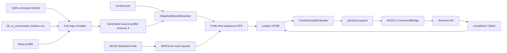

# Архитектура NXKeys

## Цель

NXKeys предоставляет устойчивый клавиатурный слой для Siemens NX 2512:

- 12 системных действий остаются прямыми сочетаниями;
- профессиональные команды вызываются через контекстный Leader;
- базовый профиль содержит проверенные ручные команды;
- полная карта содержит 1169 намерений в 32 разделах;
- исполняемые `BUTTON ID` разрешаются из каталога конкретной установки NX.

## Поток данных



## Профили и источники данных

### Базовый профиль

`config/nx2512-pro-hybrid.json` содержит:

- 12 базовых ускорителей;
- 14 модулей;
- curated primary-команды;
- известные `BUTTON ID`;
- ручные пути и aliases;
- deployment и Leader settings.

### Полная карта

`config/full-command-map/` содержит 1169 намерений команд. Каждое намерение имеет стабильный ID, раздел, группу, `K1–K5`, русское/английское имя, целевой модуль и path hint.

`scripts/compile-full-command-map.mjs` объединяет базовый профиль, полный слой намерений, runtime probe и экспорт Catalog Studio. Результат:

```text
config/nx2512-pro-full.generated.json
docs/generated/full-command-resolution.md
```

Команда без надёжного реального ID остаётся отключённой.

## Runtime schema

Профиль на диске сохраняется как source schema 4. HotkeyStudio мигрирует его в runtime schema 5 и строит:

- канонические `path`;
- `path_labels`;
- безопасные aliases;
- `search_aliases`;
- `action`;
- `selection_type`;
- производные `LeaderSequenceItem`.

Производные последовательности не являются отдельным редактируемым источником истины.

## Адаптивное разрешение модуля

`AdaptiveModuleResolver` использует:

1. `module_id` Bridge;
2. `module_label`;
3. `application_id`;
4. `nx_application_ids` профиля;
5. ручное переключение `Tab`/`Shift+Tab` как контролируемый fallback.

При устаревшем или недостоверном контексте набор не активируется. При смене приложения открытый HUD перестраивается.

## Многоуровневый DFA

Внутренняя последовательность состоит из префикса модуля и 2–5 токенов пользовательского пути.

```text
Пользователь: CapsLock → C → F → E
Внутри DFA:  M → C → F → E
```

Пути внутри каждого модуля:

- уникальны после нормализации;
- не являются префиксами других путей;
- могут иметь безопасные aliases;
- могут повторяться в другом модуле, потому что scope задаёт активный контекст.

Legacy primary-grid `QWE/A·D/ZXC` остаётся слоем быстрых aliases, но модуль больше не ограничен восемью командами.

## HFSM

```text
Idle
  → Root
  → Prefix
  → Search
  → AwaitingConfirmation
  → Dispatching
  → AwaitingResult
  → Idle | Root(sticky) | Failed
```

`SwitchingModule` используется только для явной смены приложения. Keyboard hook помещает события в очередь; бизнес-состояние меняется последовательно в UI event loop.

## Guards

До dispatch проверяются:

- свежесть, revision и confidence контекста;
- текущий модуль и приложение;
- interaction state и modal dialog;
- Work Part и Display Part;
- selection count и selected types;
- `selection_type`;
- destructive confirmation;
- срок действия запроса.

Bridge повторяет критические проверки перед вызовом NX.

## Selection routing

Обычная команда:

```text
action = execute_command
```

Selection-фильтр:

```text
action = set_selection_filter
selection_filter = edge | face | body | component | ...
```

`UG_SEL_*` используются для трассировки, но не вызываются как обычные menu buttons. Bridge применяет `NXOpen.Select.FilterMember`.

## IPC и очередь

```text
pending → processing → completed | failed
```

Гарантии:

- атомарная запись и claim;
- уникальный `request_id`;
- request expiry;
- at-most-once для потенциально разрушительных операций;
- `interrupted_unknown` без автоматического повтора;
- общий protocol schema 3.

## Deployment

```text
validate
→ plan
→ staging
→ SHA-256 verification
→ backup
→ atomic commit
→ package manifest
→ health check
→ rollback on failure
```

Пакет подключается через отдельный `UGII_CUSTOM_DIRECTORY_FILE`, не изменяет системные файлы Siemens, глобальный `PATH` и `UGII_USER_DIR`.

## Границы компонентов

| Компонент | Ответственность |
|---|---|
| `NX2512_HotkeyStudio` | Profile runtime, HUD, Leader, CLI и deployment |
| `MnemonicPathGenerator` | Пути известных и базовых команд |
| Full-map compiler | 1169 намерений, каталог NX и отчёт разрешения |
| `AdaptiveModuleResolver` | Выбор активного модуля |
| `NXKeys.StateMachines` | DFA, HFSM, guards и policy |
| `NXKeys.Protocol` | Общие JSON DTO schema 3 |
| `NX2512_CommandBridge` | Контекст, selection filters и NX UI invocation |
| `NX2512_ControlCenter` | Наблюдение, поиск и диагностика |
| `NX2512_Catalog_Studio` | Каталог UI/NXOpen/UFUN и crosswalk |

## Инварианты

- ровно 12 прямых системных сочетаний;
- 14 контекстных модулей базового профиля;
- 1169 исходных намерений и 32 раздела полной карты;
- включённая команда всегда имеет точный `BUTTON ID`;
- пути и aliases внутри модуля prefix-free;
- команда другого модуля не исполняется скрытно;
- destructive-команда не минует подтверждение;
- неизвестно завершившийся запрос не повторяется;
- deployment изменяет только управляемые файлы.
