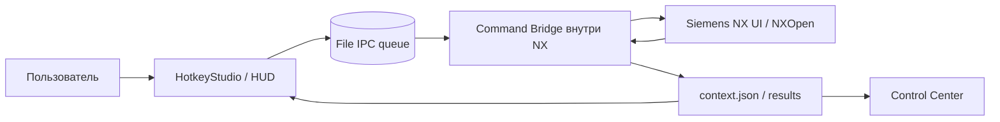
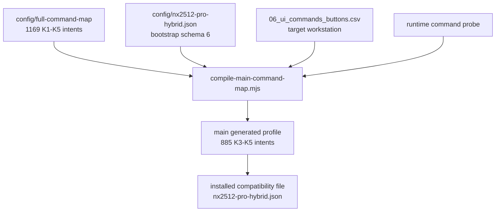
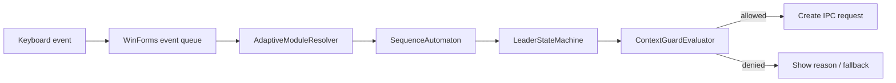
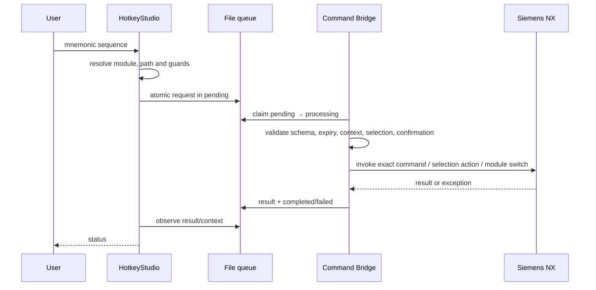
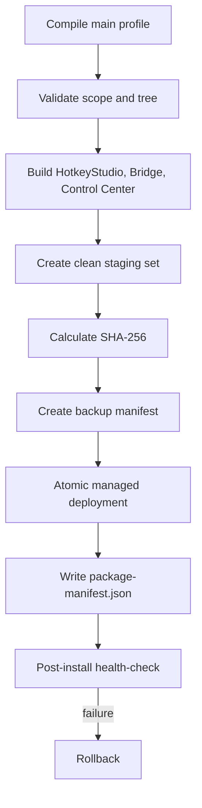

# Архитектура NXKeys

## Назначение системы

NXKeys преобразует контекстную мнемоническую последовательность пользователя в проверенный запрос к точной UI-команде Siemens NX.

Главный runtime scope содержит 885 уникальных намерений K3–K5. Полный source catalog содержит 1169 намерений K1–K5. Команда исполняется только при наличии подтверждённого `BUTTON ID` и прохождении контекстных guards.

## Контекст и границы

NXKeys состоит из desktop-приложений, генераторов профиля и NXOpen-библиотеки, загружаемой в процесс NX. Сетевого API или центрального сервера в текущей архитектуре нет.



Границы доверия:

1. **Пользовательский ввод** — намерение, но не разрешение на произвольный command ID.
2. **Профиль** — конфигурация, которую необходимо валидировать.
3. **Файловая очередь** — транспорт, содержимое которого Bridge повторно проверяет.
4. **Command Bridge** — последняя защитная граница перед NX.
5. **Siemens NX** — фактический источник availability, sensitivity, лицензии и результата команды.

## Карта компонентов

| Компонент | Ответственность | Не отвечает за |
|---|---|---|
| `NX2512_HotkeyStudio` | UI, tray, keyboard hook, HUD, поиск, CLI, profile loading, state-machine orchestration, deployment client | доказательство наличия команды в конкретной лицензии NX |
| `NX2512_CommandBridge` | context snapshot, queue claim, validation, selection actions, module switch, точный UI command invocation | проектирование mnemonic path и каталог намерений |
| `NX2512_ControlCenter` | диагностика profile coverage, Bridge, context и локальной статистики | изменение NXOpen integration |
| `NX2512_Catalog_Studio` | экспорт фактических UI commands и NXOpen candidates | доказательство семантической эквивалентности UI→API |
| `NXKeys.Protocol` | общий JSON contract schema 3 | business guards и deployment |
| `NXKeys.StateMachines` | DFA/HFSM, confirmation, timeout и guard evaluation | discovery NX installations |
| Node.js compilers | выбор K3–K5, ID resolution, path allocation и reports | runtime execution |
| `DeploymentEngine` | staging, backup, manifest, atomic commit, health и rollback | обновление загруженной DLL без restart NX |

## Слои профиля



### Intent catalog

`config/full-command-map/` содержит функцию, частоту, source section/group, языковые имена, target module и path hint. Он не является напрямую исполняемым.

### Bootstrap

`config/nx2512-pro-hybrid.json` задаёт:

- profile/scan/deployment settings;
- 12 basic shortcuts;
- 14 modules;
- known IDs и curated commands;
- workflow controls;
- Leader settings;
- safety defaults.

### Generated main profile

`config/nx2512-pro-main.generated.json` создаётся для K3/K4/K5 и включает resolution metadata. Статусы:

- `existing` — exact ID из bootstrap;
- `resolved` — надёжное соответствие из target catalog;
- `ambiguous` — несколько кандидатов, команда disabled;
- `unresolved` — ID не найден, команда disabled.

### Installed profile

Installer копирует generated main profile в managed package под compatibility filename `nx2512-pro-hybrid.json`. Поэтому одинаковое имя в source tree и managed root обозначает разные стадии жизненного цикла.

Подробное решение: [ADR-0001](adr/0001-profile-layers.md).

## Версии контрактов

| Контракт | Версия | Источник истины |
|---|---:|---|
| source/runtime profile schema | 6 | `ConfigRuntimeV5.cs` |
| minimum accepted profile schema | 3 | `ConfigRuntimeV5.cs` и installer |
| IPC schema | 3 | `NxProtocol.cs` |
| `full_command_catalog` schema | 2 | profile compiler/output |
| source sequence policy | 7 | `scripts/sequence-policy.mjs` |
| MenuScript | 139 | `MenuScriptDefaults` |
| toolbar MenuScript | 170 | `MenuScriptDefaults` |

Checked-in generated reports могут отражать предыдущую sequence policy до regeneration. Source policy имеет приоритет.

## Мнемонический ввод

Пользователь вводит 2–5 токенов после `CapsLock`. Внутренний module prefix добавляется runtime автоматически.



Пути и aliases должны быть prefix-free внутри модуля. Одинаковый пользовательский путь допустим в разных модулях, поскольку внутренние prefixes различаются.

Частотные цели текущей policy:

- K5 — не более 2 токенов;
- K4 — не более 3;
- K3 — не более 4;
- K2/K1 — до 5;
- support commands — 2.

Универсальные selection paths:

```text
SB Body       SF Face       SE Edge       ST Feature
SC Component  SU Curve      SD Datum      SR Reset
SA Select All SN Deselect All
```

Module switches используют `G*` и не добавляются в Sketch.

## State machines

`SequenceAutomaton` реализует trie/DFA путей. `LeaderStateMachine` управляет interaction lifecycle:

```text
Idle → Root → Prefix/Search
              ↓
     AwaitingConfirmation
              ↓
         Dispatching
              ↓
         AwaitingResult
              ↓
        Idle или Root
```

Смена приложения использует отдельное состояние `SwitchingModule` и считается успешной после нового подтверждённого context revision.

Подробности: [STATE_MACHINE_ARCHITECTURE.md](STATE_MACHINE_ARCHITECTURE.md).

## Исполнение команды



Обычная command row не исполняется, если точный ID отсутствует. Selection filters используют `set_selection_filter`; module switches используют `switch_module`.

## IPC и надёжность

IPC root:

```text
%LOCALAPPDATA%\NXKeys\bridge
```

Очередь:

```text
pending → processing → completed | failed
```

Request имеет уникальный ID, created/expiry timestamps и expected context fields. Bridge атомарно получает ownership через переход в `processing`.

Если NX завершился после claim, невозможно доказать, была ли команда выполнена. Такой request получает `interrupted_unknown` и не повторяется автоматически. Это at-most-once recovery, а не exactly-once guarantee.

Подробное решение: [ADR-0002](adr/0002-file-queue-at-most-once.md).

## Контекст NX

Bridge публикует:

- application и module;
- selection count/state/types;
- Work Part и Display Part availability;
- modal dialog и active command;
- confidence;
- semantic revision;
- last request/result/message;
- update timestamp.

Heartbeat без семантического изменения не должен создавать новую revision. Dispatch сравнивает expected revision и другие expectations повторно внутри Bridge.

## Разрешение UI-команд

Compiler объединяет:

1. exact IDs bootstrap;
2. target `06_ui_commands_buttons.csv`;
3. runtime probe;
4. имена, aliases и synonyms;
5. module-aware scoring.

Similarity score используется только для поиска кандидатов. Он не является достаточным основанием для включения неоднозначной команды.

## Deployment



Основные границы:

- managed files устанавливаются в `%LOCALAPPDATA%\NXKeys`;
- Bridge размещается в `custom/application`, не в `custom/startup`;
- launcher не переопределяет глобальные `PATH` и `UGII_USER_DIR`;
- existing `UGII_CUSTOM_DIRECTORY_FILE` изменяется только ограниченным способом и с backup;
- удаляются только ранее управляемые files;
- загруженная Bridge DLL требует restart NX.

## Build architecture

- HotkeyStudio и Control Center собираются на GitHub-hosted Windows runner.
- State-machine tests не требуют NX.
- Command Bridge компилируется в CI против NXOpen contract stubs.
- Production Bridge и Catalog Studio собираются против реальных NXOpen DLL целевой установки.
- Contract build подтверждает форму API, но не runtime compatibility.

## Расширение

### Новая command row

Необходимо определить intent, frequency, module, path, resolution source, selection/confirmation semantics и tests.

### Новый модуль

Требуются уникальные `id` и internal prefix, application IDs, switch command, command sets, resolver mapping, policy guards, tests, support-command generation и docs.

### Новое IPC действие

Требуется согласованное изменение shared protocol, validation обеих сторон, schema decision, tests, API docs и recovery semantics.

### Новая deployment target

Требуется явная trust boundary, package manifest behavior, backup/rollback strategy и отсутствие записи вне managed ownership.

## Известные ограничения

- runtime integration зависит от proprietary NXOpen и конкретной лицензии;
- checked-in target catalog не может доказать доступность на другой workstation;
- UI automation чувствительна к application/modal state;
- generated profile может быть большим из-за global duplication;
- coverage 885 измеряется уникальными `catalog_refs`, а не количеством module rows;
- current source содержит отдельные устаревшие schema v4 strings в error messages — это технический долг, не контракт;
- telemetry централизованно не собирается; диагностика локальная.

## Инварианты

CI и validators должны подтверждать:

- 1169 source intents и точное K1–K5 распределение;
- main scope ровно 885 K3–K5;
- отсутствие K1/K2 references в main;
- 12 basic shortcuts и 14 modules;
- prefix-free canonical paths и aliases;
- enabled command имеет ID;
- destructive request требует confirmation;
- IPC schema 3 round-trip;
- state-machine transitions и expiry;
- contract build HotkeyStudio, Control Center и Bridge;
- deployment не выходит за managed boundaries.

Фактическое выполнение критичных команд подтверждается только runtime-тестом в целевой NX.
