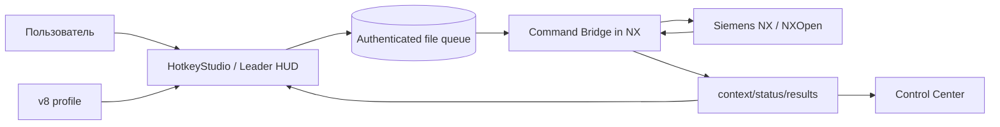
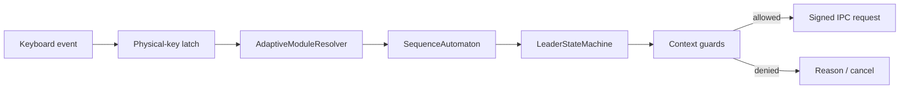
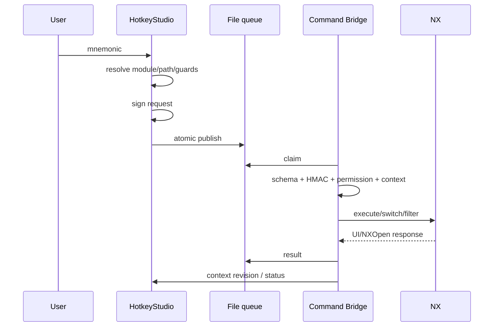
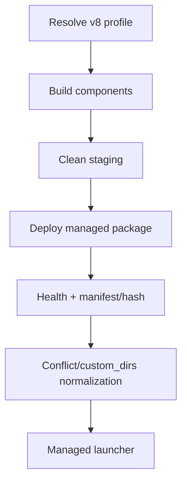

# Архитектура NXKeys v8

NXKeys преобразует контекстный клавиатурный ввод в проверенный запрос к Siemens NX 2512. Current runtime строится вокруг profile schema **8**, adaptive module resolution, authenticated file IPC schema **4** и Command Bridge внутри процесса NX.

Канонический runtime contract: [RUNTIME_V8.md](RUNTIME_V8.md).

## Компоненты



| Компонент | Ответственность |
|---|---|
| `NX2512_HotkeyStudio` | profile loading, adaptive module, Leader/HUD, keyboard hook, DFA/HFSM, CLI, deployment client |
| `NX2512_CommandBridge` | context, authenticated request admission, command dispatch, module switch, selection actions, Selection Intent `0…4` |
| `NXKeys.Protocol` | IPC schema 4, request/context/result models, HMAC/session/permission contract |
| `NXKeys.StateMachines` | sequence DFA, Leader lifecycle, guards/confirmation/timeouts |
| `NX2512_ControlCenter` | диагностика profile/runtime/Bridge |
| `NX2512_Catalog_Studio` | экспорт фактических NX UI commands и API candidates |
| `install-nxkeys.ps1` / deployment services | build, staging, managed install, backup, health, conflict cleanup |

## Версии контрактов

| Контракт | Версия |
|---|---:|
| profile | **8** |
| minimum readable profile | **3** |
| IPC | **4** |
| sequence policy | **8** |
| MenuScript | 139 |
| toolbar MenuScript | 170 |

Источники истины: `ConfigRuntimeV5.cs`, `NxProtocol.cs`, `sequence-policy.mjs`.

## Profile architecture

### Current source

```text
config/nx2512-v8-profile.json
```

V8 operation row состоит из:

```text
operation_id
command_name
paths.direct
paths.workspace_key
paths.leader
paths.secondary_aliases
adapter.kind/value/status
availability.applications/requires_work_part/blocked_in_text_input
```

После загрузки v8 operations переводятся в normalized runtime modules/sequences и permission model.

### Fallback

Если profile JSON не найден, `Config.Load` создаёт hardcoded v8 configuration, применяет defaults и validation. CI проверяет этот no-profile path отдельно.

### Legacy/catalog pipeline

`config/full-command-map/`, `nx2512-pro-hybrid.json`, generated K3–K5 profile и Node compiler остаются для catalog coverage, resolution, audits и compatibility. Исторический generated main profile выбирал **885** K3–K5 intents. Это analytical/compatibility architecture, а не current v8 runtime scope. Installer без `-ConfigPath` этот generated profile не выбирает как основной runtime profile.

## Adaptive module resolution

HotkeyStudio получает текущий NX application/context от Bridge. Resolver сначала использует exact module/application mappings и только затем эвристики label/initial.

Это защищает от коллизий вроде:

```text
Sketch
Sheet Metal
Surface
Simulation
```

Внутренний module prefix добавляется автоматически. Пользователь его не вводит.

## Leader и sequence DFA



Ключевые v8 свойства:

- path может быть однотокенным;
- aliases участвуют в реальном routing;
- paths должны оставаться prefix-free внутри runtime module;
- `workspace_key` не проецируется в root без workspace-state;
- CapsLock autorepeat блокируется physical latch до `key-up`.

### Modeling Manage

Пользовательский путь:

```text
M → L → S
```

Внутренняя sequence включает скрытый Modeling prefix, поэтому diagnostic DFA может показывать дополнительный `M`.

### Sketch

Frequent Sketch operations однотокенные (`L`, `R`, `C`, `A`, `T`), constraints используют `K → …`, dimensions — `D → …`, variants — `C → V → …`.

## Selection: два независимых уровня

### Type filter через Leader

```text
S→B body  S→F face  S→E edge  S→T feature
S→C component  S→U curve  S→D datum
S→R reset  S→A all  S→N none
```

### Selection Intent `0…4`

In-process Bridge hook задаёт распространение выбора:

```text
0 reset
1 single
2 connected/chain
3 tangent
4 inferred path/region boundary
```

Handler активируется только при NX foreground и подходящем collector/seed. Детали: [SELECTION_INTENT.md](SELECTION_INTENT.md).

## Sheet Metal canonicalization

Current NX2512 command namespace:

```text
UG_APP_SBSM
UG_SBSM_*
```

Runtime/security нормализуют старые `UG_APP_SHEETMETAL` и `UG_SHEET_METAL_*` для compatibility. Permission key строится уже по canonical command/application IDs.

## Authenticated IPC

Root:

```text
%LOCALAPPDATA%\NXKeys\bridge
```

Lifecycle:

```text
pending → processing → completed | failed
```

Schema 4 request включает session/security fields и context expectations. Managed launcher создаёт ephemeral session secret; HotkeyStudio подписывает requests HMAC-SHA-256, Bridge проверяет подпись, source process, anti-replay state, profile digest/permission и runtime context.

Файл queue сам по себе **не даёт права** на command execution.

At-most-once recovery сохраняется: request, оставшийся в `processing`, не retry-ится автоматически и переходит в `interrupted_unknown`.

## Dispatch pipeline



## Interactive command caveat

Bridge invokes UI commands through NX APIs including `DialogTester.InvokeMenuButtonAction`. Для части интерактивных commands `false` может требовать дополнительной live-NX интерпретации; contract build не доказывает, что диалог не открылся.

Поэтому фактический UI result подтверждается integration test на target NX, а не только return value/stub build.

## Deployment architecture



Current installed profile:

```text
%LOCALAPPDATA%\NXKeys\managed\NX2512.6000\nx2512-v8-profile.json
```

Bridge размещается в `custom/application`. Обновление загруженной DLL требует полного restart NX.

## Trust boundaries

1. keyboard intent — не command authority;
2. profile — валидируемая policy/configuration;
3. queue — недоверенный transport;
4. HMAC/session/profile permission — admission controls;
5. Bridge — последняя NXKeys boundary;
6. Siemens NX — фактический источник availability/sensitivity/effect.

## Что проверяется без NX

CI подтверждает:

- v8 profile/schema invariants;
- aliases/workspace-root behavior;
- state machines/protocol/security tests;
- hardcoded fallback;
- Sheet Metal canonicalization permissions;
- desktop builds;
- Bridge compile against NXOpen contract stubs;
- documentation/generated invariants.

## Что требует target NX

- загрузка production Bridge;
- точная чувствительность `BUTTON ID`;
- лицензии и roles;
- module mapping конкретной workstation;
- Selection Intent behavior в реальных collectors;
- interactive dialog invocation;
- destructive command effect.

## Исторические документы

Старые audit/build snapshots могут содержать schema 6, IPC 3, policy 7 и модель generated K3–K5 как main runtime. Они сохраняются как historical evidence, но не определяют current architecture.