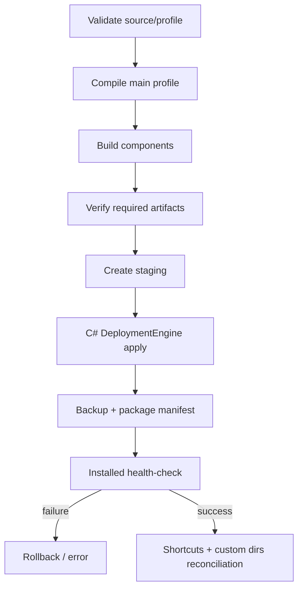

# Установка и обновление NXKeys

## Результат установки

Стандартный installer:

1. проверяет source catalog и профиль;
2. компилирует main K3–K5 profile из 885 намерений;
3. собирает HotkeyStudio, Command Bridge и Control Center;
4. формирует чистый staging-набор;
5. выполняет managed deployment с backup и manifest;
6. запускает post-install health-check;
7. создаёт launcher и ярлыки, если это не отключено.

Каноническая точка входа:

```text
install-nxkeys.ps1
```

Другие wrapper-скрипты не считаются поддерживаемым способом полной установки.

## Требования

- Windows 10/11 x64;
- Siemens NX или Designcenter NX 2512;
- .NET 8 SDK x64;
- Node.js 20 или новее;
- PowerShell 5.1 или PowerShell 7;
- `NXOpen.dll` и `NXOpenUI.dll` целевой установки;
- права записи в `%LOCALAPPDATA%\NXKeys`;
- экспорт Catalog Studio с `06_ui_commands_buttons.csv` — рекомендуется для production.

Проверьте инструменты:

```powershell
dotnet --list-sdks
node --version
$PSVersionTable.PSVersion
```

## Подготовка каталога NX

Catalog Studio должен выполняться на целевой или эквивалентной workstation NX. В export directory требуется:

```text
06_ui_commands_buttons.csv
```

Дополнительные CSV используются Control Center/API Explorer, но installer проверяет именно наличие `06_ui_commands_buttons.csv` при переданном `-CatalogDir`.

Роль, локализация, лицензии и корпоративные MenuScript-расширения могут менять доступные IDs. Не используйте старый export после значимого изменения окружения.

## Рекомендуемая установка

Рабочая директория — корень репозитория. Закройте NX.

### Siemens NX

```powershell
.\install-nxkeys.ps1 `
  -CatalogDir "D:\NX2512_Catalog_Output" `
  -NxRoot "C:\Program Files\Siemens\NX2512" `
  -Clean
```

### Designcenter NX

```powershell
.\install-nxkeys.ps1 `
  -CatalogDir "D:\NX2512_Catalog_Output" `
  -NxRoot "C:\Program Files\Siemens\DesigncenterNX2512" `
  -Clean
```

При нестандартном layout передайте точный NXOpen DLL:

```powershell
.\install-nxkeys.ps1 `
  -CatalogDir "D:\NX2512_Catalog_Output" `
  -NxOpenDll "D:\Siemens\NX2512\NXBIN\managed\NXOpen.dll" `
  -Clean
```

`NXOpenUI.dll` должен находиться рядом с разрешённым `NXOpen.dll`.

## Что изменяется

Стандартный managed root:

```text
%LOCALAPPDATA%\NXKeys\managed\NX2512.6000
```

Backup root:

```text
%LOCALAPPDATA%\NXKeys\backups
```

Installer может добавить managed custom root в уже существующий файл, на который указывает `UGII_CUSTOM_DIRECTORY_FILE`. Перед изменением создаётся backup этого файла.

NXKeys не должен изменять системную установку Siemens, глобальный `PATH` или `UGII_USER_DIR`.

## Только компиляция профиля

```powershell
.\install-nxkeys.ps1 `
  -CatalogDir "D:\NX2512_Catalog_Output" `
  -CompileOnly
```

Результаты:

```text
config/nx2512-pro-main.generated.json
docs/generated/main-profile-resolution.md
```

Проверьте в отчёте:

- `selected_frequencies`: K3, K4, K5;
- `selected_intents`: 885;
- counts `existing`, `resolved`, `ambiguous`, `unresolved`;
- отсутствие неожиданного роста ambiguous/unresolved;
- source sequence policy, соответствующую текущему compiler.

`-CompileOnly` не требует NXOpen DLL, потому что не собирает Bridge.

## Установка без CatalogDir

Допустима диагностическая компиляция/установка с IDs из bootstrap и runtime probe:

```powershell
.\install-nxkeys.ps1 `
  -NxRoot "C:\Program Files\Siemens\NX2512" `
  -Clean
```

Команды без надёжного ID останутся disabled. Для production повторите установку с актуальным export.

## Параметры installer

| Параметр | Назначение | Ограничение/риск |
|---|---|---|
| `-ConfigPath <file>` | использовать заранее подготовленный generated profile | installer отклоняет scope, отличный от K3/K4/K5 и 885 intents |
| `-CatalogDir <dir>` | каталог с `06_ui_commands_buttons.csv` | путь должен существовать |
| `-NxRoot <dir>` | root установки NX для поиска NXOpen | предпочтителен путь с `2512` |
| `-NxOpenDll <file>` | точный `NXOpen.dll` | рядом требуется `NXOpenUI.dll` |
| `-OutputPath <file>` | путь generated profile при компиляции | не используйте managed root как compiler output |
| `-CompileOnly` | скомпилировать профиль и завершить | компоненты не собираются и не устанавливаются |
| `-Clean` | очистить build outputs и управляемый package перед установкой | сохраните нужные backups; не является удалением всей `%LOCALAPPDATA%\NXKeys` |
| `-NoBuild` | использовать уже существующие `dist` artifacts | artifacts обязаны быть согласованы с profile и NXOpen; installer проверит required files, но не происхождение build |
| `-AllowRunningNX` | не блокировать установку при запущенной NX | загруженная Bridge DLL не обновится до restart; не используйте для Bridge upgrade |
| `-NoShortcut` | не создавать desktop/start-menu shortcuts | launcher остаётся в managed root |
| `-NoGlobalDuplication` | не дублировать global intents по модулям при generation | меняет число module rows и UX поиска; coverage intents остаётся 885 |

`-NoBuild` следует использовать только в контролируемом release pipeline после отдельной проверки hashes и source commit.

## Установка заранее скомпилированного профиля

```powershell
.\install-nxkeys.ps1 `
  -ConfigPath .\config\nx2512-pro-main.generated.json `
  -NxRoot "C:\Program Files\Siemens\NX2512" `
  -Clean
```

Profile должен иметь:

- schema version 3–6, который runtime мигрирует к current schema 6;
- `leader_key.adaptive_module_mode = true`;
- `full_command_catalog`;
- selected frequencies `K3|K4|K5`;
- selected intents `885`.

## Этапы deployment



Required artifacts включают HotkeyStudio executable/profile/policy, Bridge DLL и Control Center executable.

## Запуск

```text
%LOCALAPPDATA%\NXKeys\managed\NX2512.6000\launch-nx2512-with-nxkeys.cmd
```

Installed main profile:

```text
%LOCALAPPDATA%\NXKeys\managed\NX2512.6000\nx2512-pro-hybrid.json
```

Имя оставлено для compatibility; содержимое является main generated K3–K5 profile.

## Проверка после установки

```powershell
$root = "$env:LOCALAPPDATA\NXKeys\managed\NX2512.6000"
$studio = "$root\NX2512_HotkeyStudio.exe"
$config = "$root\nx2512-pro-hybrid.json"

& $studio validate --config $config
& $studio health --config $config
```

Затем запустите NX через launcher и выполните:

```powershell
& $studio bridge-status --config $config
```

Проверьте:

- managed manifest и hashes;
- свежий Bridge context;
- правильный application/module;
- безопасные selection filters;
- одну read-only или обратимую команду каждого используемого модуля;
- destructive-команды только на копии тестовой детали.

## Обновление

1. обновите source tree;
2. повторно экспортируйте catalog при изменении NX/роли/лицензии;
3. закройте NX;
4. выполните стандартную установку с `-Clean`;
5. проверьте health и Bridge;
6. сохраните предыдущий backup до окончания приемки.

Не заменяйте Bridge DLL вручную при работающем NX.

## Восстановление

```powershell
& $studio backups --config $config
& $studio restore --config $config
```

Выбранный manifest:

```powershell
& $studio restore `
  --config $config `
  --manifest "C:\path\to\manifest.json"
```

`--force` используйте только после ручной проверки причин отказа обычного restore.

## Удаление

Отдельный подтверждённый uninstall command в текущем CLI отсутствует. Не удаляйте произвольные Siemens custom files.

Для безопасного удаления managed package:

1. закройте NX и HotkeyStudio;
2. сохраните backups и manifest;
3. удалите только managed root NXKeys;
4. удалите созданные NXKeys shortcuts;
5. если NXKeys был добавлен в внешний `custom_dirs.dat`, восстановите backup или удалите только строку managed custom root;
6. не удаляйте чужие entries и роли.

Этот процесс требует ручной проверки, потому что расположение внешнего `custom_dirs.dat` зависит от workstation.

## Типовые ошибки

### `Node.js 20+ не найден`

Установите поддерживаемую версию Node и откройте новый PowerShell.

### `.NET 8 SDK не найден`

Установите SDK, не только runtime. Проверьте `dotnet --list-sdks`.

### `NXOpen.dll не найден`

Передайте `-NxRoot` или `-NxOpenDll`.

### Путь не подтверждает NX 2512

Используйте точный путь нужной установки. Production installer не должен молча собирать Bridge против случайной версии.

### NX запущен

Закройте NX. `-AllowRunningNX` не подходит для обновления Bridge.

### Health-check не прошёл

Не запускайте рабочую NX. Изучите installer output, package manifest и последний backup. Следуйте [OPERATIONS.md](OPERATIONS.md).

## Ручная приемка на NX workstation

- Command Bridge загружается один раз;
- context обновляется;
- application/module mapping корректен;
- `SB…SN` работают ожидаемо;
- `G*` переключает доступные приложения;
- unresolved/ambiguous не исполняются;
- confirmation нельзя обойти;
- interrupted request не повторяется;
- rollback восстанавливает предыдущий package;
- корпоративная роль и лицензии не создают неожиданный dispatch.
