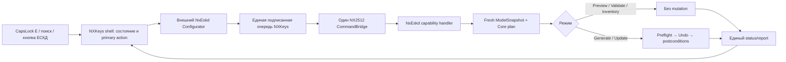

# План интеграции NxEskd в NXKeys для Siemens NX 2512.6000

Статус: план реализации, не заявление о готовности к промышленной эксплуатации.  
Дата аудита: 13.08.2026.  
Аудируемая база: `main` на commit `b48ff3ac`.  
Связанные документы: [план упрощения NXKeys](NXKEYS_UX_SIMPLIFICATION_PLAN.md),
[реализованный mnemonic runtime](MNEMONIC_COMMAND_LANGUAGE.md),
[архитектурные гарантии NxEskd](../nxeskd/docs/ARCHITECTURE_AND_CONFIGURATOR.md) и
[станционный протокол NxEskd](../nxeskd/docs/NX2512_6000_STATION_TESTS.md).

## 1. Решение

`NxEskd` следует интегрировать не как второй продукт рядом с NXKeys, а как **необязательный capability pack**
NXKeys. Для пользователя остаются:

1. один launcher NXKeys;
2. одна security session;
3. один `NX2512_CommandBridge`;
4. один контекстный вход `CapsLock → E` в Modeling/Drafting и одна кнопка `ЕСКД` в существующей группе NXKeys;
5. один поток `проверить исходные данные → увидеть Preview → подтвердить Create/Update → получить отчёт`;
6. один setup, update, repair и uninstall;
7. один понятный следующий шаг в каждом состоянии.

`Preview`, `Validate`, `Inventory`, `Generate` и `Update` сохраняются как разные backend-capabilities и
проверяемые режимы. Они перестают быть шестью конкурирующими пользовательскими точками входа.

Стандартная установка NXKeys не должна собирать и молча устанавливать NxEskd. Если pack отсутствует,
поиск `ЕСКД` показывает состояние `Не установлен` и одну action `Установить модуль ЕСКД`. Если pack
установлен, но не совместим с текущей maintenance release NX, он не загружается, а пользователь получает
action `Установить совместимую версию`.

## 2. Что показал аудит

### 2.1. Что уже следует сохранить

- `NxEskd.Core` отделён от NXOpen и WPF и строит типизированный `DrawingPlan`.
- `NxEskd.NxRuntime` является границей NXOpen.
- Configurator работает вне процесса NX и использует один `ProfileEditorDocument`.
- `Generate` и `Update` имеют разные preconditions.
- План операций является DAG с проверкой циклов.
- Существуют immutable `ModelSnapshot`, capability/license preflight, Undo/postcondition contracts и
  single-destroy правила для Builder.
- Managed ownership основан на составном ключе; ручные и чужие объекты нельзя молча присваивать.
- Stale deletion требует Preview и отдельного подтверждения.
- Поддерживаемые виды ограничены `base`, `projected`, `section`, `detail`, `flat_pattern`.
- PDF/DXF планируются через временный файл и атомарную публикацию.
- Есть Core, Configurator и smoke tests, capability matrix и подробный station protocol.

Эти свойства являются частью интеграционного контракта. Упрощение UI не даёт права ослаблять их.

### 2.2. Где сейчас возникает лишняя сложность

| Факт | Где видно | Последствие |
|---|---|---|
| Шесть NX-команд представлены шестью проектами и DLL | `nxeskd/src/NxEskd.Commands/*` | шесть способов начать одну задачу, шесть сборочных единиц и шесть точек отказа |
| Отдельные menu/ribbon объявляют Control Center, Generate, Update, Preview, Validate и Inventory | `nxeskd/startup/nx_eskd.men`, `nxeskd/application/rbn_nxeskd.rtb` | пользователь должен понимать внутренние этапы до того, как система изучила деталь |
| Те же шесть действий продублированы маршрутами `E→C/G/U/P/V/I` | `config/nx2512-v8-profile.json` | mnemonic language отражает устройство модуля, а не пользовательскую задачу |
| `CommandHost.OpenCommandCenter()` запускает WPF-процесс и ждёт его до двух часов | `nxeskd/src/NxEskd.NxRuntime/CommandHost.cs` | NX-команда удерживает главный поток и выглядит зависшей |
| NxEskd использует собственный protocol v1 request-файл | `nxeskd/src/NxEskd.Core/Runtime/CommandRequest.cs` | второй IPC-контракт не наследует HMAC, allowlist, anti-replay и context revision NXKeys schema 4 |
| Корневой installer собирает NxEskd по умолчанию с `-SkipTests` | `install-nxkeys.ps1` | обычная установка становится developer build и может развернуть непроверенный модуль |
| Configurator копируется в `eskd-configurator` и ещё раз в `custom/application` | `install-nxkeys.ps1` | дублирование файлов и риск загрузки WPF-зависимостей процессом NX |
| Есть отдельный installer/state root и persistent `NX_ESKD_ROOT` | `nxeskd/scripts/nxeskd.ps1` | два жизненных цикла установки, две модели восстановления и глобальная переменная среды |
| Решение содержит 13 `.csproj`, из них шесть command shims и отдельный smoke executable | `nxeskd/NxEskdDrawingAutomation.sln` | количество проектов не соответствует количеству архитектурных ответственностей |
| `nxeskd/` занимает около 87 MiB; внутри лежит ещё один полный API-каталог | `nxeskd/NX2512_Full_Function_API_Catalog_20260804_011429/` | тяжёлый clone/build context и параллельные источники API inventory |
| Главная форма Configurator показывает много вкладок и raw JSON как обычный уровень | `nxeskd/src/NxEskd.Configurator/MainWindow.xaml` | новичок видит схему конфигурации раньше результата и блокирующих проблем |
| Реальная станционная проверка NX 2512.6000 ещё не выполнена | `nxeskd/docs/VERIFICATION_STATUS.md` | нельзя заявлять совместимость, rollback или production readiness по одним static tests |

## 3. Неподвижные правила интеграции

1. Не создавать второй Bridge, второй daemon, вторую очередь, вторую security session или второй launcher.
2. Не загружать WPF, Configurator и его зависимости в процесс NX.
3. `NxEskd.Core` не получает ссылок на NXOpen, WPF, WinForms или mutable NX objects.
4. Session, Part, Builder, Undo и NXObject существуют только в `NxEskd.NxRuntime`, выполняемом главным
   потоком NX через `NX2512_CommandBridge`.
5. Configurator и desktop не передают NX runtime готовый к исполнению список NX-вызовов. Runtime заново
   загружает профиль, снимает свежий snapshot, строит план и проверяет hash/context перед mutation.
6. Один источник истины означает один authoritative artifact на каждом этапе: source profile → compiled
   capability snapshot → immutable model snapshot → resolved job/plan → execution report. Не следует
   объединять большой предметный ESKD-профиль с keyboard-профилем NXKeys в один физический JSON.
7. `Generate` запрещён поверх существующего managed scope; `Update` запрещён без однозначного managed scope.
   UI может предложить правильный режим, но не может скрыто подменить один другим.
8. Любое удаление, recreate, overwrite released document или destructive publication требует Preview,
   явного confirmation и повторной проверки Bridge.
9. Неподдерживаемый view kind, неизвестное поле schema, недоступная лицензия или неоднозначный ownership
   блокируют выполнение до Undo.
10. Один Builder имеет одного владельца, один Commit и один Destroy даже при исключении.
11. Pack собирается против DLL конкретной установленной станции. Совместимость с `2512.6000` не означает
    автоматическую совместимость с `2512.6002` и наоборот.
12. Не добавлять новый `.csproj` для DTO, screen, command или installer. Сначала объединять существующее.
13. Не показывать raw BUTTON ID, JSON path, assembly fingerprint или stack trace в основном пользовательском
    потоке. Они остаются в раскрываемых деталях диагностики и отчёте.
14. Нельзя маркировать capability как `nx_verified` до прохождения соответствующего station gate.

## 4. Целевой пользовательский поток

### 4.1. Один вход

В compiled profile шесть операций
`drafting.eskd_control_center/generate/update/preview/validate/inventory` заменяются одной операцией
`drafting.eskd`:

```text
route kind: leader
user route: E
application scope: modeling, drafting
adapter kind: capability
capability id: nxeskd.open_workflow
risk: none
```

В audited profile нет другого terminal `E` в Modeling/Drafting, но изменение всё равно проходит общий
prefix-free route compiler и capability-and-route lock. В других NX applications ЕСКД доступна через
поиск, но не занимает контекстный mnemonic route. Старые `E→*` удаляются с документированной миграцией:
вся их функциональность находится внутри нового workflow; runtime не сохраняет скрытый второй DFA.

Ribbon содержит одну кнопку `ЕСКД` внутри существующей группы NXKeys. Отдельная вкладка/toolbar NxEskd и
отдельные кнопки Generate/Update/Preview/Validate/Inventory удаляются.

### 4.2. Система выбирает следующий полезный шаг

| Состояние | Что видит пользователь | Единственная primary action |
|---|---|---|
| Pack отсутствует | `Модуль ЕСКД не установлен` | `Установить` |
| Pack несовместим с NX/MR или NXKeys protocol | точная несовместимая версия без stack trace | `Установить совместимую версию` |
| NX запущен не через managed launcher / Bridge недоступен | `Нет защищённой сессии NXKeys` | `Перезапустить правильно` |
| Нет WorkPart | `Откройте деталь или сборку` | `Выбрать недавний файл` либо закрыть flow |
| Первый запуск, нет профиля | три проверенных preset с кратким назначением | `Использовать выбранный preset` |
| Есть блокирующие исходные проблемы | сгруппированные issue codes и объект/поле | `Исправить` |
| Нет managed scope | summary будущего чертежа | `Показать Preview` |
| Есть однозначный managed scope | summary расхождений | `Показать изменения` |
| Preview чистый, scope отсутствует | `Будет создано …` | `Создать чертёж` |
| Preview чистый, scope существует | `Будет обновлено …` | `Обновить чертёж` |
| Есть stale/recreate/released overwrite | отдельный destructive diff | `Проверить и подтвердить` |
| Выполнение идёт | этап, объект/документ, безопасная семантика отмены | `Отменить на безопасной точке` |
| Выполнение завершено | короткий итог и warnings/manual review | `Открыть результат` |
| Выполнение прервано | что изменилось, был ли rollback, где backup/report | `Восстановить` или `Повторить Preview` |

`Inventory` выполняется автоматически при первом preflight или из раздела `Диагностика`. `Validate`
выполняется перед Preview и после mutation. Пользователь не обязан знать, в каком порядке их запускать.

### 4.3. Последовательность



Configurator запускается NXKeys desktop и сразу отделяется от NX-команды. `WaitForExit` в процессе NX
отсутствует. Закрытие Configurator не закрывает NX и не оставляет Bridge в состоянии `isProcessing`.

## 5. Целевые границы компонентов

| Компонент | Единственная ответственность | Что ему запрещено |
|---|---|---|
| Compiled NXKeys profile | route, availability, risk, capability permission | ESKD domain profile и NXOpen types |
| NXKeys desktop/shell | показать состояние, открыть workflow, подписать request, показать progress/result | выполнять NXOpen и доверять client-side Preview как плану исполнения |
| `NXKeys.Protocol` | versioned envelope, status/result DTO, HMAC canonicalization | ESKD business rules |
| `NXKeys.BridgeCore` | atomic admission, replay/duplicate/control handling | NXOpen и WPF |
| `NX2512_CommandBridge` | current context, main-thread scheduling, allowlisted handler dispatch | предметное построение чертежа и запуск WPF с ожиданием |
| `NxEskd.Core` | profile migration/validation, snapshot analysis, DAG, resolved plan, diff, report model | NXOpen, UI, IPC и environment-specific paths |
| `NxEskd.NxRuntime` | snapshot from NX, preflight, transaction, ownership, postconditions, save/export | raw JSON interpretation и пользовательская навигация |
| `NxEskd.Configurator` | один task flow и один `ProfileEditorDocument` | NX objects, второй queue/protocol и самостоятельная security session |
| NXKeys setup | optional component lifecycle, compatibility, atomic update/rollback | developer build и непроверенный `-SkipTests` package |

## 6. Единый контракт workflow

### 6.1. Envelope

В `NXKeys.Protocol/NxProtocol.cs` добавляется один общий action `run_capability`, а не отдельный protocol
action для каждой функции ЕСКД. Существующий `NxCommandRequest` получает поля:

- `capability_id` — allowlisted `nxeskd.preview`, `nxeskd.validate`, `nxeskd.inventory`,
  `nxeskd.generate`, `nxeskd.update` или `nxeskd.cancel`;
- `workflow_id` — стабильный ID одного пользовательского запуска;
- `component_id` и `component_version`;
- `payload_name` — только безопасное относительное имя внутри текущей session request directory;
- `payload_sha256` и `payload_schema_version`;
- `expected_part_id`, `expected_context_revision` и `expected_model_revision`;
- `profile_id` и `profile_sha256`;
- существующие `destructive` и `confirmation_accepted`.

Все новые поля входят в HMAC canonical payload в `NXKeys.Protocol/NxBridgeSecurity.cs`. Payload записывается
атомарно, ограничен по размеру, лежит только внутри текущей session directory и проверяется по SHA-256 до
deserialize. Absolute path, `..`, symlink/reparse escape, unknown schema field, неизвестная capability,
просроченный request, replay, duplicate ID или изменённый профиль приводят к fail-closed result.

Старый unsigned NxEskd protocol v1 не принимается Bridge даже в compatibility mode. Во время обновления
его незавершённые request-файлы переносятся в backup/quarantine с объяснением; Configurator и runtime
обновляются атомарно как один component version.

### 6.2. Payload и повторная проверка

Payload содержит только intent пользователя и подтверждения:

- operation mode;
- выбранный `profileId`/preset и scope/job ID;
- expected part identity;
- requested output/package targets;
- confirmation tokens для перечисленных destructive changes;
- client Preview hash для диагностики расхождений.

Он не содержит исполняемых NX method names, произвольных assembly paths или доверенного operation list.
Handler повторно загружает profile по зарегистрированному logical ID, проверяет hash, снимает свежий
`ModelSnapshot`, заново строит `ResolvedDrawingJob`/`DrawingPlan` и сравнивает plan hash. Если модель,
профиль, WorkPart или context изменились после Preview, mutation блокируется с action `Повторить Preview`.

### 6.3. Status, result и cancellation

В том же `NxProtocol.cs` расширяется result/status model без создания проекта на DTO. Bridge атомарно
публикует:

- `workflow_id`, `request_id`, `phase`, `percent` и user-facing message;
- stable `issue_code` и `recommended_action`;
- `preview_hash`, `report_name`, `report_sha256`;
- `rollback_attempted`, `rollback_verified`, `manual_review_required`;
- final status `completed`, `blocked`, `cancelled`, `failed` или `interrupted_unknown`.

`nxeskd.cancel` идёт через ту же authenticated inbox. `BridgeRequestInbox` может установить только
thread-safe cancellation flag и не вызывает NXOpen в background thread. До Undo отмена немедленная;
внутри mutation она применяется только в явно размеченной безопасной точке с rollback; для drawing
package — между документами. Force-kill NX или Builder запрещён, а UI пишет `Отмена после безопасного этапа`,
если немедленная остановка небезопасна.

## 7. План работ

### E0. Зафиксировать честный baseline и release gates

**Менять:**

- `.github/workflows/ci.yml` и существующие NxEskd checks;
- `nxeskd/tests/NxEskd.Core.Tests/RepositoryArchitecture*.cs`;
- `nxeskd/docs/CAPABILITY_MATRIX.md` и `nxeskd/docs/VERIFICATION_STATUS.md`.

**Сделать:**

- зафиксировать baseline всех пяти backend modes, ownership kinds, supported view kinds, profile fields,
  publication targets и package functions;
- зафиксировать текущие шесть routes и их миграцию в одну capability, чтобы удаление route не выглядело
  удалением функции;
- добавить architecture guards: Core без NXOpen/UI, Configurator без NXOpen, Bridge без WPF, NX runtime
  без raw profile JSON dispatch;
- сделать общий required workflow для Core tests, Configurator tests, schema/migrations, protocol/security,
  package manifest и repository invariants;
- явно хранить статусы `implemented`, `ci_verified`, `nx_verified`, `target_only`.

**Тестировать:** намеренно добавить NXOpen reference в Core, WPF reference в runtime package, неизвестное
поле профиля и ложный `nx_verified` — каждый дефект должен уронить required check.

**Готово, когда:** зелёный CI означает, что commit можно передавать на station gate, но не объявляет его
station-verified.

### E1. Свести mnemonic и capability model к одному входу

**Менять:**

- `config/nx2512-v8-profile.json`;
- `NX2512_HotkeyStudio/Models/V8Models.cs` и единый profile compiler из P1 основного UX-плана;
- `NX2512_HotkeyStudio/Services/CommandResolver.cs`, `LeaderKeyEngine.cs` и route lock tests;
- `NX2512_HotkeyStudio/UI/LeaderHudForm.cs` и search model.

**Сделать:**

- заменить шесть `drafting.eskd_*` записей одной `drafting.eskd` с route `E` и adapter
  `capability:nxeskd.open_workflow`;
- ограничить mnemonic Modeling/Drafting, добавить guards `pack installed`, `compatible`, `Bridge ready`,
  `WorkPart available`; в search сохранять entry во всех контекстах с точной unavailable reason;
- компилировать одну capability identity и одну permission; Preview/Validate/Inventory/Generate/Update
  становятся actions внутри workflow, а не DFA terminals;
- не менять route адаптивно по telemetry и не хардкодить `E` в runtime;
- показать в HUD только `ЕСКД — подготовить или обновить чертёж`, без BUTTON ID.

**Тестировать:** prefix-free по всем scopes; `CapsLock→E` открывает ровно один workflow в Modeling/Drafting;
в Sketch сохраняется его собственный `E`; отсутствующий pack не dispatch-ится; search объясняет install,
incompatibility и missing WorkPart; старые `E→*` отсутствуют в compiled routes и перечислены в migration note.

**Готово, когда:** пользователь учит один route, а capability lock доказывает сохранение пяти режимов.

### E2. Убрать шесть command DLL и отдельное меню

**Менять:**

- `nxeskd/NxEskdDrawingAutomation.sln`;
- `nxeskd/src/NxEskd.Commands/*`;
- `nxeskd/src/NxEskd.NxRuntime/CommandHost.cs`;
- `nxeskd/startup/nx_eskd.men`, `nxeskd/application/rbn_nxeskd.rtb`;
- `nxeskd/scripts/nxeskd.ps1` package section;
- `NX2512_HotkeyStudio/Services/NxRibbonLayout.cs` и `OverlayGenerator.cs`.

**Сделать:**

- удалить шесть shim projects `CommandCenter/Generate/Update/Preview/Validate/Inventory`;
- переименовать/перестроить существующий `CommandHost` в один allowlisted
  `NxEskdCapabilityHandler`, реализующий общий Bridge handler contract;
- удалить `OpenCommandCenter()`, `Process.Start` и двухчасовой `WaitForExit` из NX runtime;
- удалить отдельные NxEskd menu/ribbon artifacts; существующий NXKeys overlay генерирует одну кнопку `ЕСКД`;
- упаковывать для NX только `NxEskd.NxRuntime`, `NxEskd.Core` и необходимые non-UI dependencies;
- перенести smoke cases в существующие xUnit projects и удалить отдельный smoke `.csproj`.

Целевое число проектов NxEskd: шесть — Core, NxRuntime, Configurator, Core.Tests,
Configurator.Tests и PackagePlanner. Новых проектов не добавлять.

**Тестировать:** solution/build не создаёт `NxEskd.Generate.dll` и другие command DLL; package scan не находит
WPF assemblies в NX runtime directory; generated MenuScript имеет одну ESKD button и один Bridge action;
architecture test запрещает `WaitForExit` и отдельный `nx_eskd.men`.

**Готово, когда:** одна NX-side assembly boundary обслуживает все ESKD modes через общий Bridge.

### E3. Подключить NxEskd к защищённому protocol и одной очереди

**Менять:**

- `NXKeys.Protocol/NxProtocol.cs`, `NXKeys.Protocol/NxBridgeSecurity.cs`;
- `NXKeys.BridgeCore/BridgeRequestInbox.cs` и `BridgeSecurityGate.cs`;
- `NX2512_CommandBridge/Program.cs`;
- `NX2512_HotkeyStudio/Services/NxCommandBridgeClient.cs`;
- `nxeskd/src/NxEskd.Core/Runtime/CommandRequest.cs`;
- Configurator `.csproj`, `MainWindow.Commands.cs` и runtime handler.

**Сделать:**

- реализовать envelope/status из раздела 6;
- оставить `DrawingCommand` как Core enum, но удалить независимый request protocol v1 из Core;
- Configurator ссылается на `NXKeys.Protocol` и отправляет request через текущую NXKeys session;
- Bridge загружает handler только из installed component manifest, проверяет component ID/version/hash/signature
  и никогда не принимает assembly path из request;
- permission строится из того же compiled capability snapshot и profile digest, что HUD/desktop;
- plugin missing/incompatible даёт typed result, а не `FileNotFoundException` пользователю;
- read-only и destructive capabilities получают разные permissions и confirmation policy.

**Тестировать:** tampered payload/profile/component, replay, duplicate request ID, stale request, wrong session,
wrong process, path traversal, reparse escape, oversized payload, unknown field/version, changed WorkPart/context,
missing handler, denied capability и destructive request без confirmation. Во всех случаях NX-модель неизменна.

**Готово, когда:** NxEskd не имеет собственного inbox/request directory/security secret, а все requests видны
в едином журнале NXKeys.

### E4. Сделать запуск Configurator неблокирующим

**Менять:**

- `NX2512_HotkeyStudio/Program.cs` и unified shell;
- `NX2512_HotkeyStudio/Services/NxCommandBridgeClient.cs`;
- `nxeskd/src/NxEskd.Configurator/MainWindow.Profile.cs` и `MainWindow.Commands.cs`;
- существующий single-instance/session activation code.

**Сделать:**

- только NXKeys desktop запускает Configurator как дочерний process текущей managed session;
- передавать по command line только `workflow_id`; session secret передавать через наследуемое окружение или
  ACL-protected session channel, никогда не записывать в args/log/profile;
- один Configurator process на NXKeys instance; повторный вход активирует существующее окно и обновляет
  контекст только после подтверждения пользователя, если в нём есть unsaved edits;
- standalone запуск разрешить только в явно подписанном `offline profile edit` без кнопок выполнения;
- ribbon callback активирует тот же desktop workflow, а не запускает отдельный WPF process из NX;
- закрытие окна отправляет cancel только для ещё не начатого request; активную NX transaction не обрывает.

**Тестировать:** открыть flow из route, search и ribbon подряд — один keyboard hook, одна session, одно окно;
держать Configurator открытым 30 минут — NX отвечает; закрыть/перезапустить desktop; сменить WorkPart при
несохранённых edits; проверить отсутствие secret в process list, logs и crash dump metadata.

**Готово, когда:** ни один UI wait не выполняется на NX main thread и все три входа прикрепляются к одному flow.

### E5. Перестроить Configurator вокруг задачи, не вокруг JSON

**Менять:**

- `nxeskd/src/NxEskd.Configurator/MainWindow.xaml` и существующие partial code-behind;
- `ProfileEditorDocument.cs`, `PmiBomSettingsControl.xaml`, `DraftingStandardsControl.xaml`;
- `nxeskd/tests/NxEskd.Configurator.Tests/*`.

**Сделать:**

- заменить основной набор вкладок четырьмя последовательными состояниями в том же окне:
  `Исходные данные`, `Предпросмотр`, `Проверка`, `Результат`;
- на первом экране показывать active preset/profile, target sheet/package и только поля, нужные текущей детали;
- сложные drafting/PMI/BOM/template настройки оставить в раскрываемом `Расширенные настройки`, используя
  существующие typed controls;
- raw JSON перенести в явно включаемый expert mode; ошибки ведут к typed field/JSON path, но JSON не является
  первым способом настройки;
- один `ProfileEditorDocument` остаётся владельцем Load/Edit/Validate/Save/dirty/draft recovery;
- каждое состояние имеет одну primary action; secondary actions не конкурируют цветом/расположением;
- Preview показывает группы `создать`, `изменить`, `удалить`, `без изменений`, `нужна ручная проверка`;
- Generate/Update label определяется ownership preflight и явно написан на confirmation screen.

**Тестировать:** новый пользователь проходит preset→Preview→Create без JSON; эксперт меняет каждое ранее
доступное поле; dirty/draft recovery; keyboard-only navigation; 100/125/150/200% DPI; длинные русские строки;
screen reader names; 2300-line profile; collection virtualization; blocking issue focus.

**Готово, когда:** типовой чертёж создаётся без знания пяти внутренних команд и структуры profile schema,
а advanced functionality остаётся достижимой.

### E6. Зафиксировать snapshot, plan и Preview как единый pipeline

**Менять:**

- Core `ModelSnapshot`, planning, `DrawingEngine` и report model;
- `NxEskd.NxRuntime/NxExecutionAdapter.cs`, inventory adapter и snapshot capture;
- Configurator preview presentation.

**Сделать:**

- Bridge снимает immutable snapshot с part identity, model revision, units, bodies/components, PMI, sheets,
  views, ownership и capability/license facts;
- Core строит один `ResolvedDrawingJob` и один topologically sorted plan;
- Preview, Validate и Apply используют тот же planner/version; Apply всё равно rebuild-ит plan из fresh snapshot;
- diff имеет стабильные logical IDs и risk classification;
- target WorkPart, DrawingSheet, View, annotation и output path всегда явные;
- unsupported view/template change не деградирует в reflection guess, а возвращает Blocking/ManualReview.

**Тестировать:** deterministic snapshot/plan/hash; shuffled JSON; changed model/profile after Preview; cycle;
duplicate logical/ownership IDs; no WorkPart; unsupported view; explicit sheet activation; no-mutation inventory
before/after Preview/Validate.

**Готово, когда:** пользователь подтверждает ровно тот план, который runtime может доказуемо пересобрать,
либо получает обязательный новый Preview.

### E7. Укрепить NX transaction boundary

**Менять:**

- `NxEskd.NxRuntime/NxExecutionAdapter.cs`, `NxManagedObjectRegistry.cs`,
  `NxCapabilityPreflight.cs`, `NxReflection.cs` и существующие publishers/builders;
- `NX2512_CommandBridge/Program.cs` main-thread dispatch.

**Сделать:**

- проверять thread identity и запрещать NXOpen из watcher/admission/UI threads;
- capability/license/profile/ownership/duplicate checks выполнять до Undo;
- внутри Undo выполнять mutation и postconditions; Save/export разрешать только после успешных postconditions;
- Builder lifecycle централизовать через существующие helpers; убрать локальные Commit/Destroy обходы;
- stale delete применять только к exact-owned object полного ключа
  `profileId + jobId/scopeId + objectKind + logicalId`;
- Generate/Update сохраняют отдельные contracts; silent adopt/recreate/type conversion запрещены;
- reflection остаётся только в документированной maintenance compatibility boundary с inventory evidence.

**Тестировать:** unit/fake adapter fault injection до Undo, до первого Commit, после нескольких Commit и на
postcondition; на станции — inventory before/after, rollback, duplicate ownership, ручной collision, смена
WorkPart, missing license, повторный Update, stale delete flags и single Destroy.

**Готово, когда:** любой failure имеет доказуемое before/after состояние, а не только текст `rollback done`.

### E8. Добавить понятный progress, report и recovery

**Менять:**

- Core `ExecutionReport`;
- Bridge result/status write path;
- desktop `NxCommandBridgeClient`, health model и unified shell;
- Configurator result state.

**Сделать:**

- публиковать устойчивые фазы `preflight`, `snapshot`, `plan`, `preview`, `mutation`, `postvalidate`, `save`,
  `publish`, `complete`;
- логировать technical details один раз в structured report, UI показывать short issue + recommended action;
- хранить последний workflow/report в общем NXKeys state, а не в отдельном `NxEskdGenerator` root;
- при старте Bridge переводить незавершённый mutation в `interrupted_unknown` и требовать Inventory/Preview,
  не повторять его автоматически;
- различать `rollback attempted` и `rollback verified`; предлагать backup restore только при наличии manifest;
- Open report ведёт к одному HTML/JSON report set, а не к нескольким log directories.

**Тестировать:** crash/restart на каждой фазе; missing/corrupt report; duplicate result; read-only output;
Unicode path; cancellation до Undo/в безопасной точке/между package documents; recovery action после каждого
failure class.

**Готово, когда:** после ошибки пользователь видит, что произошло, сохранён ли исходник и одну безопасную
action продолжения.

### E9. Сделать NxEskd настоящим optional component setup

**Менять:**

- `install-nxkeys.ps1`;
- `NX2512_HotkeyStudio/Models/PackageManifest.cs`;
- `NX2512_HotkeyStudio/Services/DeploymentEngine.cs`, health/repair UI;
- `nxeskd/scripts/nxeskd.ps1` и redirect scripts;
- build/package workflows.

**Сделать:**

- убрать NxEskd build/install из default path и удалить `-SkipTests` из release packaging;
- setup принимает уже собранный и подписанный component artifact; developer build остаётся отдельной командой;
- добавить один component record `nxeskd` в общий package manifest: version, NXKeys protocol range,
  Core/profile schema, exact supported NX release/MR fingerprints, file hashes и capability list;
- UI setup показывает checkbox/action `Модуль чертежей ЕСКД`; CLI использует один явный `--with nxeskd`;
- Configurator хранить один раз в versioned component directory вне `custom/application`;
- NX runtime/Core хранить в versioned runtime directory и загружать Bridge только по verified manifest;
- не записывать persistent user `NX_ESKD_ROOT`; root разрешать из installed component manifest. Если переменная
  нужна legacy migration, использовать только launcher-scoped environment и удалить после перехода;
- общий installer выполняет NX-running guard, audit, staged copy, backup, atomic switch, health check и rollback;
- uninstall удаляет только manifest-owned files, сохраняет user profiles/reports и предлагает отдельное
  подтверждение их удаления;
- отдельные NxEskd Install/Uninstall/AutoSetup actions и redirect scripts удалить после migration release.

**Целевая раскладка:**

```text
%LOCALAPPDATA%\NXKeys\
  components\nxeskd\<version>\runtime\       # Core + NX runtime, без WPF
  components\nxeskd\<version>\configurator\  # WPF ровно в одном месте
  components\nxeskd\<version>\templates\
  profiles\nxeskd\                            # durable user data
  state\workflows\                             # общая session/workflow model
  reports\nxeskd\
```

**Тестировать:** clean install без pack; install-on-demand; update/downgrade; interrupted copy; hash/signature
failure; NX открыт; wrong 2512 maintenance build; missing license; uninstall/reinstall с сохранением profiles;
cleanup старого menu, duplicate Configurator и `NX_ESKD_ROOT`; две параллельные setup attempts.

**Готово, когда:** standard NXKeys работает без NxEskd, а добавление/обновление/удаление pack не создаёт
второй installation lifecycle.

### E10. Объединить profile/template lifecycle без смешивания доменов

**Менять:**

- `nxeskd/config/active-profile.example.json` и schema/migrations;
- Core `ProfileLoader`, migration и validation;
- Configurator `ProfileEditorDocument`;
- NXKeys component/profile registry и deployment migration.

**Сделать:**

- хранить один active ESKD profile logical ID на выбранный user/project scope, а не копировать active-profile
  в несколько install directories;
- source profile остаётся единственным редактируемым предметным документом; compiled/resolved forms только
  производные и content-addressed;
- presets являются immutable package templates; пользовательское изменение создаёт один derived profile;
- ссылки на PRT/template использовать по logical ID + validated resolved path, не по случайному current dir;
- schema запрещает unknown fields, имеет явные version gates и идемпотентные migrations;
- один раз мигрировать `%LOCALAPPDATA%\NxEskdGenerator\profiles`, requests/logs и install state с backup и
  migration report; незавершённые старые requests не исполнять;
- смена profile scope, template или released policy требует нового Preview.

**Тестировать:** first run; legacy versions; repeated migration; corrupt/partial profile; unknown field;
missing/moved template; concurrent save; draft recovery; profile hash change; project scope switch; rollback
к backup.

**Готово, когда:** у каждого ESKD workflow есть один profile ID/hash и объяснимый template resolution,
но keyboard profile NXKeys не разрастается до предметной ESKD schema.

### E11. Встроить drawing packages в тот же поток

**Менять:**

- Core package planner/executor;
- `tools/NxEskd.PackagePlanner`;
- Configurator source/result states;
- Bridge handler/status journal.

**Сделать:**

- выбор `Текущая деталь` / `Комплект` находится на первом шаге того же workflow;
- PackagePlanner остаётся headless verification tool, но использует тот же Core planner/schema;
- desktop отправляет один package intent, handler последовательно обрабатывает документы через одну очередь;
- каждый документ получает собственные snapshot/plan/report и явный WorkPart; переход на следующий документ
  только после завершения/rollback предыдущего;
- cancellation — между документами; partial package result перечисляет completed/failed/not-started;
- publication manifest атомарно ссылается только на успешно проверенные outputs.

**Тестировать:** cycle и duplicate output path; missing part/template; ошибка во втором документе; отмена между
документами; смена WorkPart; повторный package update; Unicode/network/read-only output; no partial manifest.

**Готово, когда:** комплект не требует отдельного UI/installer/queue и остаётся воспроизводимым через CLI test.

### E12. Сократить репозиторий, документацию и release surface

**Менять:**

- duplicated API catalogs;
- `nxeskd/docs/*`, root README/user guide;
- `.github/workflows/*` path filters и package checks;
- solution/scripts после удаления command/smoke projects.

**Сделать:**

- оставить один versioned API inventory как release/CI artifact; убрать копию из `nxeskd/` и не хранить
  generated multi-megabyte CSV в двух местах Git;
- один пользовательский guide описывает install, `CapsLock→E`, Preview, Create/Update, report/recovery;
- architecture, protocol и station tests остаются developer references; historical audits архивируются или
  ссылаются на canonical status, но не конкурируют с user guide;
- удалить устаревшие отдельные install/build redirect scripts и menu/ribbon artifacts после migration window;
- required workflows запускать при изменениях NXKeys protocol/Bridge/installer/profile и любого `nxeskd/**`;
- добавить package-size/file-count gates и запрет дублированных assemblies/catalogs.

**Тестировать:** broken doc links; generated route/user guide parity; package manifest inventory; duplicate hash
scan; clean clone build; clean release extraction; поиск старых `NX_ESKD_*`, шести BUTTON IDs, `WaitForExit`,
отдельных installers и WPF DLL в runtime directory должен вернуть только migration/tests, затем ноль после
окончания migration window.

**Готово, когда:** кодовая база содержит столько единиц, сколько реально нужно архитектуре, а не числу кнопок.

## 8. Порядок поставки

| Этап | Работы | Разрешённый пользовательский статус |
|---:|---|---|
| 1 | E0 | NxEskd остаётся RC/disabled по умолчанию |
| 2 | E1 + E2 | один route и один handler собраны, но Apply ещё скрыт feature gate |
| 3 | E3 + E4 | единая authenticated queue и неблокирующий Configurator; разрешены Inventory/Validate |
| 4 | E5 + E6 | новый task flow и достоверный Preview на fake/runtime fixtures |
| 5 | E7 + E8 | Generate/Update включаются только на тестовых копиях с recovery/report |
| 6 | E9 + E10 | optional setup, migration и profile/template lifecycle |
| 7 | E11 | drawing packages через тот же workflow |
| 8 | E12 + полный station protocol | production label только после подписанных evidence для NX 2512.6000 |

Apply нельзя включать раньше read-only этапов. Feature gate должен находиться в signed component manifest и
compiled capability snapshot; скрытая кнопка без Bridge permission не считается защитой.

## 9. Обязательная матрица тестирования

### 9.1. На каждом commit в CI

- Core planning, schema, migrations, DAG, ownership, diff и deterministic hashes;
- Configurator document/task-flow tests;
- protocol HMAC, replay, duplicate, expiry, path containment и permission parity;
- Bridge fake-handler integration и thread boundary;
- one-route/one-button/one-handler architecture guards;
- package manifest, absence of WPF/NX DLL redistribution and duplicate files;
- capability baseline: все прежние ESKD функции достижимы из нового workflow.

### 9.2. На Windows integration runner без NX

- managed launcher → desktop → Configurator → signed inbox → fake handler → status/result;
- one-instance activation из route/search/ribbon simulation;
- process exit/crash/recovery/cancellation;
- install/update/uninstall/migrate/rollback;
- long paths, Cyrillic, spaces, ACL denial, locked files and antivirus-like delayed reads.

### 9.3. На Siemens NX 2512.6000 station

Существующие F01–F12 и 24 сценария из `nxeskd/docs/NX2512_6000_STATION_TESTS.md` обязательны. К ним добавить:

1. `CapsLock→E` и ribbon открывают один flow без зависания NX;
2. Preview/Validate не меняют inventory;
3. изменённый profile/model/WorkPart после Preview блокирует Apply;
4. повторный request/replay не выполняет mutation;
5. cancel до Undo и в безопасной точке оставляет доказуемое состояние;
6. crash NX/Desktop/Configurator даёт корректный `interrupted_unknown` и recovery action;
7. optional install/update/uninstall при закрытом и открытом NX;
8. package incompatibility по точному MR/fingerprint блокирует load;
9. Configurator/WPF assemblies не загружены в `ugraf.exe`;
10. один Bridge process/session обслуживает обычные NXKeys commands и ESKD без starvation/double dispatch.

Для `2512.6002` создаётся отдельная строка compatibility matrix и отдельный station evidence set. Нельзя
переиспользовать отметку `nx_verified` от `2512.6000` без проверки DLL fingerprints и сценариев, затронутых API.

## 10. Критерии приёмки

- один пользовательский launcher, Bridge, security session, queue и setup;
- один ESKD route и одна ribbon button вместо шести;
- ноль `WaitForExit`/modal WPF waits в процессе NX;
- ноль Configurator/WPF DLL в NX runtime directory;
- ноль persistent `NX_ESKD_ROOT` после migration;
- 13 NxEskd projects сокращены минимум до шести без потери baseline capabilities;
- standard NXKeys package не содержит и не собирает optional NxEskd;
- 100% прежних backend функций доступны внутри одного workflow либо имеют явный station-gated status;
- 100% destructive requests имеют Preview, explicit confirmation и Bridge revalidation;
- 100% Apply используют fresh snapshot и rebuilt plan;
- повторный Update без изменений не создаёт NX objects и не меняет publication outputs;
- Preview/Validate/Inventory дают нулевую разницу inventory;
- типовой пользователь проходит от `CapsLock→E` до Preview не более чем за три решения и всегда видит одну
  primary action;
- любая блокировка показывает stable issue code, краткую причину и одну recovery action;
- production readiness заявляется только после успешного signed station report для точной NX 2512.6000.

## 11. Запрещённые сокращения

- объединять Generate и Update в одну скрытую эвристику без явного confirmation label;
- пропускать Preview ради уменьшения числа кликов;
- принимать client plan или unsigned legacy request как доверенный;
- выполнять NXOpen из Configurator, watcher или background admission thread;
- загружать pack при несовпадении NX/MR/protocol/profile schema;
- удалять ручные/чужие объекты или усыновлять их по имени;
- заменять exact typed API случайным reflection fallback;
- автоматически сохранять/перезаписывать единственный production `.prt` до station verification;
- создавать отдельные apps для Preview, Inventory, packages или recovery;
- добавлять по проекту/файлу на каждый command, DTO, phase или screen;
- смешивать source profile, compiled snapshot, resolved plan и report в один изменяемый файл;
- считать зелёный Core CI доказательством реальной совместимости с Siemens NX.

## 12. Конечный результат

После выполнения плана NxEskd остаётся функционально полным предметным модулем, но перестаёт выглядеть как
отдельная система. Пользователь открывает одну команду `ЕСКД`; NXKeys определяет состояние детали и pack,
показывает только следующий безопасный шаг, всегда проводит через достоверный Preview и возвращает единый
результат. В коде этому соответствуют одно Core, один NX runtime handler, один внешний Configurator, одна
очередь, один installer и одна проверяемая цепочка данных от профиля до отчёта.
