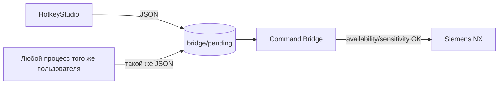
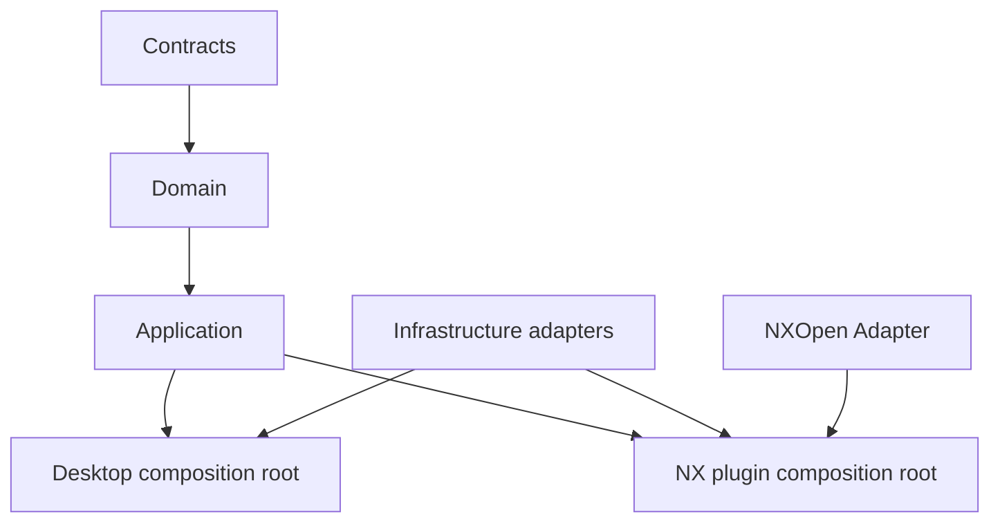

# Аудит хрупкости, архитектуры NX-плагина и качества UI NXKeys

**Дата:** 3 августа 2026 года  
**Проверенная ветка:** `main`  
**Базовый commit:** `b04da587a2d8c1baa7b019fe9fc5dc089ae92d40`  
**Область:** HotkeyStudio, Command Bridge, Control Center, Catalog Studio, общие контракты, state machines, профиль, IPC, тесты и пользовательские интерфейсы.

## 1. Цель аудита

Аудит отвечает на три вопроса:

1. Где система хрупка: может зависнуть, молча принять неверное состояние, потерять изменения, выполнить не ту команду или затруднить диагностику?
2. Соответствует ли архитектура безопасному NX-плагину: минимальная DLL внутри NX, явные границы доверия, контроль NX UI thread, версионированные контракты и проверяемое восстановление?
3. Насколько UI пригоден для ежедневной инженерной работы: понятность, скорость, обратная связь, доступность, масштабирование, безопасное редактирование и отсутствие дублирующих приложений?

Это статический аудит кодовой базы и CI. Фактическая чувствительность `BUTTON ID`, поведение разных лицензий и ролей, нагрузка на NX UI thread и совместимость с конкретным maintenance release требуют отдельной проверки на лицензированной workstation NX 2512.

## 2. Итоговая оценка

| Область | Оценка | Вывод |
|---|---:|---|
| Направление архитектуры | 7/10 | Разделение desktop companion и DLL внутри NX выбрано правильно |
| Безопасность IPC | 2/10 | Транспорт атомарный, но отправитель и разрешённый набор команд не аутентифицируются |
| Отказоустойчивость | 5/10 | Есть backup, rollback и at-most-once recovery, но остаются fail-open и неограниченные очереди |
| Поддерживаемость | 4/10 | Ключевые компоненты монолитны, зависимости направлены через executable-проекты и linked source |
| Тестируемость | 5/10 | Сильны DFA/профильные инварианты, слабы Bridge behavior, IPC security, migration и UI tests |
| UI/UX | 5/10 | Визуально аккуратно, но три разных shell, монолитные формы, слабая доступность и небезопасное редактирование |
| Готовность к production NX | Условная | Допустима для контролируемых испытаний; P0-риски необходимо закрыть до доверенного применения |

Оценки являются инженерным заключением по текущему коду, а не результатом сертификации.

## 3. Что уже сделано правильно

### 3.1. Процессная граница

HotkeyStudio работает вне NX, а `NX2512_CommandBridge` загружается в процесс NX. Это правильнее, чем помещать keyboard hook, редактор профиля, deployment и тяжёлую диагностику внутрь NX.

### 3.2. Очередь с атомарным владением

Запрос записывается через временный файл и `Move`, затем Bridge переводит его `pending → processing`. При перезапуске NX незавершённый запрос получает `interrupted_unknown` и не воспроизводится автоматически. Такая модель снижает риск повторного выполнения destructive-команды.

### 3.3. Повторная проверка контекста в Bridge

Bridge повторно проверяет revision, selection count, application, module и modal state перед вызовом NX. Это правильный принцип: desktop UI не является последней границей безопасности.

### 3.4. DFA/HFSM и валидаторы

Мнемонический язык реализован через trie/DFA и state machine. Prefix conflicts, duplicate paths, confirmation и context guards проверяются отдельно от WinForms. Профильные Node.js-валидаторы и CI дают сильную защиту от регрессий каталога.

### 3.5. Deployment

Managed root, hashes, backup manifests, health-check и rollback заметно уменьшают риск повреждения пользовательской NX-конфигурации.

### 3.6. Catalog Studio

Catalog Studio уже использует cancellation, progress и контролируемое закрытие во время сканирования. Это наиболее зрелый UI-паттерн в текущем наборе приложений.

## 4. Реестр критических рисков

### P0 — необходимо исправить до доверенного production-использования

| ID | Риск | Подтверждение | Последствие | Требуемое решение |
|---|---|---|---|---|
| NXK-FR-001 | Неаутентифицированный локальный IPC | `NxCommandBridgeClient` пишет JSON в `%LOCALAPPDATA%\NXKeys\bridge`; `NxCommandRequest` не содержит session secret/HMAC; Bridge принимает любой корректный файл | Любой процесс того же Windows-пользователя может сформировать запрос, установить `confirmation_accepted=true` и передать произвольный runnable `BUTTON ID` | Session capability, ACL, HMAC или named pipe; allowlist команд из установленного профиля |
| NXK-FR-002 | Неизвестный `action` исполняется как обычная команда | `ProcessRequestFile`: отдельные ветви есть для `switch_module`, `set_selection_filter`, `probe_command`; любой другой action попадает в `ExecuteNxCommand` | Ошибка протокола или намеренно подставленный action не отклоняется fail-closed | Строгий enum/allowlist действий; неизвестное действие всегда `rejected: unsupported_action` |
| NXK-FR-003 | Selection TOCTOU | Desktop guards проверяют `SelectedTypes`; request хранит только count/revision/application; `SemanticFingerprint()` не включает `SelectedTypes` и идентичность объектов | Между принятием команды и исполнением можно заменить выбор другим объектом того же количества без изменения ожидаемой revision | `selection_fingerprint`: tags/тип/part identity/count; включить в context token и повторно сверять перед invoke |
| NXK-FR-004 | Неподдерживаемая schema молча преобразуется в текущую | `Config.ApplyDefaults()` заменяет schema `<3` или `>6` на 6 до `Validate()` | Будущая schema или повреждённый профиль могут загрузиться с потерей неизвестных полей и быть затем сохранены как «валидные» | Сначала проверить исходную schema; мигрировать только известные 3→4→5→6; будущую schema отклонять |
| NXK-FR-005 | Сохранение профиля неатомарно | `Config.Save()` вызывает `File.WriteAllText`, хотя в проекте уже есть `AtomicFileWriter` | Сбой питания, crash или параллельный процесс может оставить пустой/частичный основной профиль | Atomic write + backup последней валидной версии + optimistic revision/lock |

### P1 — высокий архитектурный и эксплуатационный риск

| ID | Риск | Подтверждение | Рекомендация |
|---|---|---|---|
| NXK-FR-006 | Bridge — один большой static-класс | `NX2512_CommandBridge/Program.cs` совмещает lifecycle, watcher, poller, queue, context, NX dispatch, selection, logging и recovery | Оставить static entrypoint только как composition root; выделить сервисы с интерфейсами |
| NXK-FR-007 | Очередь обрабатывается на NX UI thread без бюджета | WinForms timer 150 ms вызывает enumeration/sort и цикл по всем pending files | IO выполнять вне NX thread; на NX thread передавать один admission-approved request; лимит времени/числа операций за tick |
| NXK-FR-008 | Нет ограничений размера, глубины и частоты очереди | В audited коде не найден max request size, queue depth, rate limit или janitor | Ввести max JSON size, max pending count, per-session rate limit, quarantine и retention |
| NXK-FR-009 | Bridge не проверяет профильный allowlist | `ExecuteNxCommand` получает `command_id` непосредственно из request и проверяет только availability/sensitivity NX | Bridge должен загрузить digest установленного профиля и разрешать только опубликованные command/action pairs |
| NXK-FR-010 | Ошибки чтения контекста скрываются как `null` | `ReadContext()` и `TryReadResult()` перехватывают все исключения | Возвращать typed result: offline/stale/corrupt/schema_mismatch/access_denied/io_error |
| NXK-FR-011 | Module detection эвристичен и смешан с исполнением | Sketch определяется по sensitivity `UG_SKETCH_FINISH`/`UG_SKETCH_LINE`; mapping и reflection находятся внутри `Program.cs` | `INxContextProvider` + capability matrix по NX build + диагностируемая confidence/evidence |
| NXK-FR-012 | Неограниченное накопление completed/failed/logs | В audited queue-коде не найден retention policy | Queue janitor: возраст, число файлов, общий размер, безопасное удаление только завершённых записей |
| NXK-FR-013 | Broad catch и пустые catch скрывают деградацию | `Program.cs`, Bridge, transport и cleanup содержат `catch { }` | Structured error codes, correlation/request ID, rate-limited logs; empty catch только для best-effort cleanup с комментарием |
| NXK-FR-014 | Неправильное направление project dependencies | Control Center ссылается на executable HotkeyStudio; Protocol и StateMachines подключаются linked source | Создать настоящие class libraries и зависимости внутрь domain/application |
| NXK-FR-015 | Nullability выключена во всех основных проектах | `<Nullable>disable</Nullable>` | Включать по проектам поэтапно; сначала Contracts, Domain и новые сервисы |
| NXK-FR-016 | Global single-instance не учитывает профиль/пользователя | Имена mutex/events фиксированы `Global\NXKeys_*` | `Local\` + user SID + profile digest; сообщать конфликт, а не молча сигнализировать чужой instance |
| NXK-FR-017 | Нет гарантированного завершения signal threads | Бесконечный `while(true)` с `WaitOne`, без cancellation | `CancellationToken`, объединённый shutdown handle, join с timeout, observable errors |
| NXK-FR-018 | CapsLock принудительно выключается | Повторный `keybd_event` не сохраняет исходное состояние пользователя | Запоминать pre-trigger state, применять `SendInput`, восстанавливать только изменение, сделанное NXKeys |
| NXK-FR-019 | Профиль — большой mutable graph с побочными migration/rebuild | `ApplyDefaults()` одновременно мигрирует, нормализует, генерирует пути и перестраивает runtime sequences | Разделить parser, migration pipeline, validator, compiler и immutable runtime snapshot |
| NXK-FR-020 | Редактор меняет live-модель на каждое событие grid | `PersistModuleGrid()` непосредственно мутирует команды и вызывает rebuild | Editor draft, undo/redo, diff, validation и единый atomic commit |

## 5. Главная проблема границы доверия IPC

Текущий transport защищает целостность файла во время записи, но не подтверждает происхождение команды.



`source_process_id` является информационным полем и не доказывает отправителя. `confirmation_accepted` также передаётся самим writer. Поэтому confirmation в HUD не является криптографической или процессной границей.

### Минимально допустимое усиление file IPC

1. При старте Bridge создать `session_id` и случайный 256-bit capability secret.
2. Хранить session descriptor с ACL только для текущего пользователя и процесса NXKeys.
3. В request добавить:
   - `session_id`;
   - `nonce`;
   - монотонный `sequence_number`;
   - `profile_digest`;
   - `context_token`;
   - `selection_fingerprint`;
   - `payload_hmac`.
4. Bridge проверяет HMAC, nonce replay cache, session, expiry, profile digest и allowlist.
5. Неизвестные action/fields сверх поддерживаемого контракта отклоняются.
6. Ограничить размер request, длины строк, queue depth и rate.

### Предпочтительный вариант

Для интерактивного desktop↔NX обмена предпочтительнее локальный named pipe с ACL текущего пользователя и явным handshake. File queue можно сохранить как crash-recovery journal или fallback. Решение следует принимать после runtime-теста на корпоративных workstation, антивирусах и roaming-профилях.

## 6. Правильная целевая архитектура

### 6.1. Главный принцип

DLL, загруженная в NX, должна быть минимальной, детерминированной и не содержать редактор профиля, deployment, keyboard hook, каталогизацию или тяжёлый desktop UI. Она должна:

- управлять своим lifecycle;
- публиковать достоверный NX context;
- принимать аутентифицированные запросы;
- выполнять admission policy;
- переводить разрешённую операцию на NX UI thread;
- возвращать структурированный результат;
- безопасно очищать очередь и журналы.

### 6.2. Предлагаемая структура проектов

```text
NXKeys.Contracts
NXKeys.Domain
NXKeys.Application
NXKeys.Infrastructure.FileSystem
NXKeys.Infrastructure.Windows
NXKeys.Transport.NamedPipes       или NXKeys.Transport.FileIpc
NXKeys.Desktop
NXKeys.NxPlugin
NXKeys.NxOpenAdapter
NXKeys.CatalogStudio
NXKeys.Tests.Unit
NXKeys.Tests.Contract
NXKeys.Tests.Integration
NXKeys.Tests.UI
```

### 6.3. Направление зависимостей



Точнее зависимости должны быть направлены внутрь:

- `Domain` не знает про WinForms, файлы, NXOpen и Windows API.
- `Application` зависит от Domain/Contracts и определяет ports/interfaces.
- Infrastructure реализует ports.
- Desktop и NX Plugin только связывают реализации.
- Control Center не ссылается на desktop executable.
- Protocol — отдельная versioned assembly с JSON schema и golden fixtures.

### 6.4. Компоненты внутри NX Plugin

| Компонент | Ответственность |
|---|---|
| `BridgeLifetime` | Startup, shutdown, unload option, регистрация NX callbacks |
| `IRequestTransport` | Получение и подтверждение запросов без NXOpen-зависимости |
| `RequestAdmissionPolicy` | Schema, action enum, auth, allowlist, rate/size limits |
| `NxContextProvider` | Application/module/parts/selection/modal state + evidence/confidence |
| `NxContextTokenFactory` | Создание revision/context/selection fingerprints |
| `NxCommandDispatcher` | Явное отображение action → handler |
| `NxUiThreadScheduler` | Выполнение только NX-bound части на допустимом потоке |
| `NxCommandCatalog` | Allowlist и capabilities установленного профиля |
| `ResultStore` | Atomic result и correlation data |
| `QueueJanitor` | Retention, quarantine, size limits |
| `StructuredLogger` | Event ID, request ID, session ID, bounded retention |

### 6.5. Явный dispatch

Вместо `else → ExecuteNxCommand`:

```text
execute_command     → ExecuteCommandHandler
switch_module       → SwitchModuleHandler
set_selection_filter→ SelectionFilterHandler
probe_command       → ProbeHandler
любой другой action → UnsupportedAction
```

Каждый handler имеет собственную policy и набор обязательных полей.

### 6.6. NX UI thread

Рекомендуемая модель:

1. Transport thread читает и предварительно валидирует не-NX данные.
2. Bounded channel хранит admission-approved requests.
3. NX timer/callback забирает не более одного request либо работает в ограниченном time budget.
4. Только context capture и NXOpen invocation выполняются на NX thread.
5. Result serialization и cleanup уходят обратно во внешний IO-контур.

Нельзя выполнять полный directory scan и неограниченный цикл запросов в одном UI tick NX.

## 7. Аудит UI/UX

## 7.1. Информационная архитектура

Сейчас пользователь сталкивается с тремя разными интерфейсами:

- HotkeyStudio;
- Control Center;
- Catalog Studio.

HotkeyStudio и Control Center пересекаются по профилю, Leader, Bridge, настройкам и диагностике. Это создаёт вопрос «в каком приложении нужно делать действие?» и удваивает реализацию темы, компонентов и state refresh.

### Рекомендация

Объединить HotkeyStudio и Control Center в один desktop shell. Catalog Studio оставить отдельным, потому что он имеет иной lifecycle и работает с NXOpen-каталогом.

Предлагаемая навигация единого desktop shell:

1. **Главная** — NX status, профиль, Leader, критичные предупреждения, быстрые действия.
2. **Команды** — дерево модулей, поиск, детали, безопасный draft editor.
3. **Живой контекст NX** — application/module, selection, parts, modal state, confidence/evidence.
4. **Установка и восстановление** — plan, diff, apply, backups, rollback.
5. **Каталог и API** — импорт export Catalog Studio, command resolution.
6. **Диагностика** — события, queue, errors, diagnostic bundle.
7. **Настройки** — trigger, HUD, theme/accessibility, retention.

## 7.2. Design system

Три формы имеют собственные наборы `Color.FromArgb`, fonts, padding и button factories. Это выглядит похоже, но не является единой системой.

Нужен общий `NXKeys.DesignSystem`:

- semantic colors: background/surface/border/text/muted/accent/success/warning/danger;
- spacing scale 4/8/12/16/24/32;
- typography roles;
- button variants и states;
- input, grid, status banner, empty state, metric card;
- high-contrast palette;
- DPI-aware icon and hit-target sizes;
- единые русские термины.

Необязательно переписывать всё на WPF. WinForms может остаться, если отделить presenters/view-models и создать общие controls. WPF оправдан только для desktop shell при доказанной выгоде; NX-loaded DLL не должна становиться WPF-host.

## 7.3. HUD

Сильные стороны:

- окно не активируется;
- не перехватывает мышь;
- показывает module, Bridge и selection;
- имеет confirmation state.

Проблемы:

1. Custom-drawn canvas почти не даёт UI Automation/screen-reader semantics.
2. Состояния сильно зависят от цвета.
3. Размер начинается примерно с 720–900 px и может закрыть геометрию рядом с курсором.
4. Большое количество карточек выводится колонками вместо progressive disclosure.
5. Используются фиксированные pixels/fonts и собственная отрисовка.
6. Нет пользовательских режимов reduced motion/high contrast/large text.

Целевой HUD:

- breadcrumb текущего пути;
- 6–10 следующих доступных действий, не полный каталог;
- smart anchor по свободному quadrant или фиксированное положение;
- compact/standard/large mode;
- pagination или search после превышения лимита;
- текстовая причина disabled-состояния;
- отдельный accessible live-status control/window;
- no-color-only indicators;
- настройка прозрачности и анимации.

## 7.4. Редактор команд

Текущий grid изменяет live-модель на каждое `CellValueChanged`/`CellEndEdit`, сразу перестраивает sequences и только при сохранении показывает до 60 ошибок. Это хрупко и перегружает пользователя.

Целевой сценарий:

1. Открыть immutable profile snapshot.
2. Создать editor draft.
3. Редактировать с inline validation.
4. Поддерживать undo/redo.
5. Показывать conflict/prefix errors рядом с полем.
6. Перед сохранением показывать diff: путь, ID, safety, aliases.
7. Сохранить атомарно и создать last-known-good backup.
8. После записи повторно загрузить и валидировать файл.
9. Предлагать `Восстановить последнюю рабочую версию`.

## 7.5. Ошибки и диагностика

Сейчас разные причины часто сводятся к `null`, `OFFLINE`, MessageBox или одной строке status bar.

Нужно различать:

- NX не запущен;
- Bridge не загружен;
- context stale;
- context JSON corrupt;
- schema mismatch;
- access denied;
- queue full/rate limited;
- profile mismatch;
- command unavailable/insensitive;
- NX modal/active command;
- selection changed;
- interrupted unknown.

Каждая ошибка должна иметь:

- стабильный error code;
- понятное действие пользователя;
- технические детали по раскрытию;
- correlation/request ID;
- кнопки `Копировать`, `Открыть журнал`, `Создать diagnostic bundle`.

## 7.6. Долгие операции

HotkeyStudio отключает всю форму на время `Task.Run`; restore выполняется синхронно. Control Center загружает каталоги через UI thread.

Нужен единый async-command pattern:

- cancellation token;
- progress stage + percentage;
- сохранение навигации, когда это безопасно;
- защита от повторного запуска;
- retry только для идемпотентных операций;
- сохранение подробного результата;
- никакого `Enabled=false` на всё окно без аварийной отмены.

## 7.7. Текст и согласованность

В UI найдены устаревшие или противоречивые строки:

- `schema v4`, хотя current schema = 6;
- `3 колонки`, хотя язык теперь имеет 2–5 токенов и отдельную Sketch-грамматику;
- смешение `Enabled`, `Command Name`, `Backups / Profile` с русскими названиями.

Все строки следует вынести в resources и проверять терминологическим lint.

## 8. Пробелы тестирования

Текущие tests хорошо проверяют профиль, state machine, Sketch paths и contract compilation. Не хватает:

### Security/IPC

- неизвестный action отклоняется;
- request без capability/HMAC отклоняется;
- replay nonce отклоняется;
- command вне profile allowlist отклоняется;
- queue size/rate limits;
- oversized/malformed JSON;
- access denied/corrupt context не превращаются в generic offline;
- selection fingerprint mismatch.

### Profile

- future schema fail-closed;
- каждая поддерживаемая migration отдельно;
- неизвестные поля не теряются молча;
- crash во время save оставляет старую валидную версию;
- concurrent edit conflict.

### Bridge behavior

- request lifecycle success/reject/fail/interrupted;
- crash windows до/после NX invoke и до/после result write;
- bounded processing budget;
- context confidence/evidence matrix;
- retention janitor;
- NX API exceptions mapped to stable error codes.

### UI

- keyboard-only navigation и focus order;
- high DPI 100/125/150/200%;
- Windows high contrast;
- long Russian/English strings;
- HUD on multi-monitor with negative coordinates;
- accessible names/roles/live regions;
- visual regression screenshots;
- editor undo/diff/last-known-good recovery.

## 9. План исправлений

### Фаза 0 — немедленное уменьшение хрупкости

1. Strict action allowlist в Protocol и Bridge.
2. Future schema fail-closed.
3. Atomic `Config.Save()` и last-known-good backup.
4. Typed transport errors вместо silent `null`.
5. Max request size, queue depth и retention.
6. Исправить stale UI/runtime strings `schema v4` и `3 колонки`.

**Критерий завершения:** невозможно исполнить неизвестный action; повреждённый/будущий профиль не перезаписывается; crash-save не уничтожает профиль.

### Фаза 1 — защищённый IPC

1. Session capability и ACL либо named pipe handshake.
2. HMAC/nonce/replay protection.
3. Profile/action/command allowlist.
4. Context token и selection fingerprint.
5. Structured result/error schema.

**Критерий завершения:** произвольный процесс того же пользователя не может самостоятельно сформировать доверенный destructive request.

### Фаза 2 — архитектурные границы

1. Создать Contracts/Domain/Application class libraries.
2. Удалить linked-source compilation.
3. Убрать dependency ControlCenter → HotkeyStudio executable.
4. Включить nullable в новых библиотеках.
5. Выделить transport/context/dispatcher/lifecycle из Bridge.

**Критерий завершения:** domain и application tests запускаются без WinForms, Windows hook и NXOpen stubs.

### Фаза 3 — bounded NX execution

1. Off-thread IO и bounded channel.
2. Один request/time budget на NX tick.
3. NX capability matrix и context evidence.
4. Queue janitor и log rotation.
5. Integration harness с fault injection.

**Критерий завершения:** queue flood не замораживает NX UI; crash windows имеют предсказуемый результат.

### Фаза 4 — единый качественный UI

1. Объединить HotkeyStudio и Control Center.
2. Ввести design system.
3. Перевести редактор на draft/undo/diff/atomic commit.
4. Переработать HUD под progressive disclosure и accessibility.
5. Добавить typed diagnostics и diagnostic bundle.
6. Ввести UI automation и visual regression.

**Критерий завершения:** пользователь выполняет ежедневную настройку, диагностику и восстановление в одном shell без редактирования JSON и без выбора между двумя приложениями.

## 10. Acceptance criteria

### Надёжность

- unsupported profile schema никогда не нормализуется молча;
- все важные записи atomic + reload validation;
- очередь имеет size/rate/retention limits;
- все request transitions наблюдаемы и имеют stable code;
- Bridge restart не повторяет неопределённую команду.

### Безопасность

- transport подтверждает session и sender capability;
- Bridge допускает только action/command из установленного профиля;
- destructive confirmation невозможно подставить простым JSON-полем;
- selection/part context повторно идентифицируется перед invoke;
- unknown action и unknown command fail-closed.

### Архитектура

- NX Plugin является тонким composition root;
- NXOpen вызовы находятся только в adapter/handlers;
- desktop UI не является библиотекой для других приложений;
- Contracts/Domain/Application не зависят от WinForms/NXOpen;
- каждый сервис тестируется через интерфейс или pure function.

### UI

- один desktop shell;
- полный keyboard navigation;
- high DPI/high contrast проверены;
- HUD не закрывает основную рабочую область и имеет compact mode;
- inline validation, undo/redo, diff и last-known-good recovery;
- ошибки различимы и сопровождаются действием пользователя.

### Проверка в NX 2512

- cold/warm startup Bridge;
- разные modules, роли и лицензии;
- modal dialogs и active commands;
- selection replacement same-count/different-object;
- queue flood и slow disk simulation;
- NX crash в ключевых окнах request lifecycle;
- длительная сессия 8+ часов и cleanup completed/failed/logs;
- multi-monitor/high-DPI HUD;
- обновление и rollback пакета.

## 11. Решение по переписыванию

Полная одномоментная перепись не рекомендуется. Сильные части — профильные validators, DFA/HFSM, managed deployment, at-most-once recovery и Catalog Studio — следует сохранить.

Оптимальный путь:

1. сначала закрыть P0 fail-open и IPC risks;
2. затем извлечь архитектурные границы без изменения пользовательского поведения;
3. после стабилизации объединить desktop UI;
4. менять transport file IPC→named pipe только через совместимый adapter и измерения на реальных workstation.

## 12. Заключение

NXKeys имеет правильную общую идею: desktop companion управляет вводом и профилем, а DLL внутри NX выполняет минимальный проверенный dispatch. Однако текущая реализация остаётся переходной: атомарность файлов ошибочно воспринимается как доверенность отправителя, NX Bridge перегружен ответственностями, profile migration допускает fail-open, а UI разделён между двумя пересекающимися desktop-приложениями.

Приоритет должен быть таким:

```text
IPC trust boundary
→ selection/context integrity
→ profile atomicity and fail-closed migration
→ bounded NX UI-thread execution
→ project boundaries
→ unified accessible UI
```

После закрытия P0/P1 система сможет перейти от функционального инженерного прототипа к контролируемому production-инструменту для NX 2512.

## 17. Статус реализации фазы 0

Реализованы первичные меры снижения хрупкости:

- `NXK-FR-002` — неизвестные protocol actions теперь отклоняются fail-closed;
- `NXK-FR-003` — добавлен selection fingerprint в context revision и повторную проверку Bridge;
- `NXK-FR-004` — загрузка неподдерживаемой schema отклоняется до migration/defaults;
- `NXK-FR-005` — профиль сохраняется через `AtomicFileWriter`;
- частично `NXK-FR-008` — введены лимиты payload, pending queue и requests per poll;
- `NXK-FR-010` — добавлены typed transport read results.

`NXK-FR-001` и `NXK-FR-009` остаются открытыми: файловый IPC пока не аутентифицирует sender,
а Bridge ещё не проверяет подписанный allowlist установленного профиля. Это следующий обязательный этап.

## 18. Статус реализации фазы 1

Закрыты два главных риска границы доверия:

- `NXK-FR-001` — запросы подписываются ephemeral HMAC-сессией, проверяется источник процесса и anti-replay;
- `NXK-FR-009` — Bridge независимо строит allowlist из активного профиля и проверяет его digest,
  action/command/module/target/selection и confirmation policy.

IPC повышен до schema 4. Старая schema 3 намеренно отклоняется fail-closed. Секрет создаётся
managed launcher и не сохраняется на диск.
