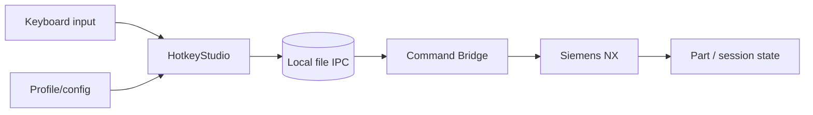

# Модель безопасности NXKeys

## Цель

NXKeys должен предотвращать случайное выполнение неподтверждённой, контекстно неверной или повторной команды. Модель снижает риск, но не заменяет безопасность Siemens NX, права ОС, резервное копирование и инженерную проверку производственных данных.

## Активы

- открытая деталь и производственные данные;
- выбранная команда и mnemonic sequence;
- command profile и resolved IDs;
- NX context/selection;
- Bridge DLL и managed package;
- IPC requests/results;
- backups и package manifest;
- corporate role/custom directories.

## Границы доверия



- keyboard input не содержит command ID;
- profile должен пройти validation;
- file system transport не считается доверенным;
- Bridge повторно валидирует request;
- NX является фактическим источником availability/sensitivity;
- operator принимает решение после `interrupted_unknown`.

## Scope главного профиля

Main runtime включает 885 намерений K3–K5. K1/K2 исключены из стандартного runtime для снижения перегрузки, но это не security boundary само по себе.

Реальная safety boundary — exact ID, enabled status, guards и confirmation.

## Запрет выдуманных IDs

- `existing` — exact known ID;
- `resolved` — надёжно разрешённый ID;
- `ambiguous` — disabled;
- `unresolved` — disabled.

Command name, similarity score и API candidate не дают права на dispatch.

## Контекстные проверки

Перед dispatch учитываются:

- freshness и confidence;
- application/module;
- Work Part и Display Part;
- modal dialog и active command;
- selection count/state/types;
- exact command ID;
- action/selection filter;
- destructive/confirmation policy.

Bridge повторяет критичные checks после claim request, потому что context мог измениться.

## Confirmation

`destructive=true` или `confirm_before_execute=true` требует explicit Enter в состоянии `AwaitingConfirmation`.

Confirmation должна быть связана с конкретной resolved command. Нельзя повторно использовать старое подтверждение для другого request.

## Selection actions

`UG_SEL_*` используют `action: set_selection_filter`. Source policy v7 закрепляет:

```text
SB SF SE ST SC SU SD SR SA SN
```

Selection action не должна молча выполнять обычную command с похожим ID.

## Module switches

Switch считается завершённым после fresh context, подтверждающего target application/module. Client не должен оптимистически менять active module до ответа NX.

## IPC и повторное выполнение

```text
pending → processing → completed | failed
```

Гарантии:

- atomic publication и claim;
- уникальный request ID;
- expiry;
- duplicate protection;
- отдельный result;
- `interrupted_unknown` после recovery processing request;
- отсутствие автоматического retry неизвестного результата.

Это at-most-once recovery. Exactly-once выполнение не заявляется.

## Deployment safety

NXKeys должен:

- устанавливать files только в managed ownership boundaries;
- размещать Bridge в `custom/application`;
- не изменять системные файлы Siemens;
- не подменять глобальные `PATH`/`UGII_USER_DIR`;
- сохранять backup внешнего custom dirs file перед patch;
- проверять staging и installed SHA-256;
- вести `package-manifest.json`;
- удалять только ранее управляемые files;
- выполнять rollback при ошибке;
- блокировать обычное обновление при запущенной NX.

`-AllowRunningNX` ослабляет operational guard и не обновляет уже загруженную Bridge DLL.

## Threats и controls

| Риск | Control | Остаточное ограничение |
|---|---|---|
| неверный ID | exact ID + resolution status | target catalog может устареть |
| context изменился | expected revision/application/selection + Bridge recheck | NX state может быть сложно классифицировать |
| duplicate execution | unique ID + processing ownership | результат после crash может быть unknown |
| обход destructive confirmation | HFSM state + protocol validation | неверная classification command остаётся риском |
| повреждение managed files | manifest/hash/health | локальный пользователь может изменять files между checks |
| подмена request | schema/context/expiry validation | отдельной cryptographic authentication нет |
| обновление locked DLL | require NX stopped | operator может использовать override flag |
| утечка данных через logs/export | local storage + documentation rules | требуется организационная очистка artifacts |

## Что не является гарантией

- успешный C# build;
- contract build против NXOpen stubs;
- наличие command ID в CSV;
- высокий similarity score;
- отсутствие exception в generator;
- profile coverage 885;
- наличие backup без проверки restore;
- `dry_run=false` как доказательство production readiness.

## Проверка на target NX

Перед production:

1. использовать копию детали;
2. подтвердить application/module mapping;
3. проверить selection filters;
4. проверить command availability/sensitivity;
5. проверить confirmation;
6. проверить wrong context rejection;
7. проверить modal dialog behavior;
8. симулировать Bridge interruption на безопасной command;
9. проверить health/rollback;
10. зафиксировать runtime-verified evidence.

## Secrets и proprietary data

Запрещено добавлять в repository/log examples:

- proprietary NX DLL;
- license files;
- credentials/tokens;
- production parts/drawings;
- закрытые roles/extensions;
- персональные данные;
- внутренние network paths без необходимости.

## Incident handling

При подозрении на неверный dispatch:

1. остановите Leader;
2. не повторяйте sequence;
3. сохраните current part безопасным способом;
4. соберите request/result/context/status/log;
5. зафиксируйте commit/profile hash;
6. отключите command row;
7. проверьте actual ID и module;
8. используйте процесс из `SECURITY.md` при возможном security impact.

## CI boundaries

CI подтверждает структуру, schemas, paths, state machines, C# builds, Bridge contract и deployment invariants. CI не подтверждает фактическую лицензию, чувствительность кнопки и эффект command в Siemens NX.

## Требует ручной проверки

- полнота destructive classification всех 885 intents;
- корректность selection type mapping для target objects;
- corporate code-signing policy;
- ACL IPC root;
- правильность IDs после NX/role/license change;
- отсутствие конфликтов с corporate custom directories.

## Phase-zero runtime hardening

The first remediation phase closes the immediate fail-open paths:

- unsupported protocol actions are rejected rather than dispatched as NX commands;
- profile schemas outside the known migration range are rejected before defaults are applied;
- profile saves use the existing atomic writer;
- queue depth, payload size, field length, and work per poll are bounded;
- the selected-object fingerprint participates in context revision and dispatch validation;
- transport read failures are classified instead of being collapsed into `null`.

The file queue is still a same-user local trust boundary, not authenticated IPC. Command allowlisting,
session capabilities and anti-replay protection remain mandatory before the bridge is treated as a
hardened production boundary.
