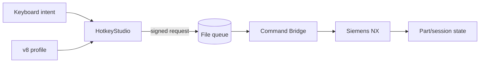

# Модель безопасности NXKeys v8

NXKeys снижает риск случайного, контекстно неверного, подменённого или повторного command dispatch в Siemens NX. Система не заменяет резервное копирование, права ОС, безопасность NX и инженерную проверку production data.

Current contracts: profile schema **8**, IPC schema **4**, sequence policy **v8**.

## Границы доверия



- keyboard input — намерение, а не разрешение на произвольный `command_id`;
- profile проходит validation и формирует permission model;
- queue file — недоверенный transport artifact;
- authenticated session/HMAC — admission control;
- Bridge повторно проверяет permission и fresh NX context;
- NX остаётся фактическим источником availability/sensitivity/effect.

## Что защищается

- открытые детали и session state;
- выбранная команда и sequence;
- v8 profile и profile digest;
- NX context/selection fingerprint;
- managed binaries/manifest;
- IPC requests/results;
- session secret, nonce и anti-replay state;
- backups/custom directories.

## Authenticated IPC schema 4

Managed launcher создаёт случайный session secret и передаёт его доверенным дочерним процессам. Secret не записывается в file queue.

Request содержит:

```text
session_id
client_instance_id
nonce
sequence_number
profile_digest
payload_hmac
```

Bridge до NX invocation проверяет:

1. schema/expiry;
2. shared session id;
3. HMAC-SHA-256;
4. trusted source process/executable;
5. anti-replay nonce/sequence;
6. profile digest;
7. action/command/module/application/filter permission;
8. destructive/confirmation policy;
9. fresh context и selection fingerprint.

Unsigned schema-3 requests и requests вне managed launch session не являются совместимыми current clients.

## Profile permission model

Permission строится из активного validated profile. Request не может получить больше прав только потому, что знает существующий NX `BUTTON ID`.

Canonicalization должна совпадать с runtime execution. Для Sheet Metal:

```text
UG_APP_SHEETMETAL → UG_APP_SBSM
UG_SHEET_METAL_*  → UG_SBSM_*
```

V8 `availability.applications` участвует в построении switch permissions.

## Context guards

Перед dispatch повторно проверяются:

- application/module;
- context revision/freshness;
- Work/Display Part;
- modal state/active command;
- selection count/state/fingerprint;
- exact canonical command/action;
- destructive/confirmation semantics.

Context snapshot сам по себе не является полномочием: Bridge проверяет актуальное состояние непосредственно перед invocation.

## Confirmation

Destructive command требует explicit confirmation. Подтверждение должно относиться к конкретной resolved operation/request и не может переиспользоваться для другого action.

Нельзя исправлять ложные срабатывания safety guard отключением confirmation.

## Queue и duplicate execution

```text
pending → processing → completed | failed
```

Controls:

- atomic publish;
- bounded payload/queue/work-per-poll;
- unique request id;
- expiry;
- HMAC session;
- nonce + monotonic sequence;
- claim ownership;
- `interrupted_unknown` recovery;
- отсутствие automatic retry неизвестного результата.

Это at-most-once recovery, а не exactly-once guarantee.

## Selection mechanisms

### Leader type filters

`S → …` меняют type-selection intent (`body`, `face`, `edge`, …) через разрешённые selection actions.

### Selection Intent `0…4`

In-process keyboard hook Command Bridge меняет chain/tangent/path semantics только когда NX foreground и обнаружен active collector либо seed selection.

Guard-логика специально не должна перехватывать обычный ввод цифр в text-like controls.

Подробнее: [SELECTION_INTENT.md](SELECTION_INTENT.md).

## CapsLock safety

Leader trigger имеет physical-key latch: повторные key-down из autorepeat игнорируются до реального key-up. Это защищает от случайного множественного dispatch из одного удержания CapsLock.

## Workspace-local keys

`workspace_key` не проецируется в root Leader без явного workspace-state. Это предотвращает неоднозначность terminal root/subtree, например конфликт одиночного `M` с Modeling Manage `M → …`.

## Command ID integrity

- новый runtime command должен использовать точный подтверждённый ID;
- similarity/name совпадение не является authority;
- Sheet Metal uses canonical `UG_SBSM_*`;
- Sketch constraints используют точные `UG_SKETCH_*_CONSTRAINT` IDs;
- compatibility mapping допустим только в специально проверенном normalization layer.

## Interactive NX commands

Особый риск — различие между фактическим открытием интерактивного NX dialog/collector и return value API invocation.

`DialogTester.InvokeMenuButtonAction(...)` нельзя считать абсолютным доказательством результата для всех interactive commands без target-NX test. Если UI открылся, но Bridge трактовал `false` как failure, сохраняйте logs/request/context и проверяйте живую NX семантику вместо повторного запуска команды вслепую.

## Deployment safety

- managed ownership под `%LOCALAPPDATA%\NXKeys`;
- Bridge только в `custom\application`;
- backup перед cleanup/patch;
- package manifest/hash health checks;
- controlled `UGII_CUSTOM_DIRECTORY_FILE` normalization;
- conflict cleanup архивирует известные legacy items;
- full NX restart перед заменой Bridge DLL;
- `-AllowRunningNX` не является hot reload.

## Threats и controls

| Риск | Control | Остаток |
|---|---|---|
| forged queue JSON | session HMAC + source process + permission digest | не защищает от code injection в trusted process |
| replay | nonce + monotonic sequence | trusted process compromise остаётся вне модели |
| wrong command ID | profile permission + canonical ID | target catalog/role может измениться |
| wrong context | revision/application/selection fingerprint recheck | сложный NX state требует live tests |
| duplicate after crash | claim + `interrupted_unknown` + no retry | финальный NX side effect может остаться unknown |
| CapsLock autorepeat | physical latch | hardware/driver edge cases требуют UX test |
| numeric hotkey stealing input | foreground/modifier/text/collector guards | необычные custom NX controls могут потребовать guard update |
| locked Bridge update | require NX stopped | operator override остаётся operational risk |
| profile/runtime mismatch | schema validation + profile digest | incorrect profile semantics всё ещё возможны |

## Что не является гарантией

- успешный C# build;
- NXOpen contract stub build;
- наличие ID в CSV;
- высокий similarity score;
- green generated-profile coverage;
- отсутствие exception в compiler;
- `health` без live NX command test.

## Target NX acceptance

На копии детали проверьте:

1. managed launch создаёт authenticated session;
2. unsigned/wrong-session request rejected;
3. module mapping корректен;
4. CapsLock не autorepeat-ится;
5. Modeling Manage работает;
6. Sketch constraints/dimensions работают;
7. Sheet Metal uses canonical commands;
8. Selection Intent `0…4` не перехватывает обычные numeric fields;
9. interactive dialogs/collectors трактуются корректно;
10. destructive confirmation нельзя обойти;
11. rollback восстанавливает package.

## Incident response

При подозрении на неверный dispatch:

1. остановите Leader;
2. не повторяйте sequence;
3. сохраните production data безопасным способом;
4. зафиксируйте commit/profile digest/session id и время;
5. сохраните request/result/context/status/log;
6. проверьте фактический NX side effect;
7. отключите проблемный operation/permission до расследования;
8. при security impact используйте процесс из `SECURITY.md`.

## Ограничения модели

Authenticated local IPC защищает от обычного same-user процесса, который просто пишет forged JSON в queue. Модель не защищает от атакующего, способного внедрить код в NX/HotkeyStudio, читать память trusted processes с эквивалентными правами или незаметно заменить managed binaries с обходом integrity controls.

Полный transport contract: [api.md](api.md). Runtime contract: [RUNTIME_V8.md](RUNTIME_V8.md).
