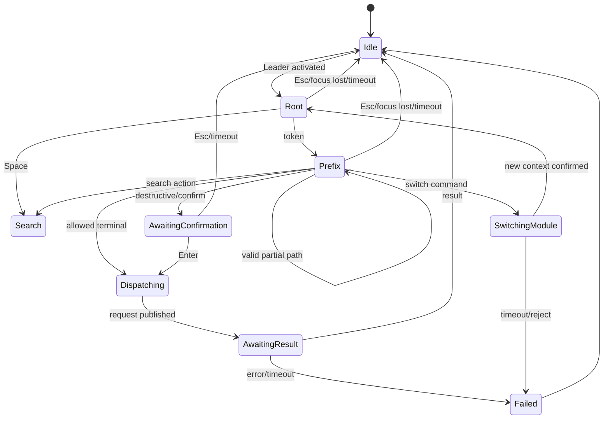
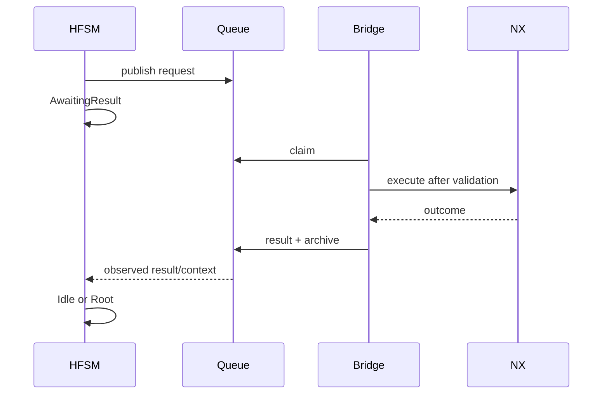

# Архитектура конечных автоматов NXKeys

## Назначение

Контекстный ввод разделён на четыре слоя:

1. `SequenceAutomaton` — trie/DFA prefix-free последовательностей;
2. `LeaderStateMachine` — HFSM пользовательского взаимодействия;
3. `ContextGuardEvaluator` — проверка контекста NX;
4. `LeaderBehaviorProfile` — декларативные guards, fallback и timeouts.

Keyboard hook не исполняет команды напрямую. События передаются в WinForms UI queue, поэтому state transitions выполняются последовательно.

## Входные данные

- profile schema 6;
- paths/aliases из enabled module commands;
- active module от `AdaptiveModuleResolver`;
- context snapshot IPC schema 3;
- declarative policy `config/nx2512-state-machines.json`;
- user events: Leader key, tokens, search, Enter, Esc, Backspace, Tab.

## DFA

При загрузке профиля canonical paths и aliases компилируются в automaton.

```text
<internal module prefix> + <2–5 user tokens>
```

Пример:

```text
User: CapsLock → E → E → B
DFA:             M → E → E → B
Command:         Modeling → Edit → Edge → Blend
```

DFA отклоняет:

- пустой path;
- duplicate normalized terminal;
- terminal, являющийся префиксом другого terminal;
- conflict canonical path/alias;
- недостижимый terminal.

Одинаковый user path допустим в разных modules из-за разных internal prefixes.

## HFSM states



Подтверждённые state names в коде включают `Idle`, `Root`, `Prefix`, `Search`, `AwaitingConfirmation`, `Dispatching`, `AwaitingResult`, `SwitchingModule`, `Failed`.

## Инварианты

- dispatch происходит только после terminal resolution и guard success;
- destructive command проходит `AwaitingConfirmation`;
- Enter подтверждает текущее destructive intention, но не произвольный request;
- Esc, остановка engine и потеря допустимого focus отменяют sequence;
- ошибка публикации request освобождает keyboard capture;
- module switch завершается только после нового подтверждённого context;
- stale result не должен активировать другую sequence;
- duplicate request не исполняется повторно Bridge.

## Declarative policy

```text
config/nx2512-state-machines.json
```

Policy может задавать:

- state timeouts;
- allowed modules/applications;
- interaction state;
- Work Part / Display Part requirements;
- minimum context confidence;
- selection minimum и allowed types;
- confirmation;
- unavailable fallback/message.

Пример guard:

```json
{
  "commands": {
    "MEEB": {
      "guards": {
        "modules": ["modeling"],
        "require_work_part": true,
        "minimum_context_confidence": 60,
        "selection": {
          "minimum": 1,
          "types_any": ["Edge"]
        }
      },
      "on_unavailable": {
        "action": "show_reason",
        "message": "Выберите одно или несколько рёбер"
      }
    }
  }
}
```

`requires_selection` в command row не всегда означает hard preselection. Жёсткий минимум определяется policy/guard.

## Context snapshot

Bridge публикует IPC schema 3:

```text
revision, status, application_id, module_id, module_label,
selection_count, selection_state, selected_types,
work_part_available, display_part_available,
modal_dialog_active, active_command_id,
context_confidence, updated_utc,
last_request_id, last_result, last_message
```

`revision` меняется при семантическом изменении. Heartbeat без изменения context не должен искусственно менять revision.

Default protocol freshness — 3 секунды. Runtime UI может отображать более старый context для диагностики, но dispatch обязан соблюдать guard freshness.

## Guard evaluation

До публикации request клиент проверяет доступные условия. Bridge повторно проверяет:

- protocol schema;
- request expiry;
- expected context revision;
- expected selection count;
- expected application;
- modal state;
- exact command ID или special action parameters;
- destructive confirmation.

Двойная проверка нужна, потому что context может измениться между user input и Bridge claim.

## Confirmation

`destructive=true` или `confirm_before_execute=true` переводит HFSM в `AwaitingConfirmation`. Request получает `confirmation_accepted=true` только после явного подтверждения текущей command.

Backspace/Esc не должны подтверждать действие. Timeout отменяет pending intention.

## Selection actions

```text
action = set_selection_filter
selection_filter = none | all | reset | edge | face | body |
                   component | curve | datum | feature | operation
```

Source policy v7 резервирует `SB`, `SF`, `SE`, `ST`, `SC`, `SU`, `SD`, `SR`, `SA`, `SN`.

Selection action не маршрутизируется как обычная menu command без необходимости.

## Module switching

`switch_module` может содержать target application или command ID. Локальный active module не меняется оптимистически. HFSM ждёт fresh context с новой revision/application/module.

Source policy не добавляет обычные `G*` switches в Sketch и Selection/Object module.

## IPC result lifecycle



Если process NX завершился после claim, request получает `interrupted_unknown` при recovery и автоматически не повторяется.

## Tests

```powershell
dotnet run --project .\NXKeys.StateMachines.Tests\NXKeys.StateMachines.Tests.csproj -c Release
```

Test runner покрывает:

- DFA construction/conflicts;
- declarative policy;
- deterministic replay;
- randomized transitions;
- confirmation invariants;
- typed selection guards;
- switch-module behavior;
- expiry;
- protocol snake_case round-trip;
- at-most-once recovery contracts.

Дополнительно:

```powershell
node .\scripts\validate-command-tree.mjs
node .\scripts\validate-main-command-map.mjs
```

## Изменение state machine

1. Обновите implementation и declarative model согласованно.
2. Добавьте deterministic test.
3. Добавьте randomized invariant, если изменяется transition space.
4. Проверьте cancellation/timeouts.
5. Проверьте release keyboard capture при exception.
6. Обновите protocol, если меняется request/result contract.
7. Проверьте target NX для context-dependent behavior.

## Ограничения

- contract tests не заменяют real NX integration;
- modal dialogs и active command detection зависят от NX runtime;
- selection type names могут отличаться по фактическим NX objects;
- source profile schema 6 не гарантирует, что старые error strings в UI уже обновлены;
- exact timing keyboard hook требует ручной Windows UX-проверки.
