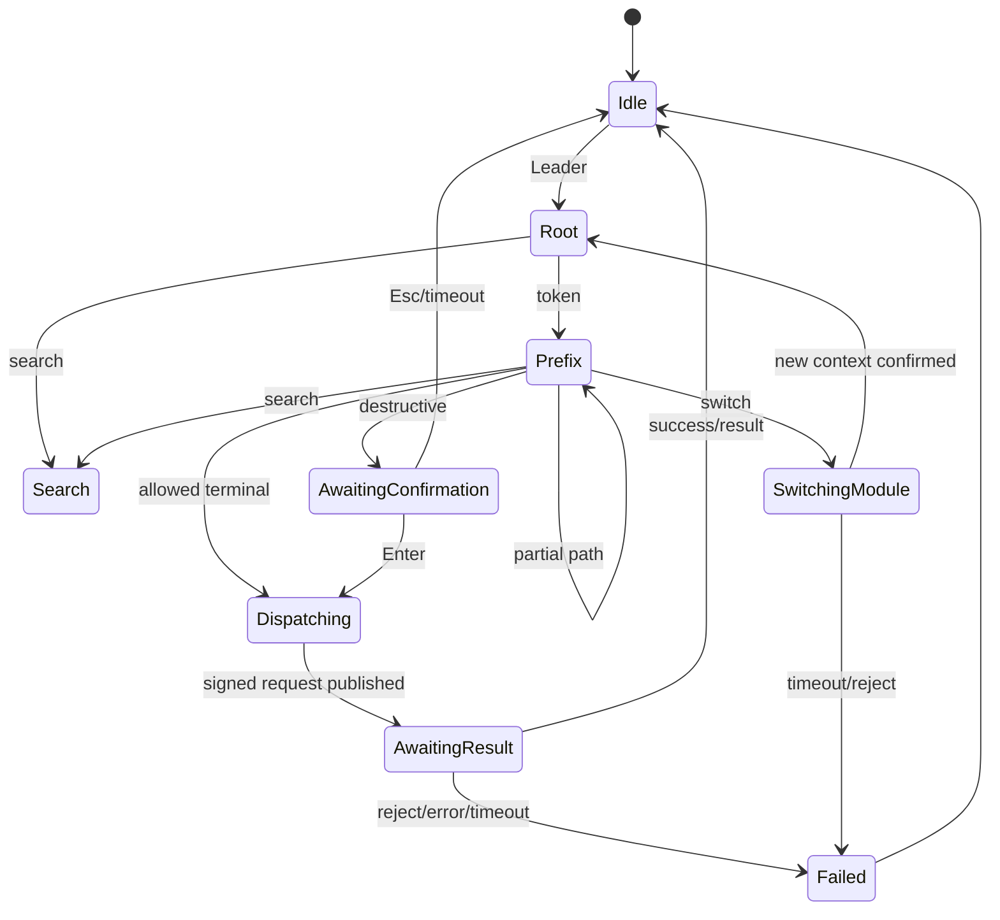
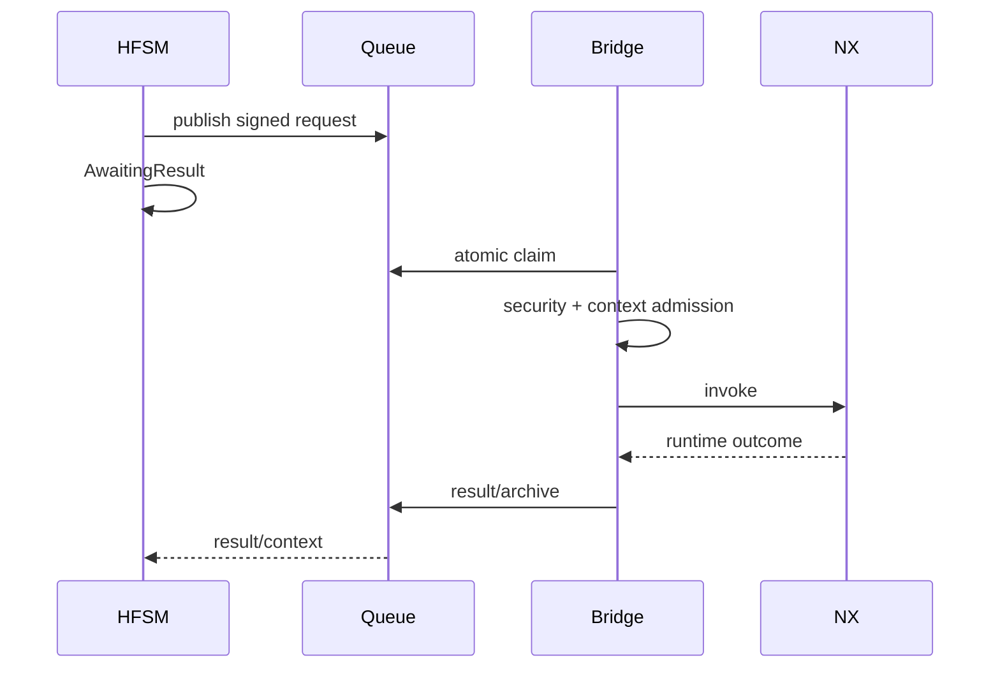

# Архитектура конечных автоматов NXKeys v8

Контекстный ввод NXKeys разделён на четыре уровня:

1. `SequenceAutomaton` — trie/DFA runtime paths;
2. `LeaderStateMachine` — HFSM пользовательского interaction lifecycle;
3. `ContextGuardEvaluator` — context/selection guards;
4. `LeaderBehaviorProfile` — декларативные guards, fallback и timeouts.

Current input profile schema — **8**, IPC context/request schema — **4**.

## Входные данные

- normalized v8 paths/aliases;
- active module от `AdaptiveModuleResolver`;
- context snapshot schema 4;
- `config/nx2512-state-machines.json`;
- user events: Leader, token, search, Enter, Esc, Backspace, Tab;
- signed request/result lifecycle.

## DFA

Runtime sequence строится как:

```text
<hidden internal module prefix> + <user path>
```

User path в v8 может быть **однотокенным**.

Пример active Sketch:

```text
User: CapsLock → L
DFA:             S → L
```

Пример Modeling Manage:

```text
User: CapsLock → M → L → S
DFA:             M → M → L → S
```

Первый `M` во втором примере — hidden Modeling prefix, второй — пользовательский Manage root.

DFA отклоняет duplicate terminal и terminal/prefix conflicts. `secondary_aliases` участвуют в том же проверяемом path space.

Workspace-only keys без explicit workspace state не добавляются как root terminals.

## HFSM states



## Основные инварианты

- keyboard hook не исполняет NX command напрямую;
- dispatch возможен только после terminal resolution + guards;
- destructive action проходит confirmation state;
- signed request связан с конкретным resolved action;
- module switch завершается только после нового подтверждённого context;
- stale result не активирует новую sequence;
- duplicate/replayed request rejected;
- `interrupted_unknown` не retry-ится автоматически;
- stopping/error освобождает keyboard capture.

## Declarative policy

```text
config/nx2512-state-machines.json
```

Policy может задавать:

- timeouts;
- allowed module/application;
- interaction state;
- Work/Display Part requirements;
- minimum context confidence;
- selection requirements/types;
- confirmation;
- unavailable fallback/message.

## Context schema 4

Bridge публикует, среди прочего:

```text
revision
application_id
module_id/module_label
selection_count/state/types/fingerprint
work_part_available
display_part_available
modal_dialog_active
active_command_id
context_confidence
updated_utc
security_status
security_session_id
security_profile_digest
last_request_id/last_result/last_message
```

Semantic revision учитывает selection fingerprint и security state. Heartbeat без semantic change не должен увеличивать revision.

Default freshness — 3 секунды.

## Guard evaluation

Client проверяет доступные guards до publish. Bridge после claim повторно проверяет:

- schema/expiry;
- authenticated session/HMAC;
- source process;
- anti-replay state;
- profile permission;
- expected revision/application;
- expected selection fingerprint/count;
- modal state;
- destructive confirmation.

Это защищает от TOCTOU между user input и actual NX invocation.

## Confirmation

`destructive=true` / `confirm_before_execute=true` переводит interaction в `AwaitingConfirmation`. `confirmation_accepted=true` появляется только после explicit confirmation текущей command.

## Selection type actions

Leader type-selection actions:

```text
S→B body
S→F face
S→E edge
S→T feature
S→C component
S→U curve
S→D datum
S→R reset
S→A all
S→N none
```

Source sequence policy — **v8**.

Это отдельный слой от Selection Intent `0…4`, который обрабатывается внутри Command Bridge без Leader HFSM.

## Selection Intent state boundary

`SelectionIntentHotkeys` не является terminal веткой Leader DFA. Он имеет собственный узкий keyboard admission:

- NX foreground;
- no system modifiers;
- no text input;
- active native collector или seed selection;
- physical key latch.

Modes `0…4` меняют native NX intent toggles/rules. Подробности: [SELECTION_INTENT.md](SELECTION_INTENT.md).

## Module switching

`switch_module` публикуется как authenticated IPC action. HFSM не меняет active module оптимистически; переход подтверждается fresh context с ожидаемой application/module.

Sheet Metal canonical target — `UG_APP_SBSM`.

## Result/recovery lifecycle



Если NX завершился после claim, recovery переводит request в unknown failure и не выполняет blind retry.

## Physical CapsLock latch

Leader trigger защёлкивает real key-down до key-up. Autorepeat events не должны создавать повторные transitions `Idle → Root` из одного удержания CapsLock.

## Tests

```powershell
dotnet run --project .\NXKeys.StateMachines.Tests\NXKeys.StateMachines.Tests.csproj -c Release
dotnet run --project .\NX2512_HotkeyStudio.Tests\NX2512_HotkeyStudio.Tests.csproj -c Release
```

Плюс:

```powershell
node .\scripts\validate-documentation.mjs
node .\scripts\validate-command-tree.mjs
node .\scripts\validate-main-command-map.mjs
```

## Изменение state machine

1. обновите implementation и declarative policy согласованно;
2. добавьте deterministic regression;
3. добавьте randomized invariant, если меняется transition space;
4. проверьте cancellation/timeouts/capture release;
5. синхронизируйте protocol/security при изменении request lifecycle;
6. обновите документацию;
7. выполните live NX test для context-dependent behavior.

## Ограничения

- stubs/CI не доказывают live NX dialog semantics;
- actual selection object types зависят от NX;
- keyboard timing требует Windows UX test;
- old K3–K5 sequence reports не определяют current v8 user paths.
