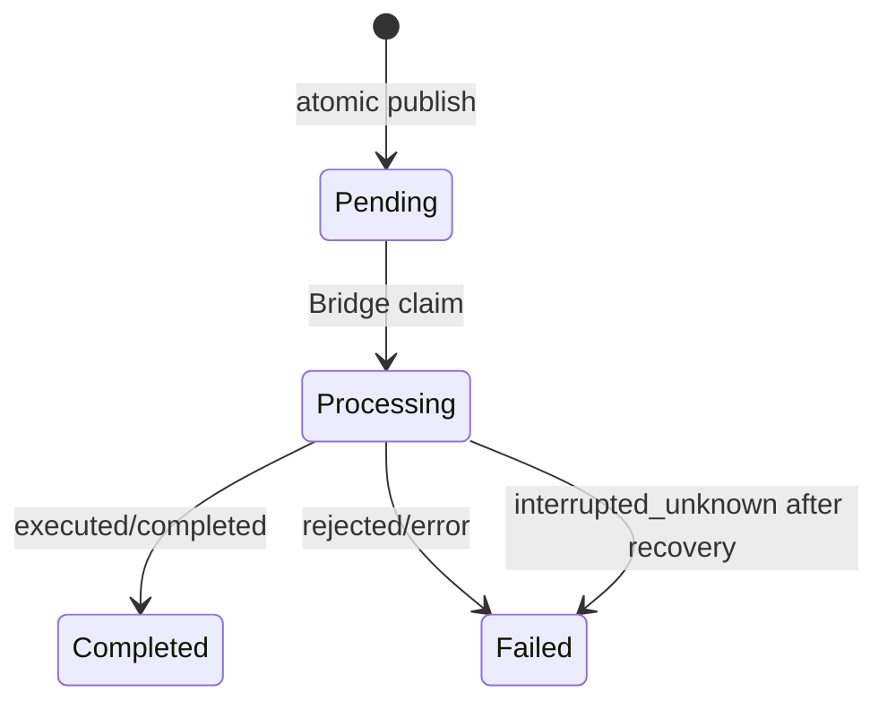

# NXKeys File IPC API

## Область

NXKeys использует локальный файловый IPC между HotkeyStudio и Command Bridge. Это **не HTTP API**, не сетевой service и не публичный remote endpoint.

- protocol schema: `3`;
- encoding: JSON UTF-8;
- IPC root: `%LOCALAPPDATA%\NXKeys\bridge`;
- источник истины: `NXKeys.Protocol/NxProtocol.cs`;
- execution/recovery semantics: `NX2512_CommandBridge/Program.cs`.

## Модель доверия

Отдельная application-level authentication в protocol schema не подтверждена. Доступ ограничивается локальной учётной записью и файловыми permissions ОС. Поэтому Bridge не доверяет содержимому request только потому, что файл появился в `pending`: request проходит schema, expiry, context и confirmation validation.

Не размещайте IPC root в сетевой папке или каталоге синхронизации.

## Каталоги и ownership

```text
%LOCALAPPDATA%\NXKeys\bridge\
├── pending\       опубликованные запросы HotkeyStudio
├── processing\    запросы, атомарно захваченные Bridge
├── completed\     успешно завершённые запросы и результаты
├── failed\        reject/error/interrupted_unknown
├── context.json   последний контекст NX
└── status.json    heartbeat и статус Bridge
```

Ownership:

- writer HotkeyStudio формирует request и публикует его в `pending` после завершения записи;
- Bridge получает ownership атомарным переходом в `processing`;
- после claim внешний writer не должен изменять request;
- Bridge пишет result и архивирует request;
- диагностические consumers читают файлы без изменения.

## Жизненный цикл



Гарантия — at-most-once recovery. Exactly-once не заявляется: при аварии после начала исполнения результат может остаться неизвестным.

## `NxCommandRequest`

### Минимальный пример обычной команды

```json
{
  "schema_version": 3,
  "request_id": "20260730-001",
  "action": "execute_command",
  "command_id": "UG_MODELING_EXTRUDED_FEATURE",
  "command_name": "Extrude",
  "sequence": "M C F E",
  "module_id": "modeling",
  "target_application_id": "",
  "selection_filter": "",
  "created_utc": "2026-07-30T17:30:00Z",
  "expires_utc": "2026-07-30T17:30:15Z",
  "source_process_id": 1234,
  "expected_context_revision": 42,
  "expected_selection_count": -1,
  "expected_application_id": "UG_APP_MODELING",
  "destructive": false,
  "confirmation_accepted": false
}
```

### Поля

| Поле | Тип | Обязательно | Контракт |
|---|---|---:|---|
| `schema_version` | integer | да | строго `3` |
| `request_id` | string | да | уникальный ID запроса |
| `action` | string | да | тип действия |
| `command_id` | string | зависит | обязателен для обычного действия; для switch допустим target application |
| `command_name` | string | нет | человекочитаемое имя/трассировка |
| `sequence` | string | нет | нормализованная внутренняя последовательность с module prefix |
| `module_id` | string | нет в protocol model | ожидаемый runtime module для guards/trace |
| `target_application_id` | string | для switch | целевое приложение, если нет подходящего command ID |
| `selection_filter` | string | для filter без ID | selection action |
| `created_utc` | ISO-8601 string | operationally | время создания |
| `expires_utc` | ISO-8601 string | да | request считается invalid, если дата не распознана или истекла |
| `source_process_id` | integer | нет | PID writer |
| `expected_context_revision` | integer | нет | optimistic context expectation |
| `expected_selection_count` | integer | нет | `-1` означает «не проверять/неизвестно» |
| `expected_application_id` | string | нет | expected NX application |
| `destructive` | boolean | нет | включает обязательное confirmation правило |
| `confirmation_accepted` | boolean | для destructive | должно быть `true`, если `destructive=true` |

Default request lifetime в shared protocol — 15 секунд.

## Действия

### `execute_command`

Требует непустой `command_id`. Bridge повторно проверяет context и вызывает точную NX UI-команду. Наличие ID в JSON не означает, что команда доступна или чувствительна в текущей NX.

### `set_selection_filter`

Пример:

```json
{
  "schema_version": 3,
  "request_id": "20260730-filter-edge",
  "action": "set_selection_filter",
  "command_id": "UG_SEL_EDGE_PRIORITY",
  "command_name": "Edge Selection Priority",
  "sequence": "M S E",
  "module_id": "modeling",
  "selection_filter": "edge",
  "created_utc": "2026-07-30T17:30:00Z",
  "expires_utc": "2026-07-30T17:30:15Z",
  "expected_context_revision": 42,
  "expected_selection_count": -1,
  "destructive": false,
  "confirmation_accepted": false
}
```

Поддерживаемые значения по текущей Bridge/profile модели:

```text
none, all, reset, edge, face, body, component,
curve, datum, feature, operation
```

Source policy v7 использует десять универсальных путей: `SB`, `SF`, `SE`, `ST`, `SC`, `SU`, `SD`, `SR`, `SA`, `SN`.

Bridge применяет selection behavior через NXOpen, а не обязан вызывать `UG_SEL_*` как обычную menu button. `command_id` сохраняется для трассировки и validation fallback.

### `switch_module`

Требует `target_application_id` либо непустой `command_id`.

HFSM не считает switch завершённым сразу после записи request. Успех подтверждается новым свежим context с ожидаемым application/module и revision.

## Validation запроса

`NxCommandRequest.Validate()` подтверждённо проверяет:

- schema version;
- `request_id`;
- `action`;
- command ID для non-switch action;
- target application или command ID для switch;
- filter или command ID для selection action;
- expiry;
- confirmation для destructive request.

Bridge добавляет runtime checks, включая expected context/application/selection и modal state.

## Безопасная публикация request

Writer должен:

1. сформировать полный JSON во временном файле в том же filesystem;
2. закрыть/flush файл;
3. атомарно переименовать или переместить его в `pending`;
4. не изменять файл после публикации;
5. использовать новый уникальный `request_id` для нового пользовательского действия;
6. не создавать автоматический retry с новым ID после `interrupted_unknown`.

Не записывайте request постепенно под финальным именем в `pending`: Bridge может увидеть неполный JSON.

## `NxContextSnapshot`

```json
{
  "schema_version": 3,
  "revision": 42,
  "status": "running",
  "application_id": "UG_APP_MODELING",
  "module_id": "modeling",
  "module_label": "Modeling",
  "selection_count": 2,
  "selection_state": "known",
  "selected_types": ["Edge"],
  "work_part_available": true,
  "display_part_available": true,
  "modal_dialog_active": false,
  "active_command_id": "",
  "context_confidence": 100,
  "updated_utc": "2026-07-30T17:30:00Z",
  "last_request_id": "20260730-001",
  "last_result": "executed",
  "last_message": "OK"
}
```

### Семантика

- `selection_count = -1` — неизвестно, а не ноль;
- `selection_state` описывает достоверность;
- `revision` меняется при семантическом изменении context;
- `updated_utc` используется для freshness;
- default protocol freshness — 3 секунды;
- `context_confidence` не заменяет конкретные guards;
- modal state должен блокировать неподходящий обычный dispatch.

Consumer должен читать `context.json` с учётом конкурентной замены файла и отклонять malformed/stale snapshot.

## `NxCommandResult`

```json
{
  "schema_version": 3,
  "request_id": "20260730-001",
  "status": "executed",
  "message": "OK",
  "context_revision": 42,
  "completed_utc": "2026-07-30T17:30:01Z"
}
```

Поля:

| Поле | Назначение |
|---|---|
| `schema_version` | protocol schema |
| `request_id` | корреляция с request |
| `status` | результат |
| `message` | diagnostic text |
| `context_revision` | revision результата |
| `completed_utc` | время завершения |

Shared model считает успешными `executed` и `completed`. Остальные statuses не следует трактовать как успех без явного contract change.

`interrupted_unknown` означает: request был в обработке, окончательный эффект неизвестен, автоматический повтор запрещён.

## Ошибки интегратора

| Ошибка | Последствие |
|---|---|
| старый schema | request rejected |
| пустой request ID/action | validation failure |
| отсутствующий command ID | validation failure для обычной команды |
| invalid/expired timestamp | request rejected |
| destructive без confirmation | request rejected |
| stale revision | runtime rejection |
| selection changed | runtime rejection |
| wrong application/module | runtime rejection или switch workflow |
| запись неполного JSON в pending | parse failure/failed request |
| повтор ID | не должен исполняться повторно |

## Profile-only metadata

Следующие поля profile layer не передаются в IPC без отдельной необходимости:

- `frequency`;
- `catalog_refs`;
- `resolution_status`;
- `resolution_candidates`;
- `path_locked`;
- `path_source`.

Bridge получает resolved execution request, а не исходное intent record.

## Совместимость

Изменение имени, типа или обязательности JSON-поля требует:

1. изменения shared `NxProtocol.cs`;
2. решения о protocol schema;
3. обновления HotkeyStudio и Bridge;
4. round-trip/validation tests;
5. recovery compatibility;
6. обновления этого документа.

Не создавайте сторонний writer только по примеру JSON: сначала реализуйте atomic publication, expiry, context expectations и обработку неопределённого результата.

## Runtime hardening limits

Protocol schema 3 now rejects unknown `action` values fail-closed. Supported actions are
`execute_command`, `switch_module`, `set_selection_filter`, and `probe_command`.

The transport enforces:

- request payload up to 64 KiB;
- at most 256 pending request files;
- at most 8 requests admitted per Bridge poll;
- text fields up to 1024 characters;
- exact schema checks for context and result reads;
- typed read states: `NotFound`, `Corrupt`, `SchemaMismatch`, `AccessDenied`, and `IoError`;
- `expected_selection_fingerprint` verification immediately before NX invocation.

These controls reduce accidental and malformed input. They do not authenticate the local sender;
session capability/HMAC or a protected named pipe remains the next security phase.
