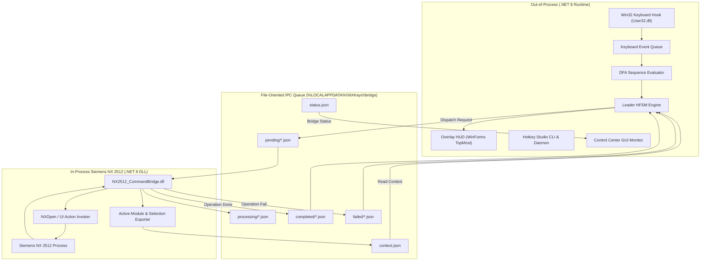

# Architecture Map (Stage 1) — Out-of-Process / In-Process Control & Data Flow

**Date:** July 24, 2026  
**Repository Path:** `d:\Programms\NXkeys`  

---

## 1. System Architecture Overview

NXKeys adopts an isolated, out-of-process control daemon pattern paired with an in-process C# DLL inside Siemens NX to ensure system stability.

---

## 2. HFSM State Transition Specifications

The HFSM (Hierarchical Finite State Machine) regulates user key combinations:

1. **`Idle`**: Hotkey engine listens for `CapsLock` press.
2. **`Root`**: `CapsLock` pressed. Overlay HUD displays 8 contextual commands (`QWE/A·D/ZXC`) for the currently active NX module (e.g., Modeling).
3. **`Prefix` / `Search`**: User types `Space` to initiate fuzzy search across module commands.
4. **`AwaitingConfirmation`**: Target command has destructive side-effects (e.g., Delete/Trim). System waits for `Enter` confirmation key.
5. **`Dispatching` / `AwaitingResult`**: Command JSON request written to IPC `pending/` directory. System waits for `completed/` or `failed/` notification.
6. **`SwitchingModule`**: User changes Siemens NX application (e.g. from Modeling to Sketch). `CommandBridge` updates `context.json`, resetting HFSM to the new active module scope.
7. **`Failed`**: Error captured during validation or IPC timeout. Error notification displayed on HUD; state automatically resets to `Idle`.

---

## 3. IPC Queue Mechanics & Safety Controls

* **Request Expiry:** Requests contain an `expires_utc` timestamp and `expected_context_revision`. If Siemens NX is busy or frozen, expired requests are marked `failed` without execution.
* **Context Guards:** `ContextGuardEvaluator` checks if the current NX module matches the target command's module scope. Cross-module command execution is strictly blocked.
* **Safety Boundary:** basic OS short-cuts (`Ctrl+S`, `Ctrl+Z`, `Ctrl+C`, etc.) are hard-coded in `BasicShortcutPolicy` (12 barrier shortcuts) and cannot be overridden by module JSON files.
