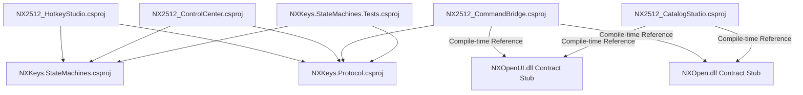

# Dependency Map (Stage 1) — Technology Stack & Assembly Graphs

**Date:** July 24, 2026  
**Repository Path:** `d:\Programms\NXkeys`  

---

## 1. Project Reference Dependencies (.NET Solution)

---

## 2. Shared Libraries & Framework Dependencies

| Subsystem / Assembly | Target Framework | Dependencies | External Assemblies / APIs |
|---|---|---|---|
| `NX2512_HotkeyStudio.csproj` | `.NET 8.0-windows` | `NXKeys.Protocol`, `NXKeys.StateMachines` | Win32 API (`User32.dll`, `Kernel32.dll`), `System.Windows.Forms` |
| `NX2512_CommandBridge.csproj` | `.NET 8.0-windows` (x64) | `NXKeys.Protocol` | Siemens NXOpen (`NXOpen.dll`, `NXOpenUI.dll`, `NXOpen.UF`) |
| `NX2512_ControlCenter.csproj` | `.NET 8.0-windows` | `NXKeys.Protocol`, `NXKeys.StateMachines` | `System.Windows.Forms` |
| `NX2512_Catalog_Studio.csproj` | `.NET 8.0-windows` | None | Siemens NXOpen (`NXOpen.dll`, `NXOpenUI.dll`, `NXOpen.UF`) |
| `NXKeys.Protocol.csproj` | `.NET 8.0` | None | `System.Text.Json` |
| `NXKeys.StateMachines.csproj` | `.NET 8.0` | `NXKeys.Protocol` | `System.Text.Json` |
| `NXKeys.StateMachines.Tests` | `.NET 8.0` | `NXKeys.StateMachines`, `NXKeys.Protocol` | Built-in test runner |

---

## 3. Configuration & Script Dependencies

* `config/nx2512-pro-hybrid.json` (JSON Schema v3): Canonical profile declaring 12 basic shortcuts and 14 adaptive modules.
* `config/nx2512-state-machines.json`: Declarative state machine behavior parameters (IPC timeouts, retry limits, confirmation rules).
* `scripts/validate-command-tree.mjs`: Node.js script validating JSON structure, key slot uniqueness (`QWE/A·D/ZXC`), and 112 command definitions.
* `install-nx-ribbon-buttons.ps1`: PowerShell installation script executing transactional deployment via `DeploymentEngine`.
